Xero accounting
=============================================
Splynx is able to sync customers, invoices and payments with Xero accounting software - https://www.xero.com

To install Xero addon navigate to **Config/Integrations/Add-ons**:

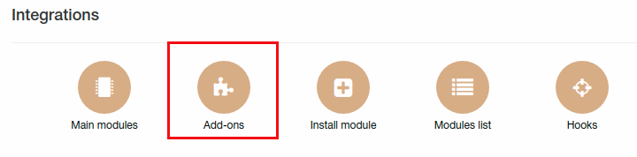

and in list of available addons find "splynx-xero":

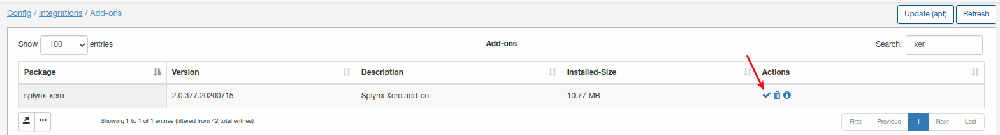

Once installation completed, navigate to **Config/Integrations/Modules list** and click on edit button near "splynx-xero" module:

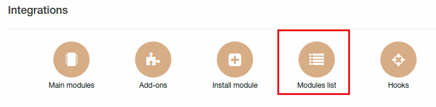

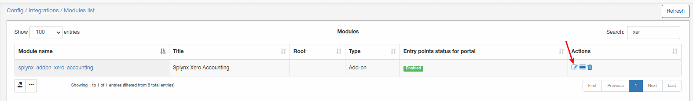

Here can be found general settings of Xero module. First of all we need specify "Splynx domain" under accounting API settings:

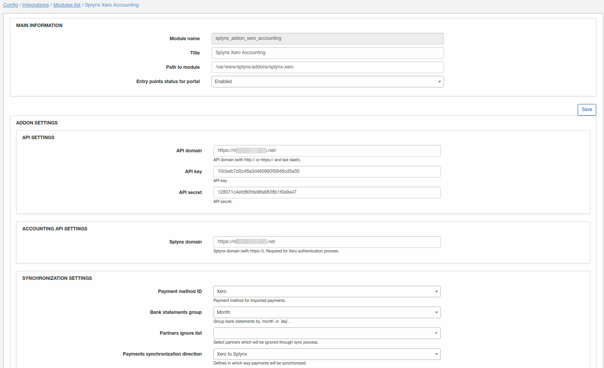
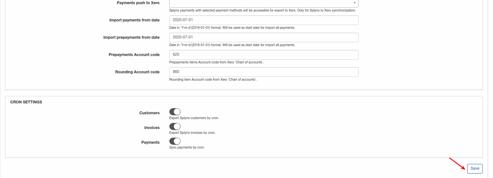
Splynx domain must be the same as API domain URL but without last slash "/". **HTTPS required!**

### Synchronization settings:

**Payment method ID** - select payment method for imported payments;

**Bank statements group** - group bank statements by "month" or "day";

**Partners ignore list** - here can be selected partners which will be ignored through sync process. Customers, invoices and payments of selected partners WON'T be synced with Xero;

**Payments synchronization direction** - define way of payments sync: Xero -> Splynx or Splynx -> Xero. If selected way Xero to Splynx - all payments what were created in Splynx won't be synced to Xero;

**Payments push to Xero** - selected payment method payments will be synced to Xero but only if selected method of syncing payments Splynx->Xero;

**Import payments from date** - date in 'Y-m-d'(2019-01-01) format. Will be used as start date for import all payments;

**Import prepayments from date** - date in 'Y-m-d'(2019-01-01) format. Will be used as start date for import all prepayments;

**Prepayments account code** - Prepayments items Account code from Xero 'Chart of accounts';

**Rounding account code** - Rounding item Account code from Xero 'Chart of accounts'.

### Cron settings
Here can be selected items to sync with Xero by cron(scheduled sync one time per day). Payments will be only synced when direction of syncing payments is Splynx->Xero.

### Let's start with Xero
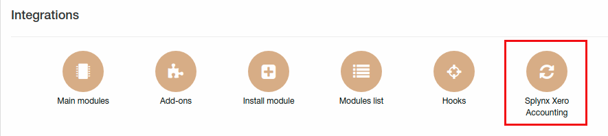

Now you have to connect your Xero account with Splynx, to do this click on "Connect with Xero":

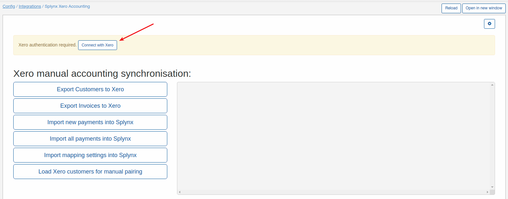

After linking your Xero account with Splynx you will see list of Xero organization. Select that organization what you will use with Splynx:

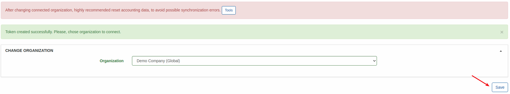

**NOTE**: all customers, invoices and payments will be synced only with selected organization. If organization must be changed in Splynx Xero addon - you will have to reset all synced invoices, customers and payments and start from a scratch.

Now when Xero account linked with Splynx, first thing to do - import mapping settings(chart accounts in Xero, tax rates, bank accounts) into Splynx. Click on "Import mapping settings into Splynx" button to do this.

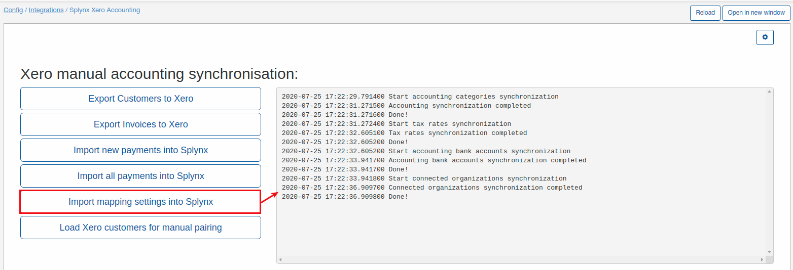

When this process done, navigate to Config/Finance and you will see 3 new buttons: Accounting categories, Accounting bank accounts and accounting taxes - all of them have to be configured.

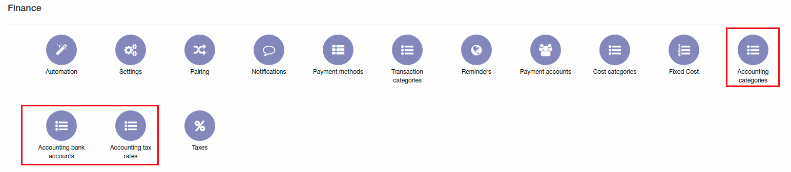

Let's start with Accounting categories:

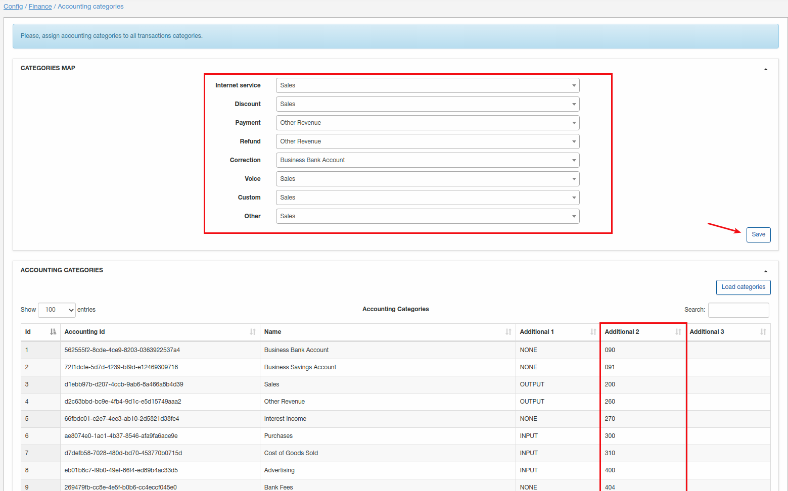

Under "Categories map" ALL categories must be selected with some item from "Accounting categories". Pay attention to field "Additional 2" under accounting categories - each category must have account code. To enable displaying of additional fields at the bottom of this page you will see this button:

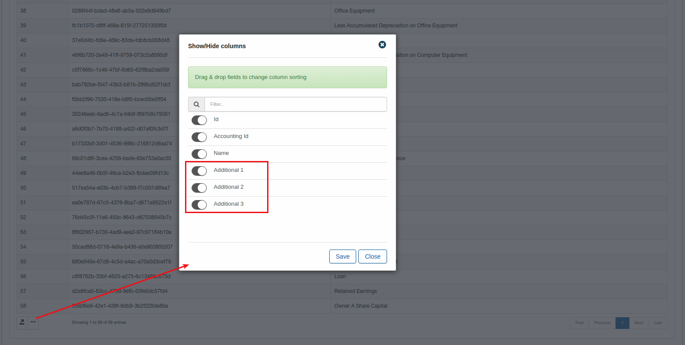

If synced category has no account code - Xero won't be able to sync invoices for this category.

Now when categories are configured let's proceed with bank accounts:

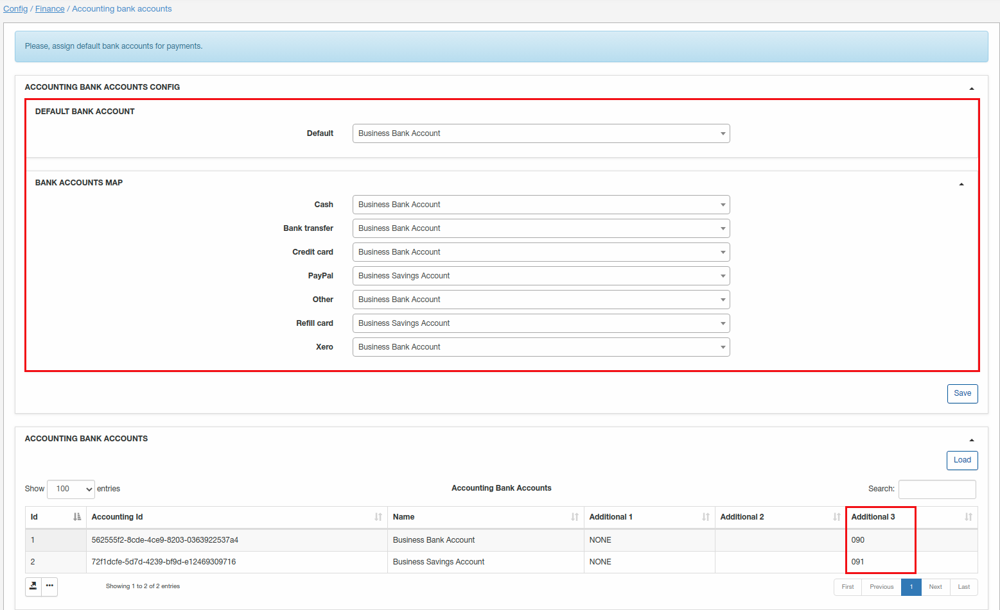

The same story with bank accounts - each bank account must have account code(additional 3 field here) and default bank account must be selected.

And the last one is accounting tax rates:

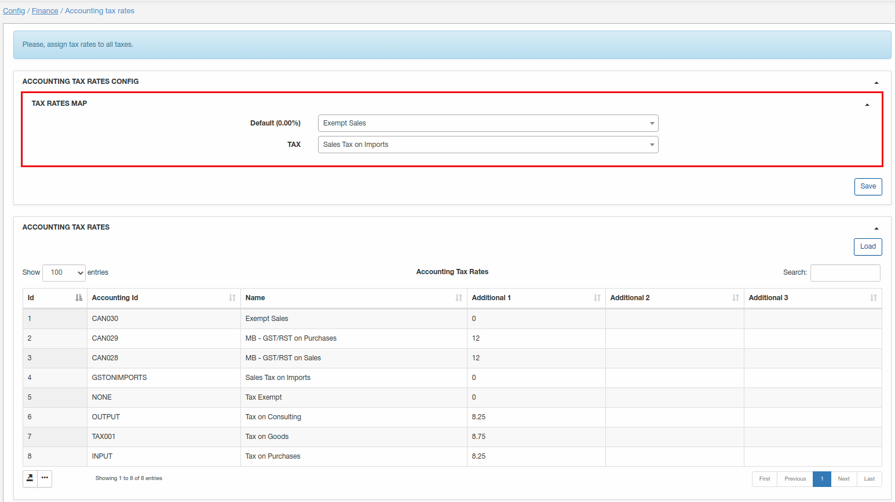

Once "Accounting categories", "Accounting bank accounts" and "Accounting tax rates" are configured - Splynx Xero addon is ready for using.

In our test Splynx we have 2 customers and few invoices for each customer, let's sync them to Xero:

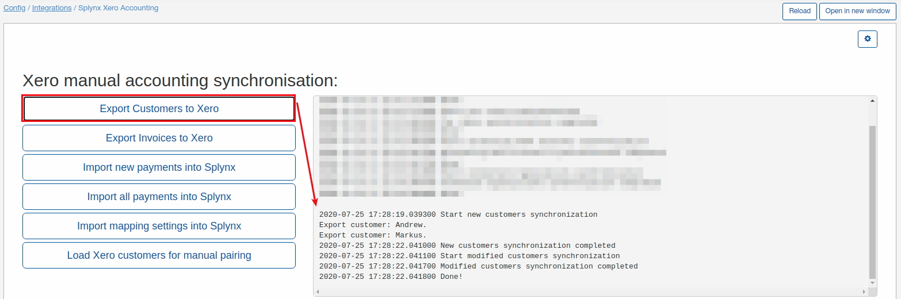

Once customer sync completed, we can sync invoices:

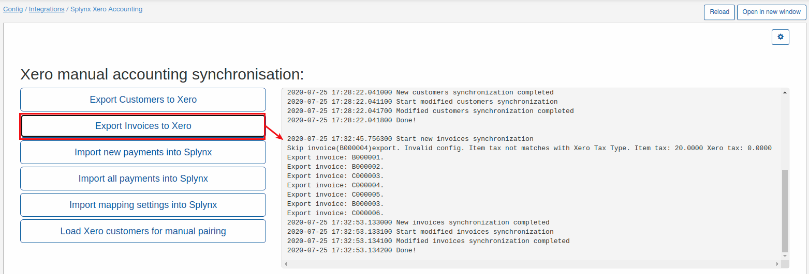

As you can see from the screenshot some invoice was skipped because of incorrect tax rate (not match with tax rates what we synced from Xero).

Under Xero we can see our synced customer and invoices:

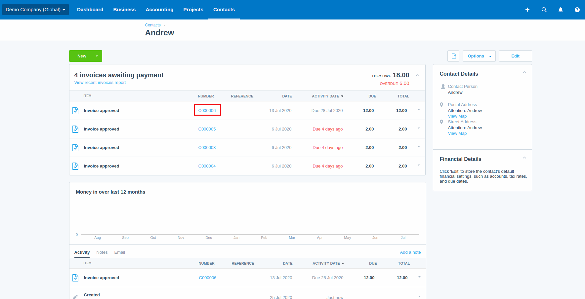

Let's pay invoice "C0000006" for Andrew customer:

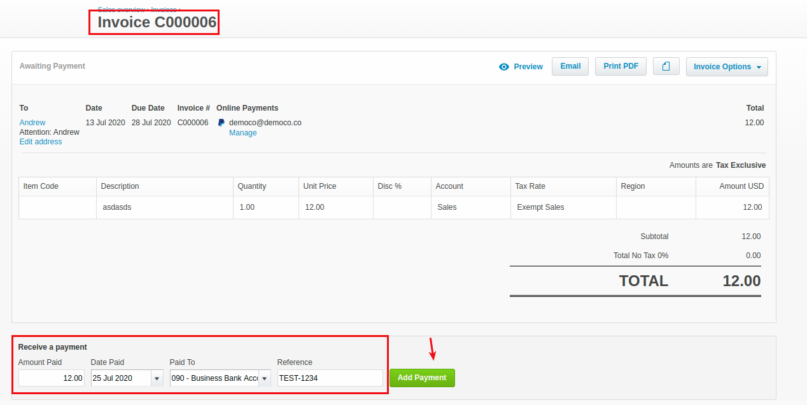

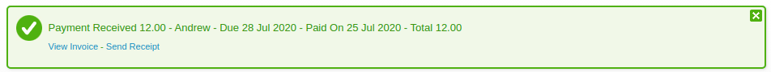

Now we can sync payments from Xero to Splynx by click on "Import new payments into Splynx". On our test Xero account we had a lot of payments so all of them were synced, but only payments what will match by customer - will be created in Splynx.

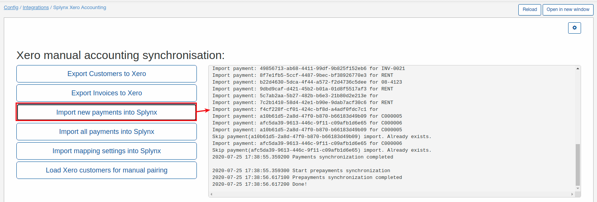

Payments what we synced from Xero can be checked under **Finance/Bank statements/History**:

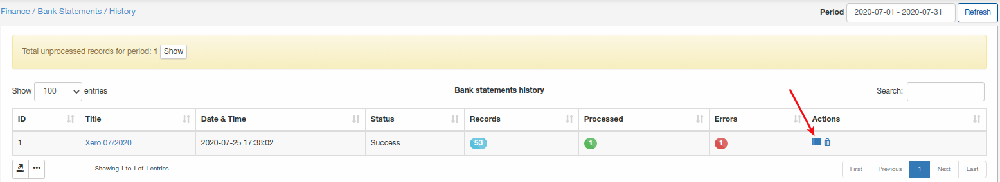

If some payment missed, or you need to check something - navigate to this menu and you will find all the information here.

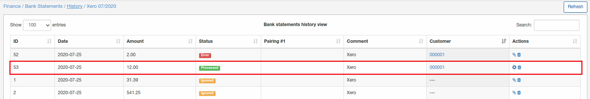

As you can see from a screenshot only 1 payment was processed (created). Statement record with "Error" didn't create a payment because all invoices of customer with amount 2 were paid in Splynx (we marked it as paid) but overdue in Xero, so Splynx decided not to create payment. If admin sure that statement record with error must be processed as payment - it can be paired manually.

Sometimes it's needed to manually pair statement record(create payment in Splynx) to customer because addon logic didn't create payment directly to avoid any mistakes. So we recommend to check bank statements at least one time per day.

Now we can observe paid invoice under customer billing tab and payment:

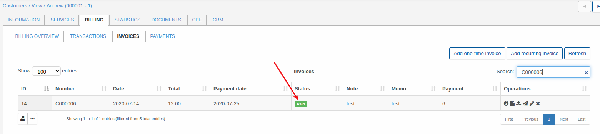

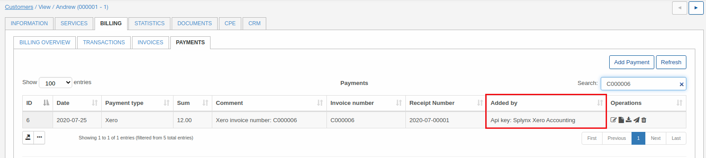

### Xero logs

Syncing logs can be found under **Administration/Logs/Accounting integrations**:

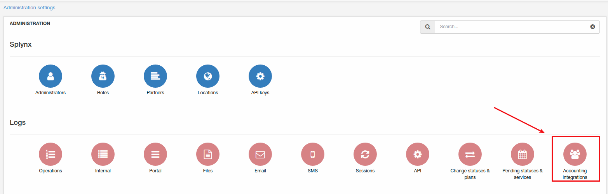

If customer has "Accounting ID" it means it was synced, if no - wasn't sync.

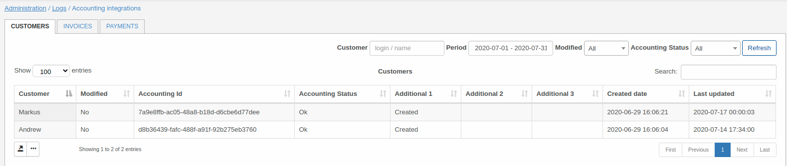

The same for invoices and payments, if accounting ID is present - it was synced:

"Invoice ID" corresponds to Splynx invoice ID.

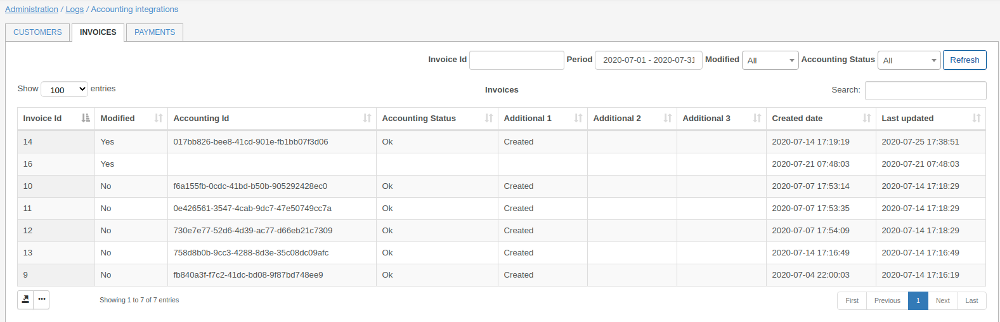

"Payment ID" corresponds to payment ID in Splynx.

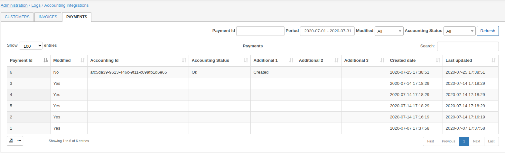

### Xero tweaks
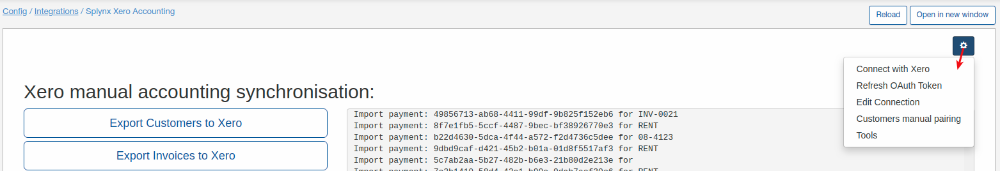

In this menu can be found few more settings and tools for Xero addon:

**Connect with Xero** - if Splynx Xero addon was disconnected from Xero account you have to reconnect here;

**Refresh OAuth token** - setting to refresh OAuth token;

**Edit connection** - using for editing of connection with Xero when email or password was changed for Xero account;

**Customers manual pairing** - if some customers weren't pair automaticall click on this menu to pair them manually:

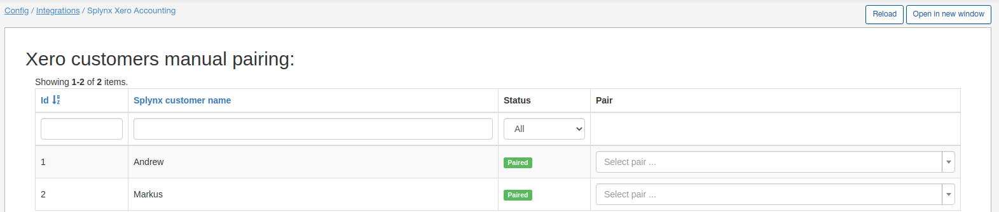

I have only 2 customers and they are paired, if status is "Not paired" in "select pair" field you can find needed customer from Xero to pair with this customer;

**Tools** - this menu is using for resetting of accounting database, all items will be erased. It is using for organization change. Before change accounting database must be reset:

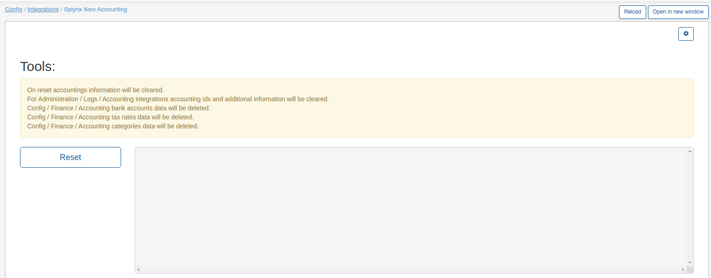
