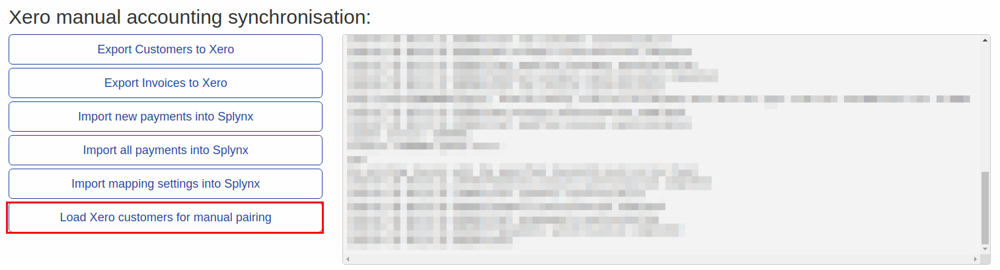

Xero accounting
=============================================
Splynx is able to sync customers, invoices and payments with Xero accounting software - https://www.xero.com

To install Xero addon navigate to **Config/Integrations/Add-ons**:

and in list of available addons find "splynx-xero":

Once the installation has completed, navigate to **Config/Integrations/Modules list** and click on the edit button under the actions column:

Here we can see the general configuration of the Xero integration module. First of all we need to specify "Splynx domain" in the accounting:

The Splynx domain must be the same as the API domain URL but without last slash "/". **HTTPS is required!**

### Synchronization settings:

**Payment method ID** - select the payment method for imported payments;

**Bank statements group** - group bank statements by "month" or "day";

**Partners ignore list** - here we should select the partners which will be ignored in sync process. Customers, invoices and payments of selected partners WON'T be synced with Xero.
  Note! Only one partner should be synced - multiple partner sync is not supported in accounting integrations;

**Payments synchronization direction** - define the direction of payments sync: Xero -> Splynx or Splynx -> Xero. If Xero to Splynx is selected - all payments which were created in Splynx won't be synced to Xero;

**Payments push to Xero** - the selected payment methods payments will be synced to Xero only if the selected method of syncing payments Splynx->Xero;

**Import payments from date** - date in 'Y-m-d'(2019-01-01) format. Will be used as start date for importing all payments;

**Import prepayments from date** - date in 'Y-m-d'(2019-01-01) format. Will be used as start date for importing all prepayments;

**Prepayments account code** - Prepayments items Account code from Xero 'Chart of accounts';

**Rounding account code** - Rounding item Account code from Xero 'Chart of accounts'.

### Cron settings
Here we can select which items to sync with Xero via cron jobs(scheduled sync once a day). Payments will be only synced when direction of syncing payments is Splynx->Xero.

### Let's start with Xero

Next we have to connect the Xero account with Splynx, to do this - click on "Connect with Xero":

After linking your Xero account with Splynx you will see a list of Xero organization. Select the organization which you will use with Splynx:

**NOTE**: all customers, invoices and payments will be synced only with the selected organization. If the organization must be changed in the Splynx Xero addon - you will have to reset all synced invoices, customers and payments and start from scratch.

When the Xero account linking is completed, the first step is to import mapping settings (chart accounts in Xero, tax rates, bank accounts) into Splynx. Click on the "Import mapping settings into Splynx" button to do this.

When this process completed, navigate to Config/Finance and you will see 3 new buttons: Accounting categories, Accounting bank accounts and accounting taxes - all of them have to be configured.

Let's start with Accounting categories:

Under "Categories map" ALL categories must be selected with some item from "Accounting categories". Pay attention to the field "Additional 2" under accounting categories - each category should have an account code. To enable displaying of additional fields, at the bottom of this page select the breadcrumbs (column selector) button:

If the synced category has no account code - Xero won't be able to sync invoices for this category.

As soon as the relevant categories are configured let's proceed with bank accounts:

We will follow the same procedure with bank accounts each bank account should have an account code (additional 3 field here) and the default bank account should be selected.

The last accounting config to sync is tax rates:

Once "Accounting categories", "Accounting bank accounts" and "Accounting tax rates" are configured - Splynx Xero addon is ready to start syncing.

In our test Splynx we have 2 customers and a few invoices for each customer, let's sync them to Xero:

Once the customer sync has completed, we can sync the invoices:

As you can see from the screenshot an invoice was skipped because of an incorrect tax rate (not matching with the tax rates that we synced from Xero).

Under Xero we can see our synced customers and invoices:

Let's capture the payment related to the invoice "C0000006" for the customer "Andrew":

Now we can sync payments from Xero to Splynx by clicking on "Import new payments into Splynx". On our test Xero account we had a lot of payments so all of them were synced, but only payments which are matched to a corresponding customer - will be created in Splynx.

Payments that we synced from Xero can be viewed in **Finance/Bank statements/History**:

If some payments are skipped, or you need to view payments - navigate to the above mentioned section to view all payments.

As you can see from the screenshot only 1 payment was processed (created). The statement record with "Error" didn't create a payment because all invoices with an amount of "2" were already paid in Splynx (we marked it as paid) but overdue in Xero. When there's a discrepancy in payments we do not sync these payments.

Sometimes it's required to manually pair a statement record(create a payment in Splynx) to a customer because the integration logic has built in directly to avoid any mistakes. We recommend to check bank statements on a regular basis.

Lastly we can observe the paid invoice as well as the payment under the:

### Xero logs

Sync logs can be found under **Administration/Logs/Accounting integrations**:

If a customer/invoice/payment has "Accounting ID" it means it was synced, if not - it wasn't synced.

The same for invoices and payments, if accounting ID is present - it was synced:

"Invoice ID" corresponds to Splynx invoice ID.

"Payment ID" corresponds to payment ID in Splynx.

### Xero tweaks

In this menu there are a few more settings and tools related to the Xero addon:

**Connect with Xero** - if the Splynx-Xero addon was disconnected from Xero account you have to reconnect here;

**Refresh OAuth token** - setting to refresh the OAuth token;

**Edit connection** - using for editing the connection with Xero when the credentials were changed in the Xero;

**Customers manual pairing** - this function is used where there are existing customers in Splyn as well as Xero. There is a button "Load Xero customers for manual pairing". This feature pulls the customer list from Xero into Splynx and allows the admin to manually pair the customers without having to create them in either platform again.

I have only 2 customers and they are paired, if status is "Not paired" in "select pair" field you can find needed customer from Xero to pair with this customer;

**Tools** - this menu is used for resetting the accounting database, all items will be erased. It is mainly used when the organization changes. Before changing  the organization the accounting database must be reset:

