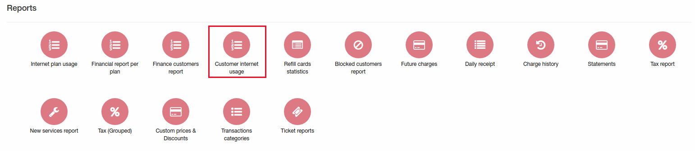
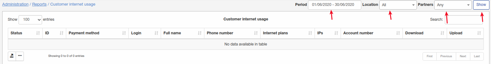
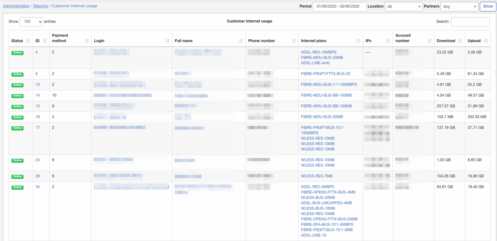
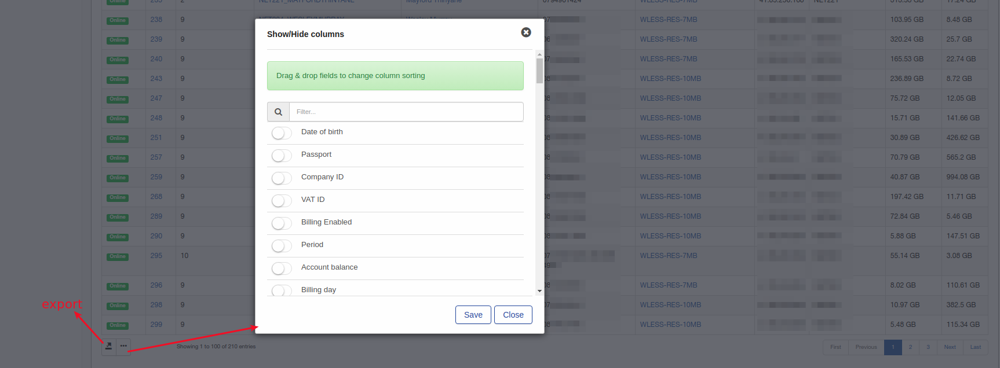

Customer internet usage
====

In this report can be found data how much traffic customer used.

To generate report set period, location, partner and click on "Show":

Report will output data with customer ID, internet services, amount of used data(download/upload) and many others parameters what can be configured at the right bottom corner.

