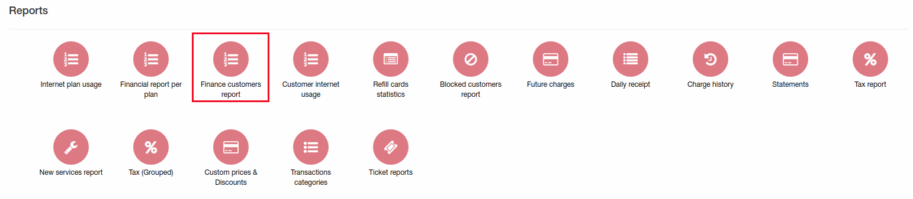
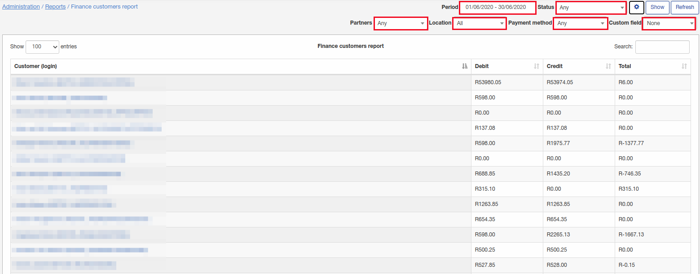
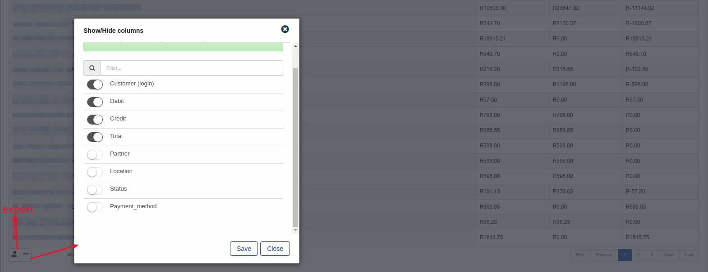

Finance customers report
====

In this report can be found information about money flow for each customer(amount of debit transactions, amount of credit transactions and difference between them).

To generate report set some filters:
 * period;
 * status of customers;
 * partners;
 * location;
 * payment method;
 * custom field(if customers have some custom fields).

Report will output next data:
 * Customer(login);
 * Debit - amount of debit transactions for given period;
 * Credit - amount of credit transaction for given period;
 * Total - difference between Debit and Credit.

At the right bottom corner of report some additional fields can be configured to output and report can be exported in some format:

