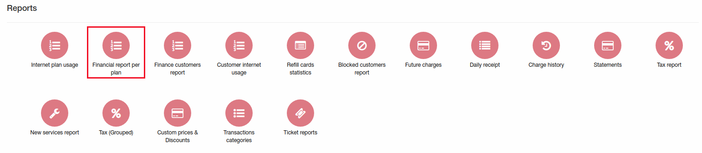
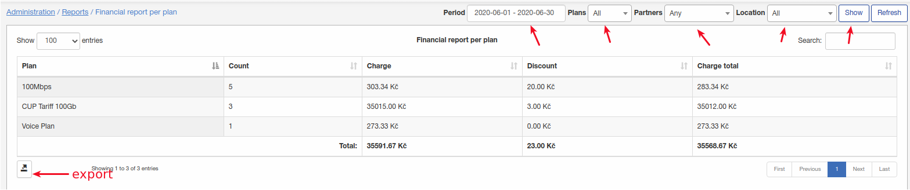

Financial report per plan
====

In this report can be found information on how much money will be charged from tariff plans for given period.

Select period, type of plans, partners, locations and click on "Show" to generate report.

Will be displayed next data:
1. Plan name;
2. Count of services for each plan;
3. Charge amount;
4. Discount amount;
5. Total charge.

As usual report can be exported using button at the right bottom corner of report.
