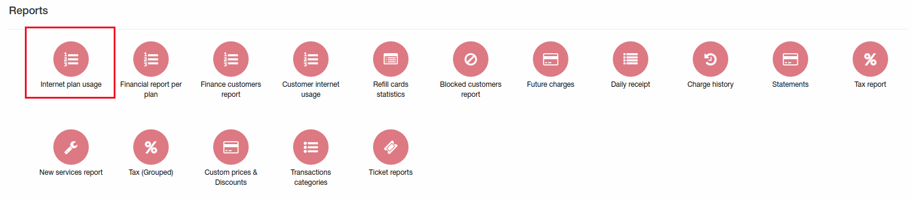
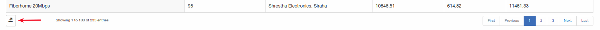

Internet plan usage report
====

In this report can be found data about how much GB per plan customers downloaded/uploaded for given period.

To generate report follow next steps:
1. Select period;
2. Select partner;
3. Select location;
4. Click on "Show".

Report contains next data:
1. Plan name;
2. Count of services for this plan;
3. Partner(in this case tariff plan configured for 2 partners - so in report you will see 2 separate lines for each partner);
4. Amount of downloaded GB;
5. Amount of uploaded GB;
6. Total GB abount.

Generation of report can take few minutes(depends on amount of customers and plans).

At the bottom of the report can be found button to export this report in CSV, Excel or other format.

