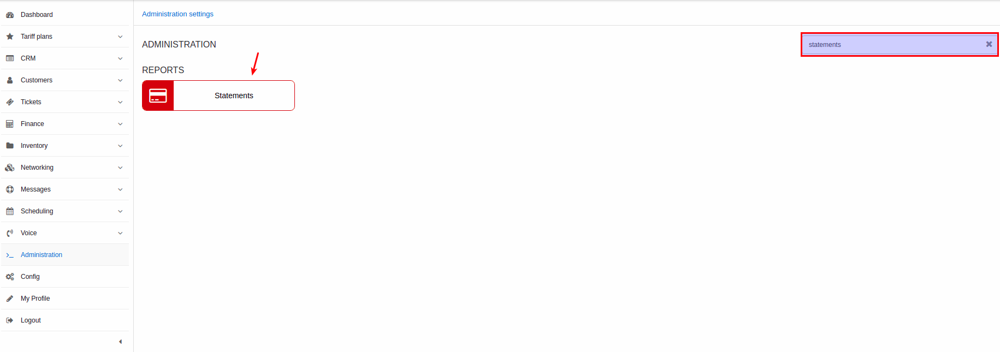
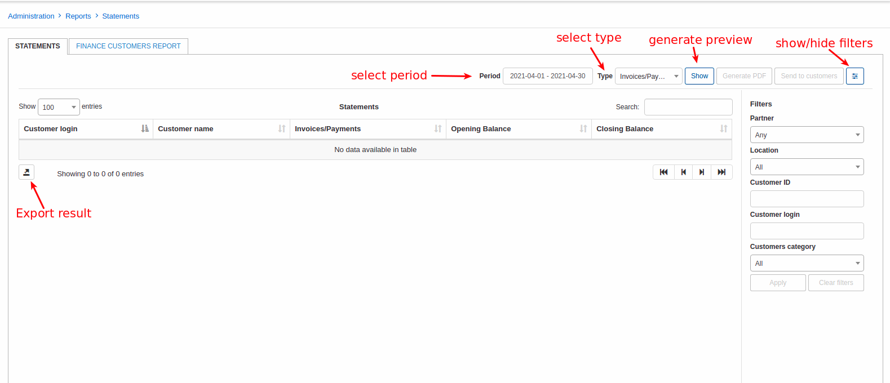
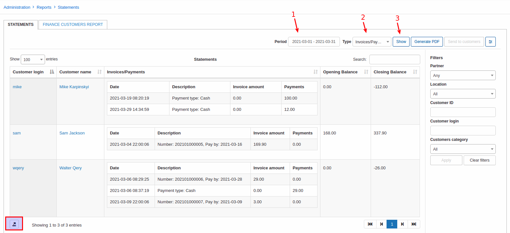
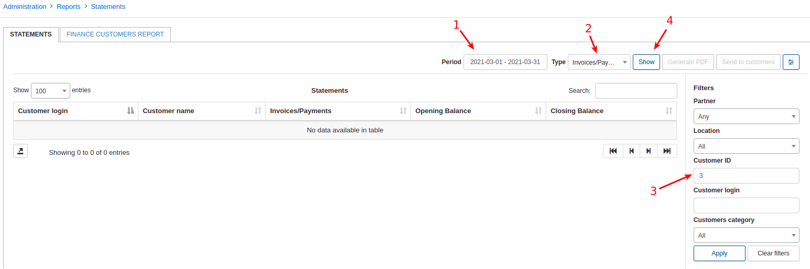
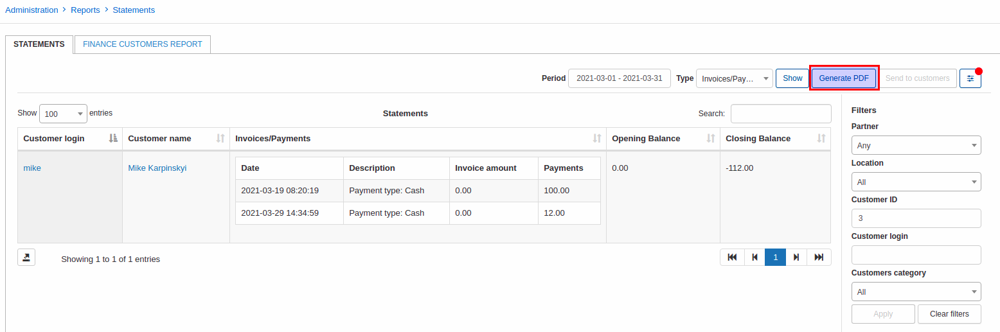
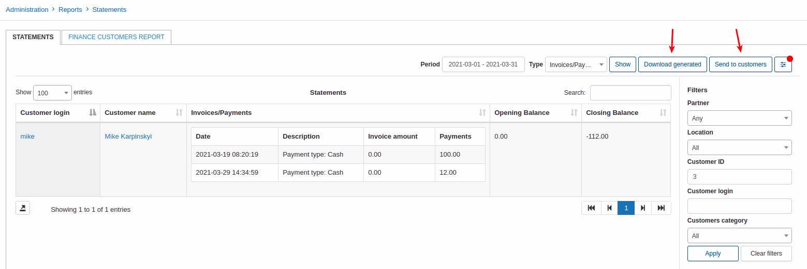
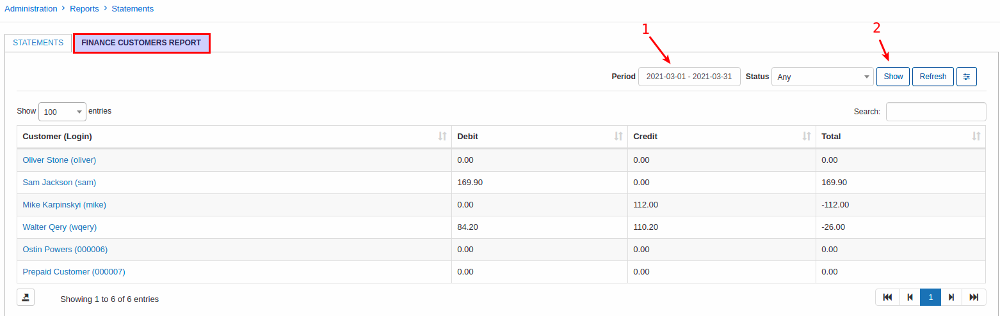

Statements
====

In this section, we can view a report of customer financial statements specifically regarding transactions and invoices VS payments. The report is represented in a table format and specifically displays data specified in the filter criteria. Therefore, it is necessary to specify which kind of report you wish to display, being either transactions or invoices/payments. Simply use the filter located at the top right of the table to select a period and the type of data to display, then click on show:

Upon clicking on "Show" the data will be retrieved according to your criteria:

You can then filter the data to display results pertaining to a specific partner and/or location, or a specific customer, or even a customer category.

and here is the result for single customer:

Once you have filtered the table/report to display data of your preference, you can then download a PDF copy of the report/table with the use of the "Generate PDF" button located within the filter. After this it will be 2 options available:

1. **Download generated** - download the result in PDF format;

2. **Send to customers** - send the personal result for each customer in this list.  

On a tab _FINANCE CUSTOMERS REPORT_  can be generated a bit simpler finance report:

Just select a period (1) and status of customers and click on **Show** (2). In can be exported using export button on the left bottom corner.
