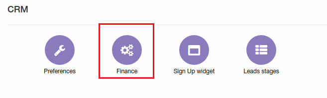
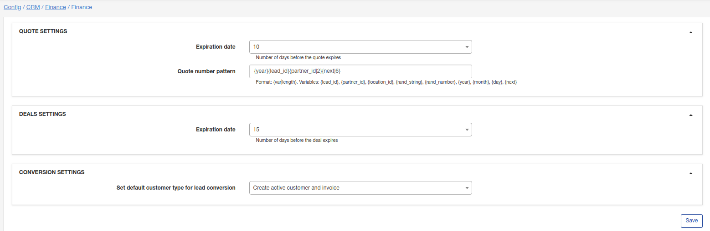

Finance
=============
**_Config -> CRM -> Finance_**

Here can be found some finance settings for CRM.

# Quote settings
* **Expiration date** - number of days before the quote expires;

* **Quote number pattern** - format of number for quotes, can be changed using variables from description.

# Deals settings
* **Expiration date** - number of days before deal expires.

# Conversion settings
* **Set default customer type for lead conversion**:
    * *Create active customer and invoice* - after conversion lead->customer status of new customer will be "active" and invoice will be created;

    * *Create inactive customer and proforma invoice* - after conversion lead->customer status of new customer will be "inactive" and proforma invoice will be created.
