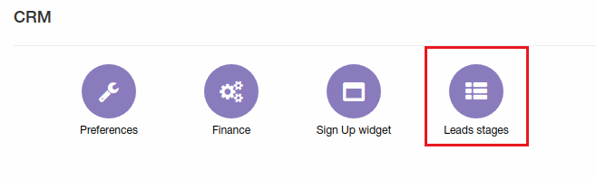
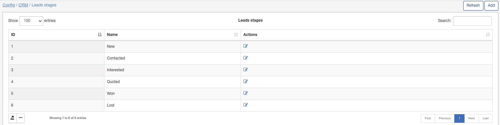
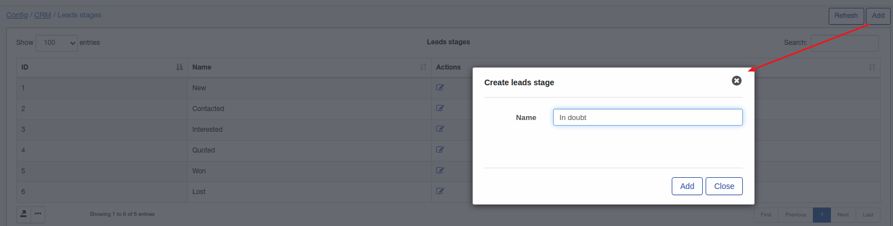
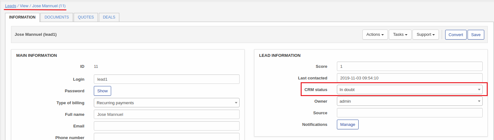

Lead stages
=============
**_Config -> CRM -> Lead stages_**

Here can be added/removed or changed lead stages what we are using for leads.

All lead stages without "delete" button are default and can't be removed, only renamed.

To add new stage click on "Add":

New stage will be available for lead:

