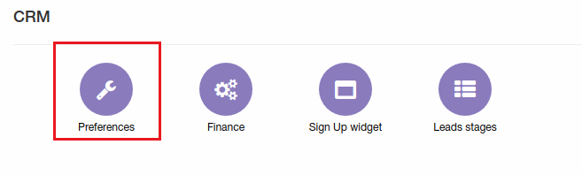
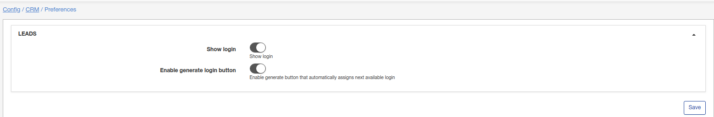
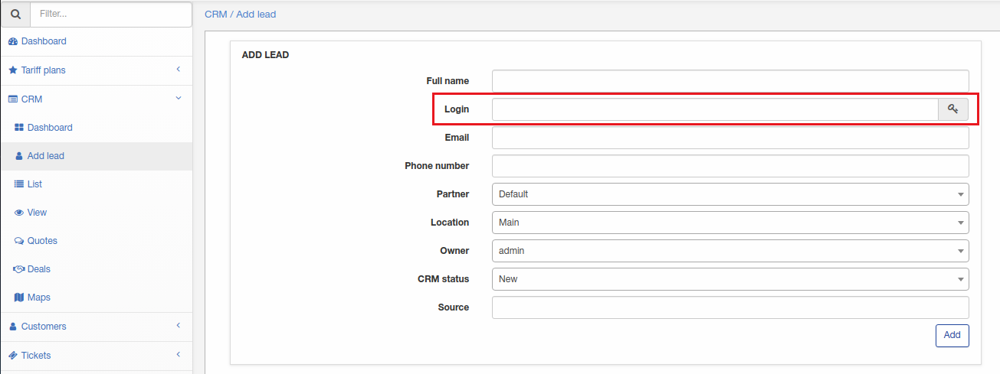

Preferences
=============
**_Config -> CRM -> Preferences_**

* **Show login** - enable/disable login for lead;

* **Enable generate login button** - enable/disable button for auto-generate login(will be visible only if "Show login" enabled).

Then when new lead will be added field "Login" will be visible or invisible depending on current CRM preferences.
