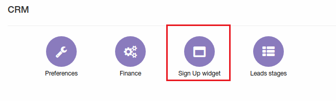
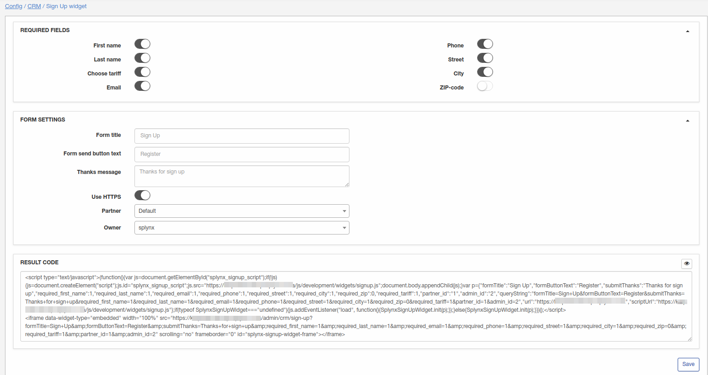
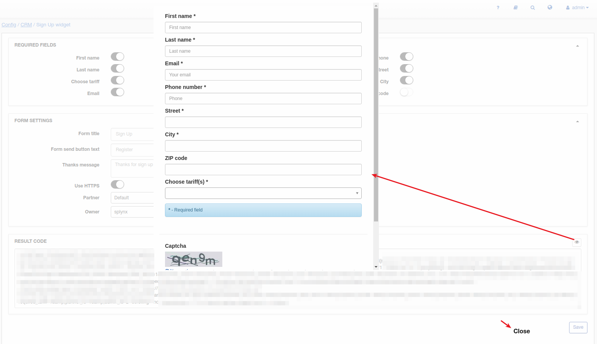

Sign Up widget
=============
**_Config -> CRM -> Sign Up widget_**

We developed this feature for lead creation from some other website directly to Splynx.
Result code can be copied to your website, and potential customer will be able to register(become lead in Splynx) directly on your website.  

# Required fields

List of fields what potential customer will have to fill in.

# Form settings

Here some form details can be changed also few important things:
* Use HTTPS - if your Splynx server is on HTTPS you should keep this option on;
* Partner - default partner what will be configured for lead;
* Default owner of lead after registration.

# Result code
After making all changes click on "Save" and result code will be ready for use.

We have a preview button to check what potential customers will see on your website:

After filling in all fields, lead will have to enter Captcha and submit this form. After this, lead will be created in Splynx.
