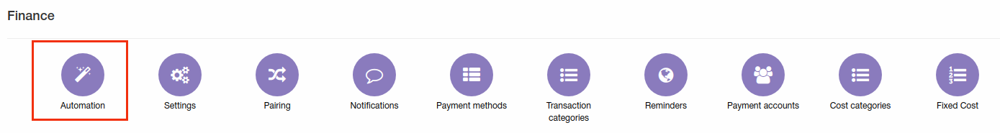
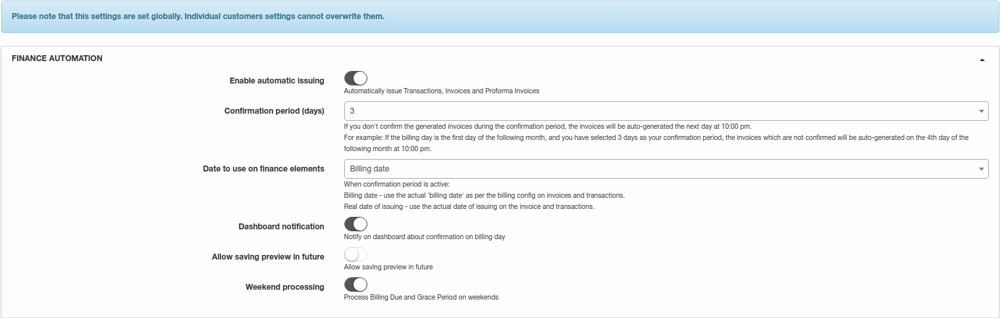
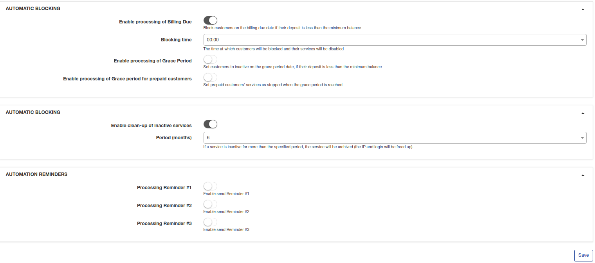

Automation
=============

To eliminate financial errors and delays from manual processes in Splynx you can configure a finance automation in `Config → Finance → Automation`. Please note, these will be a global settings.

You can configure here the following parameters of automation:

### Finance automation

* **Enable automatic issuing** - option for automatic issuing Invoices, Transactions, Proforma Invoices;

* **Confirmation period(days)** - set the date for confirmation of automatic issuing invoices. If you don't confirm issuing during set number of days, invoices will be auto generated the next day. The options for choosing confirmation days are: 0, 3, 5, 10, 15, 20, 25 days;

* **Date to use on finance elements** - here you can set the date of transactions and invoices issuing. It can be a billing day or the real date of issuing. For example, the billing day is on 1st day of the month and you have set  3 days as a waiting for confirmation. In that case the invoice can be dated on a billing day regardless confirmation days or the real date of issuing: maximum on 4th day of the month (if you won't confirm issuing and invoices will be auto generated the next day);

* **Dashboard notification** - with this option enabled you will be notified on Dashboard about confirmation on a billing day;

* **Allow saving preview in future** - with this option enabled preview of invoices issued for upcoming month(s) will be saved (`Finance → History`);

* **Weekend processing** - enable/disable processing of billing due and grace period on weekends.

### Automatic blocking

* **Enable processing of  billing Due** - enabling this process will lead to blocking non-paying customers on their billing due date and when their deposit is less then minimum deposit allowed;

* **Blocking time** - the time at which customers will be blocked and their services will be disabled;

* **Enable process Grace Period** - with this option customers will be in inactive status by the end of Grace period and when their deposit is less then minimum deposit allowed;

* **Enable processing of Grace period for prepaid customers** - set prepaid customers' services as stopped when the grace period is reached.

### Automatic services clean up
If service is disabled and customer is not active but service has static IP configured, we can automatically reset IP of this service to make this IP available in pool.

* **Enable clean-up of inactive services** - enable/disable auto cleaning;

* **Period(months)** - If a service is inactive for more than the specified period, the service will be archived (the IP and login will be freed up).

### Automation reminders

* **Processing Reminder #1** - with that option enabled Reminder #1 will be sent to customer on a day set in [Reminder settings](../reminders/reminders.md);
* **Processing Reminder #2** - with that option enabled Reminder #2 will be sent to customer on a day set in [Reminder settings](../reminders/reminders.md);
* **Processing Reminder #3** - with that option enabled Reminder #3 will be sent to customer on a day set in [Reminder settings](../reminders/reminders.md).
