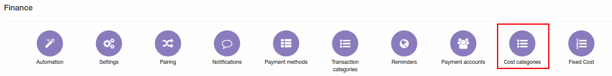
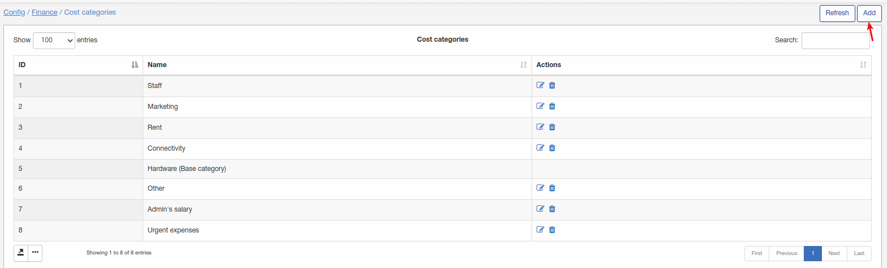

Cost categories
====
To set up cost categories navigate to `Config → Finance → Cost categories`.

These categories can be used in [Fixed costs](../fixed_costs/fixed_costs.md) for accounting of company expenses.

