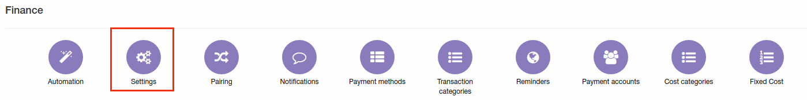
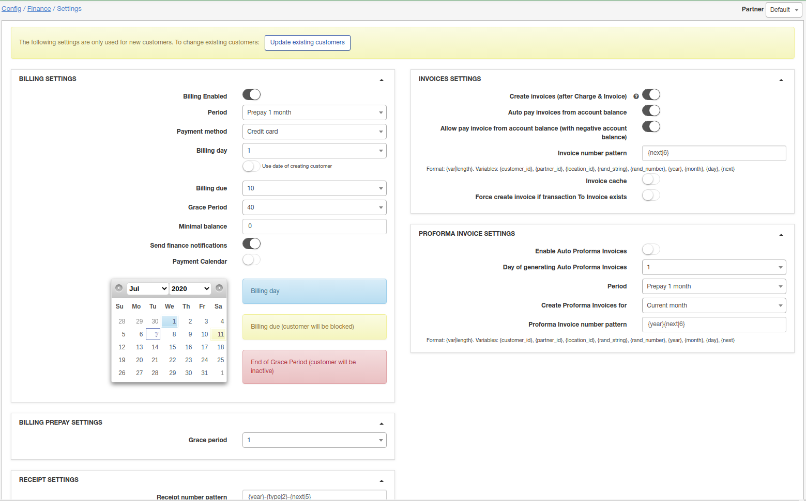
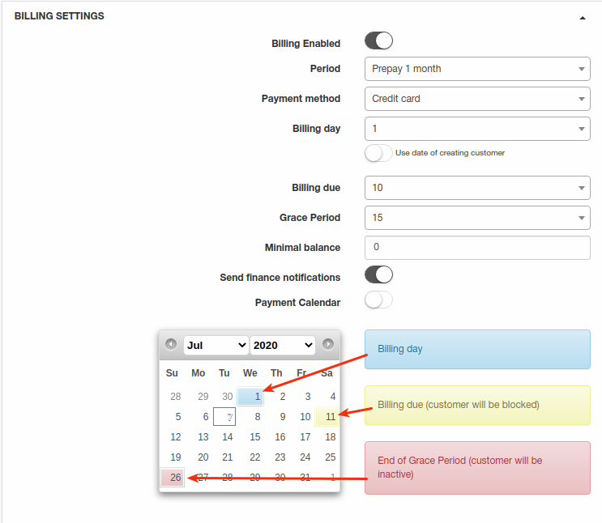
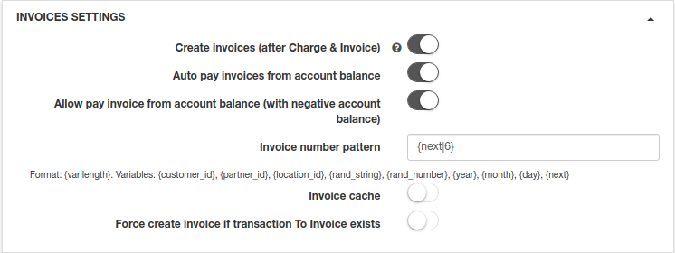
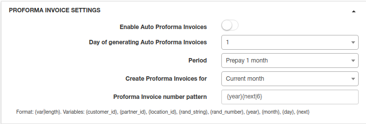
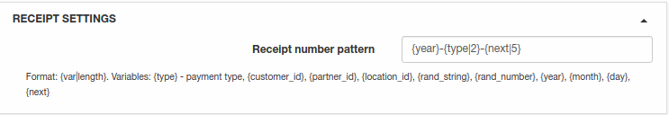
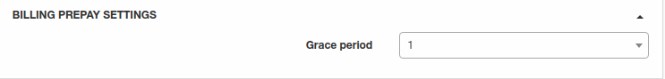
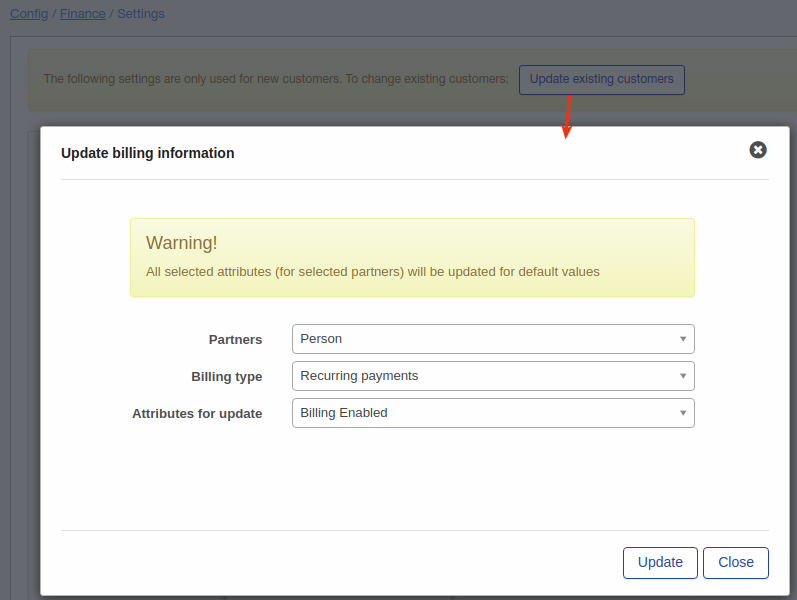
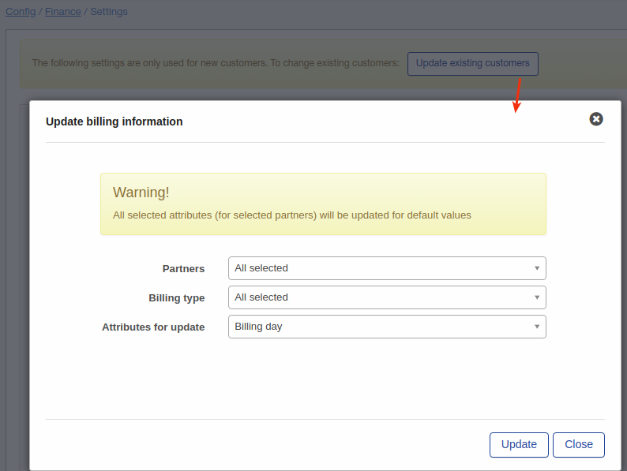

Finance settings
=============

To set global financial settings for new customers or update existing customers go to `Config → Finance → Settings`.

It is possible to set here global parameters for the following important parts of financial module:

In right top corner select partner for which you will change billing settings.

----
### Billing settings
#### Recurring type of billing is set by default in Splynx global configuration.

* **Billing Enabled** -  enable/disable billing for the customer;

* **Period** -  it can be prepaid or postpaid, which means in Prepaid Mode recurring Invoices can be issued up to 5 months in advance and in Postpaid Mode Invoices will be generated after services usage;

* **Payment Method** - choose a Payment Method for recurring payment, such as Cash, Bank Transfer, Credit Card, PayPal, Refill Card, BrainTree and others;

* **Billing day** - when the customer will be charged. It is a day of Invoice generating.
If 'use date of creating customer' enabled - billing day will be equal to day of creation customer;

* **Billing due** - the last day when customer have to make a payment before get blocked. For example, we choose 1st day of the month as a billing day and 15th day of the month as Billing due day, which means that Invoice will be generated on 1st day of the month and if customer don't make a payment until 15th day of the month, the next day he will be in blocked status. Even though customer will have blocked status, his services will be still accounted;

* **Grace Period** - when the customer's services will be disabled: time when customer will have inactive status. For e.g. it could be 10 days, which means after 10th day customer's status will be automatically changed from blocked to inactive and his services won't be accounting;

* **Minimal balance** - defines the customer balance in Recurring payment and is set by default to "0" in Global configuration, but it is possible to change here according your needs;

* **Send finance notifications** - enable/disabled sending of notifications about payments, invoices, overdue invoices etc;

* **Payment calendar** - enable/disable payment calendar under customer "Billing" tab.

#### Invoices settings

* **Create Invoices(after Charge&iInvoice)** - with this option enabled **Invoices will be issued automatically** after charging the customer;

* **Auto pay Invoices from account balance** - you can enable this option if customers' payments are regularly made from their account balance;

* **Allow pay invoice from account balance(with negative account balance)** - enable/disable possibility to pay invoices from account balance with negative amount;

* **Invoice number pattern** - you can set up an Invoice number pattern here;

* **Invoice cache** - with option enabled all changes made will be visible only in new invoices, old Invoices will remain without changes;

* **Force create invoice if transaction "To invoice" exists** - enable/disable creation of invoice from transaction with "to invoice" enabled option.

### Proforma Invoice settings

Settings for auto generating Proforma Invoices. In our billing system Proforma Invoice can be used as a request of payment in advance. For example, it can be created 1 month before the occuring payment, so you will see if customer is able to pay the Proforma Invoice. When proforma invoice is created, the customer’s balance hasn't changed. The main reason for this billing approach is to prevent the payment of VAT tax for non-paying customers. If the customer pays the amount specified in the Proforma Invoice PDF, the company can issue a tax Invoice.

* **Enable Auto Proforma Invoices** - with this option enabled Proforma Invoices will be issued automatically;
* **Day of generating Auto Proforma Invoices** - choose the day for automatic issuing Proforma Invoices;
* **Period** - choose period for proforma invoice;  
* **Create Proforma Invoices for** - there are 2 options here: create proforma invoice for current month and for the next month;
* **Proforma Invoice number pattern** - create a Proforma Invoice number pattern here.

### Receipt settings

* **Receipt number pattern** - create a payment receipt number pattern here.

### Billing prepay settings

* **Grace period** - select amount of days for prepay customers. Prepay customer will be inactive if didn't pay for some amount of days(specified here) from blocking date.

## Mass update of customers' billing Settings

Using this mass update tool billing settings can be for some amount of customer at one time instead of manual change of billing settings for each customer. Be very attentive when using this tool. Here provided few example on how to do it:

**Task 1**: disable billing for partner "Person" and for billing type = recurring:

After billing was disabled in settings click on "Update existing customers" select partner, billing type and only "billing enabled" value and click on "Update" button.

**Task 2** : Change billing day for all existed customers.

Using the same logic select all partners, all billing types and just value "billing day" for Attributes for update and click on "Update" button.
