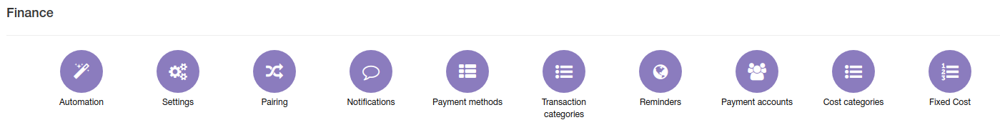
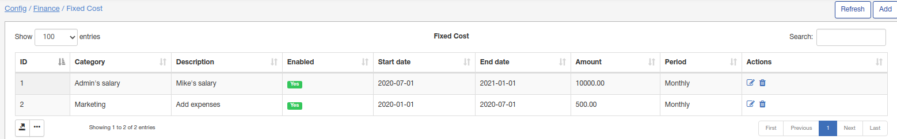

Fixed costs
====
To set up fixed costs navigate to `Config → Finance → Fixed costs`.

Here you can specify some fixed expenses of company like a salary, some static expenses.

I've added few fixed costs and will be able to use them in Finance -> Costs on dashboard. 
