Notifications
=============

To set up Notifications click on `Config → Finance → Notifications`.

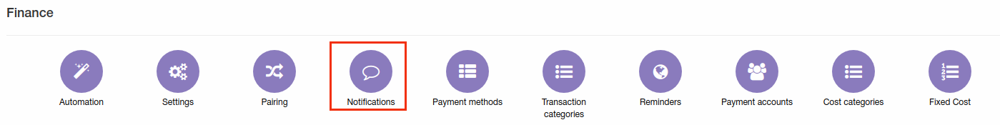

**Note** to send notifications over Emails - [email sending](../../main_configuration/email_config/email_config.md) must be configured, and to send notifications over SMS - [sms sending](../../main_configuration/sms_config/sms_config.md) must be configured

There are two main types of notifications which can be configured here: billing notifications and service notifications.

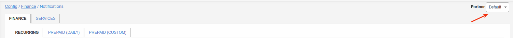

On Finance tab can be configured notifications for all billing types. Configuration for prepaid(daily) and prepaid(custom) are the same but separated on two different tabs. Don't forget to select partner at right top corner.

# **Finance**

### RECURRING
#### Invoices
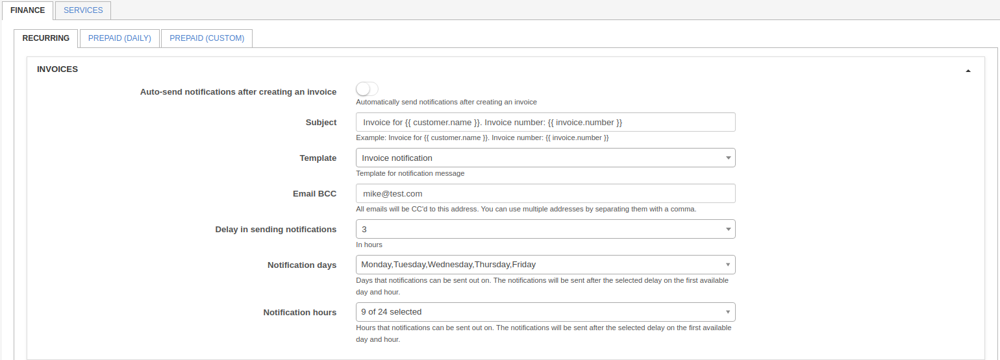

Here can be configured notifications for invoices:

* **Auto-send notifications after creating an invoice** - enable/disable auto send of invoices after creation;
* **Subject** - notification email subject;
* **Template** - email template(can be added under [Config/System/Templates/Email](../../system/templates/templates.md));
* **Email BCC** - send copy to this email;
* **Delay in sending notifications** - delay in hours to send notification after invoice creation;
* **Notification days** - available days to send notification;
* **Notification hours** - available hours to send notifications.

#### Proforma invoices
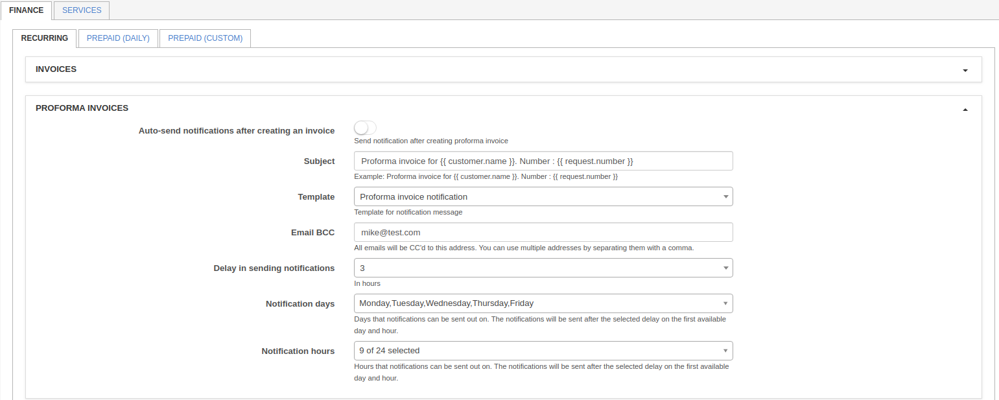

Here can be configured notifications for proforma invoices:

* **Auto-send notifications after creating an invoice** - enable/disable auto send of proforma invoices after creation;
* **Subject** - notification email subject;
* **Template** - email template(can be added under [Config/System/Templates/Email](../../system/templates/templates.md));
* **Email BCC** - send copy to this email;
* **Delay in sending notifications** - delay in hours to send notification after proforma invoice creation;
* **Notification days** - available days to send notification(will be send in first available day);
* **Notification hours** - available hours to send notifications(will be send in first available hour).

#### Payments
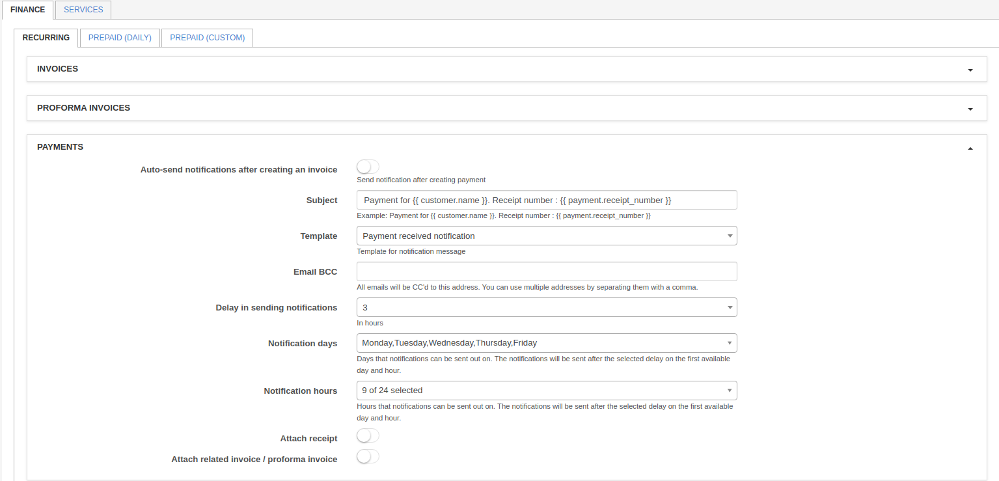

Here can be configured notifications for payments:

* **Auto-send notifications after creating payments** - enable/disable auto send of notification when payment created;
* **Subject** - notification email subject;
* **Template** - email template(can be added under [Config/System/Templates/Email](../../system/templates/templates.md));
* **Email BCC** - send copy to this email;
* **Delay in sending notifications** - delay in hours to send notification after payment creation;
* **Notification days** - available days to send notification(will be send in first available day);
* **Notification hours** - available hours to send notifications(will be send in first available hour).

#### Blocking wave

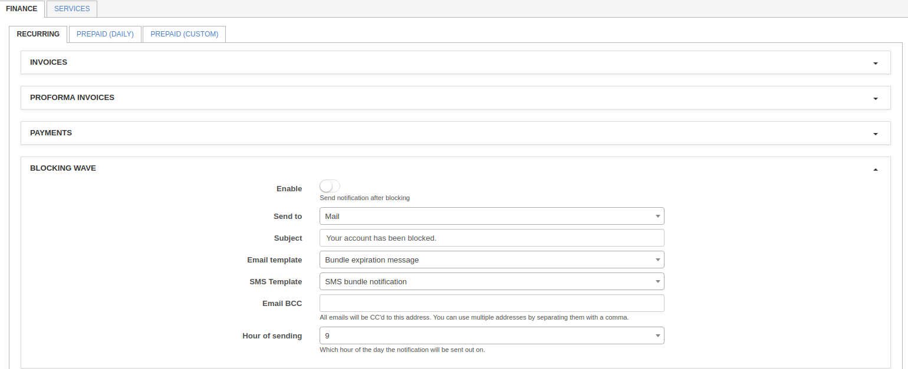

Here can be configured blocking wave notifications:

* **Enable** - enable/disable sending of notification after blocking of customer;
* **Send to** - type of notification: email, SMS or email+SMS;
* **Subject** - subject of notification;
* **Email template** - select template for email notification(can be added under [Config/System/Templates/Email](../../system/templates/templates.md));
* **SMS template** - select template for SMS notification(can be added under [Config/System/Templates/SMS](../../system/templates/templates.md);
* **Email BCC** - send copy of notification to this email;
* **Hour of sending** - select hour to send this notification.

#### Inactive wave

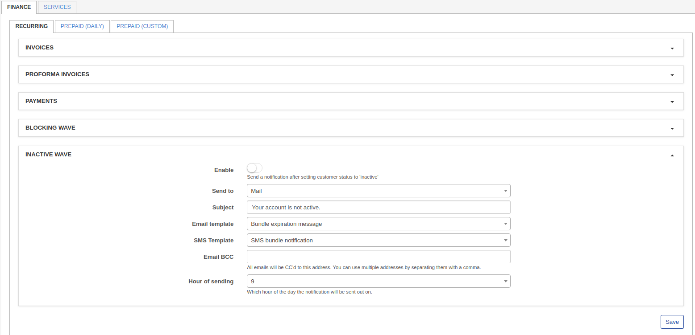

Here can be configured inactive wave notifications:

* **Enable** - enable/disable sending of notification when customer become inactive;
* **Send to** - type of notification: email, SMS or email+SMS;
* **Subject** - subject of notification;
* **Email template** - select template for email notification(can be added under [Config/System/Templates/Email](../../system/templates/templates.md);
* **SMS template** - select template for SMS notification(can be added under [Config/System/Templates/SMS](../../system/templates/templates.md));
* **Email BCC** - send copy of notification to this email;
* **Hour of sending** - select hour to send this notification.

### PREPAID

Notifications for Prepaid(daily) and Prepaid(custom) has the same parameters.

#### Main settings
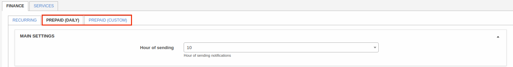

* **Hour of sending** - select hour to send notifications.

#### Blocking wave
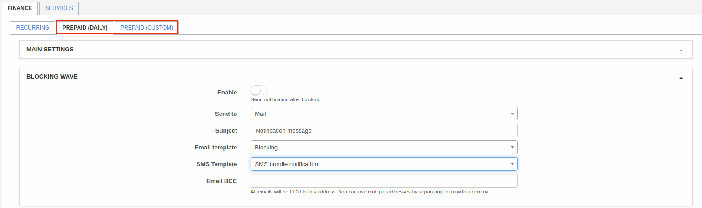

Here can be configured blocking wave notifications:

* **Enable** - enable/disable sending of notification after blocking of customer;
* **Send to** - type of notification: email, SMS or email+SMS;
* **Subject** - subject of notification;
* **Email template** - select template for email notification(can be added under [Config/System/Templates/Email](../../system/templates/templates.md);
* **SMS template** - select template for SMS notification(can be added under [Config/System/Templates/Email](../../system/templates/templates.md));
* **Email BCC** - send copy of notification to this email.

#### First notifications wave
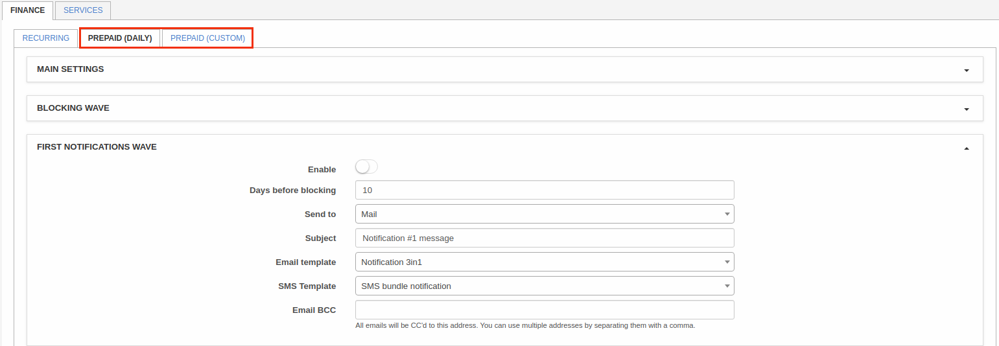

Here can be configured first wave notifications:

* **Enable** - enable/disable sending of notification;
* **Days before blocking** - amount of days before blocking to send this notification;
* **Send to** - type of notification: email, SMS or email+SMS;
* **Subject** - subject of notification;
* **Email template** - select template for email notification(can be added under [Config/System/Templates/Email](../../system/templates/templates.md);
* **SMS template** - select template for SMS notification(can be added under [Config/System/Templates/SMS](../../system/templates/templates.md);
* **Email BCC** - send copy of notification to this email.

#### Second notifications wave
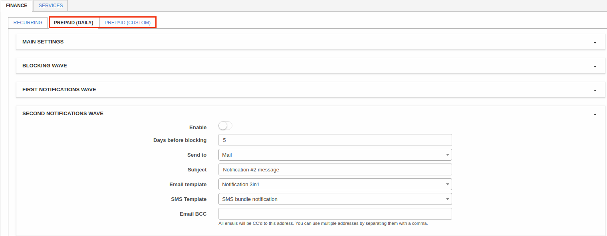

Here can be configured second wave notifications:

* **Enable** - enable/disable sending of notification;
* **Days before blocking** - amount of days before blocking to send this notification;
* **Send to** - type of notification: email, SMS or email+SMS;
* **Subject** - subject of notification;
* **Email template** - select template for email notification(can be added under [Config/System/Templates/Email](../../system/templates/templates.md);
* **SMS template** - select template for SMS notification(can be added under [Config/System/Templates/SMS](../../system/templates/templates.md);
* **Email BCC** - send copy of notification to this email.

#### Third notifications wave
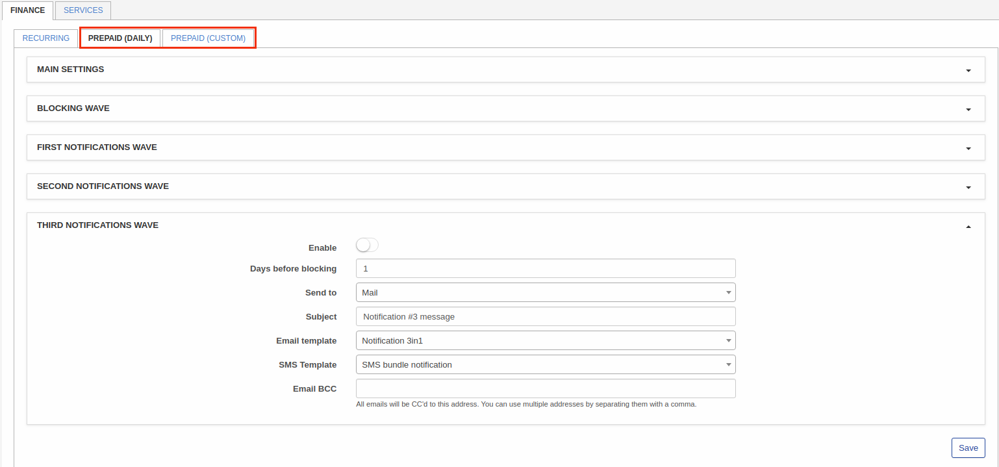

Here can be configured third wave notifications:

* **Enable** - enable/disable sending of notification;
* **Days before blocking** - amount of days before blocking to send this notification;
* **Send to** - type of notification: email, SMS or email+SMS;
* **Subject** - subject of notification;
* **Email template** - select template for email notification(can be added under [Config/System/Templates/Email](../../system/templates/templates.md));
* **SMS template** - select template for SMS notification(can be added under [Config/System/Templates/SMS](../../system/templates/templates.md));
* **Email BCC** - send copy of notification to this email.

So for example some customer will be blocked on 26th of current month, today we have 3th and all 3 waves notifications are enabled. First notification customer will receive 10 days before blocking(16th day of the month), second notification 5 days before blocking(21th day of the month) and third 1 day before blocking(25th day). All notifications will be send at that time what you specified in "Hour of sending".

# **Services**

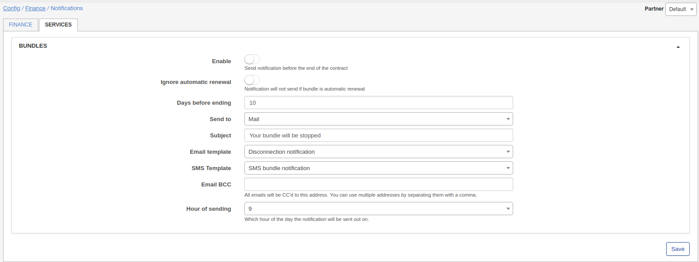

Here can be configured notifications for bundle services.

* **Enable** - enable/disable sending of notification;
* **Ignore automatic renewal** - Notification will not send if bundle is automatic renewal;
* **Days before ending** - amount of days before end of bundle contract;
* **Send to** - type of notification: email, SMS or email+SMS;
* **Subject** - subject of notification;
* **Email template** - select template for email notification(can be added under [Config/System/Templates/Email](../../system/templates/templates.md));
* **SMS template** - select template for SMS notification(can be added under [Config/System/Templates/SMS](../../system/templates/templates.md));
* **Email BCC** - send copy of notification to this email;
* **Hour of sending** - select hour to send notifications.
