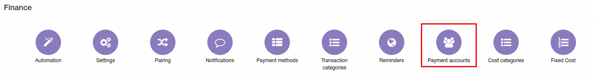
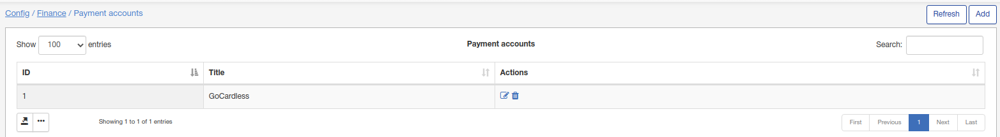
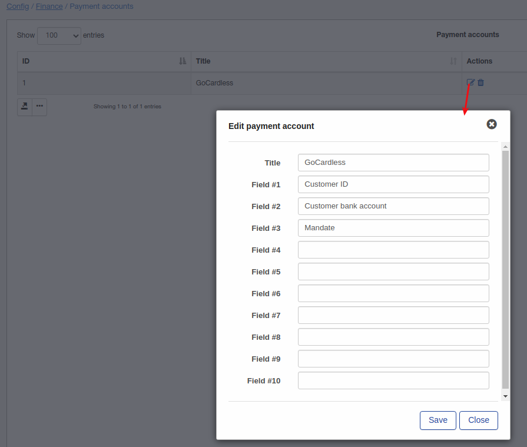
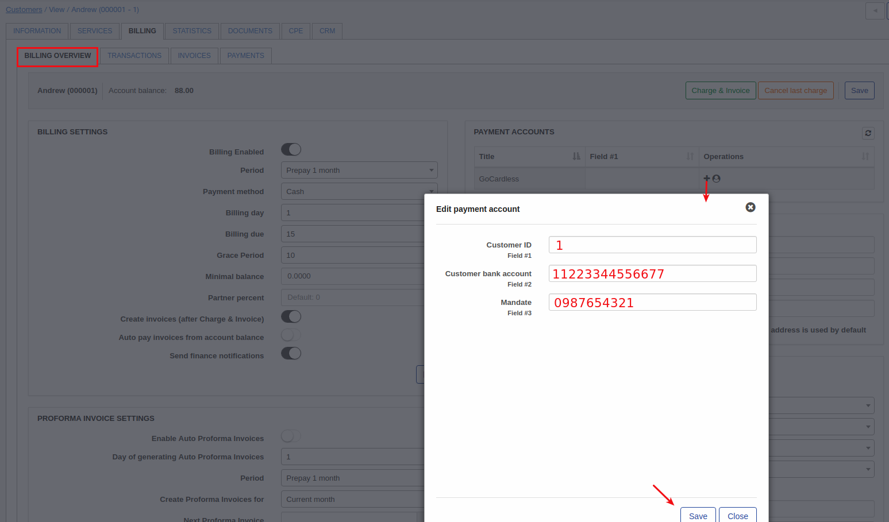

Payment accounts
====

To set up sending Payment accounts go to `Config → Finance → Payment accounts`.

Here will be listed all payment accounts what customers are able to use. For example i have installed [GoCardless addon](../../payment_systems/gocardless/gocardless.md) and my customers will be able to pay their invoices with GoCardless directly from Splynx, so new payment account will be created automatically. Please do not change automatically added payment accounts.

So after GoCardless addon installation new payment account was created, let's check what fields this account contains:

If you will add payment account from admin panel you will have to specify all these fields for customer:

