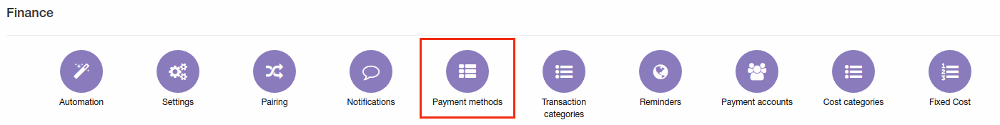
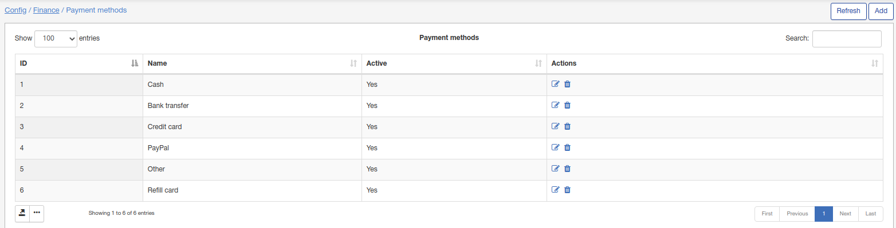
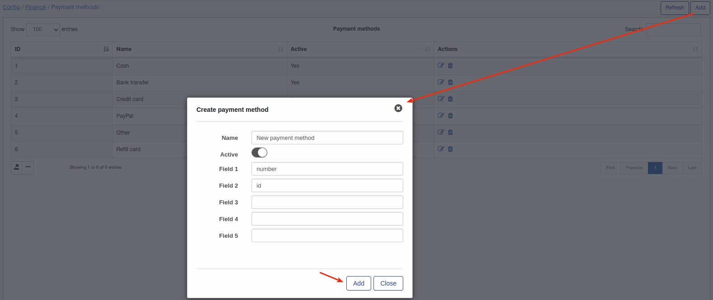
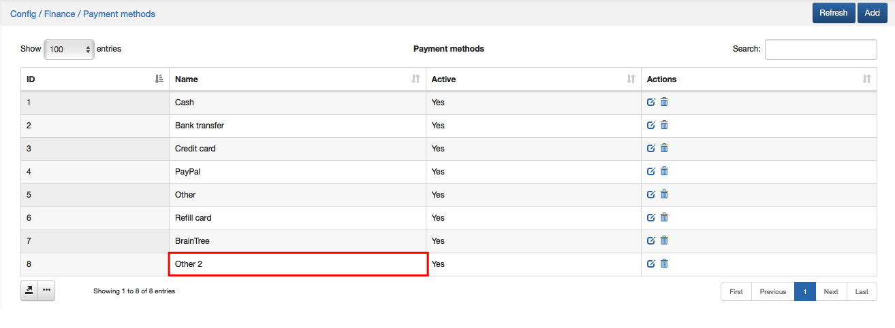
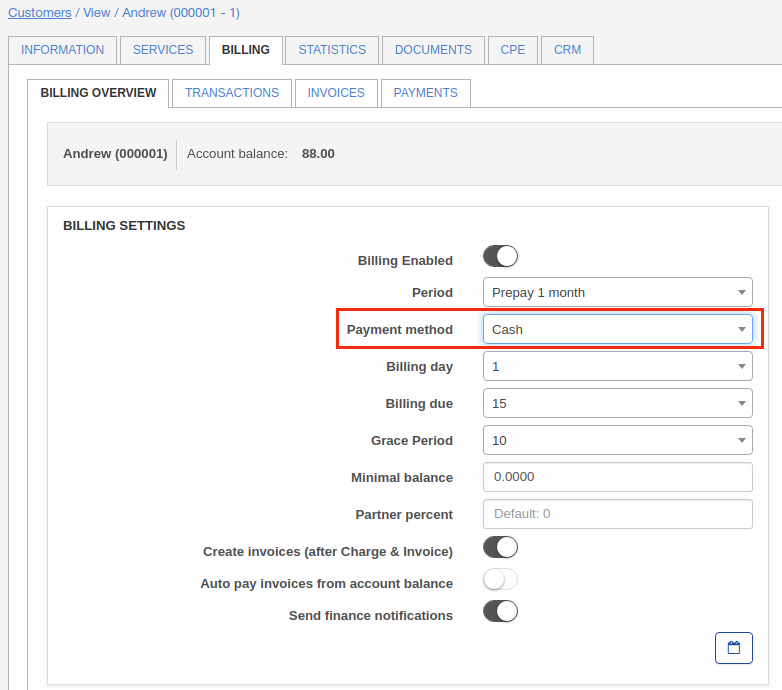

Payment methods
=============

To check your Payment Methods click on `Config → Finance → Payment Methods`.

Payment methods listed here are set by default. When you install a new payment module(ex. SageOne, Netcash, Stripe etc.) it will automatically appear here.  

You can add a new Payment method manually by clicking *Add* icon  at the top-right corner of the screen.  The window will pop-up where you will write the name of the Payment Method and enable the option *"Active"*.

After adding a new Payment method it will appear in each customer Billing settings in `Customers → View →Billing →Billing overview`.

It is possible to Edit (Rename) or Delete Payment methods by clicking on icons in Actions section of the table.
