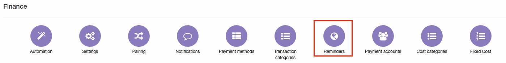
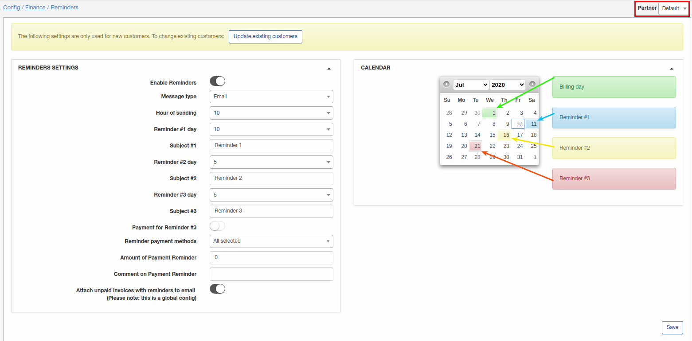
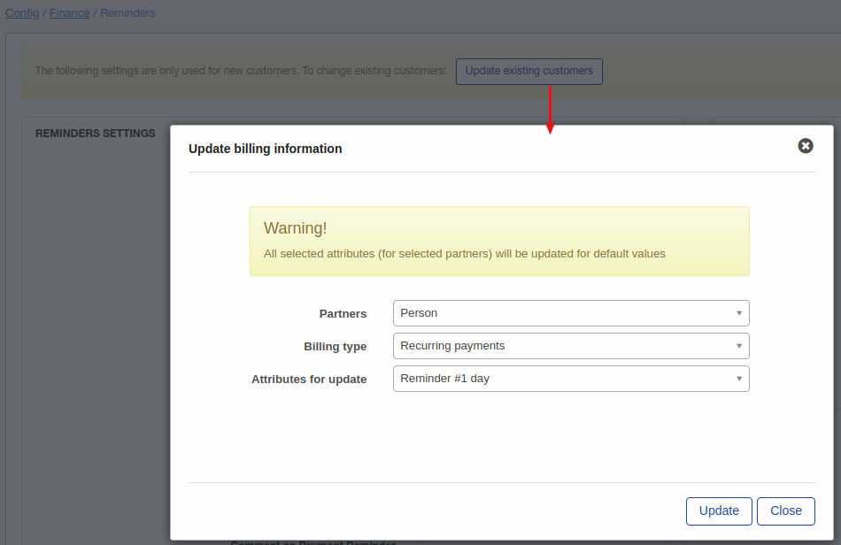
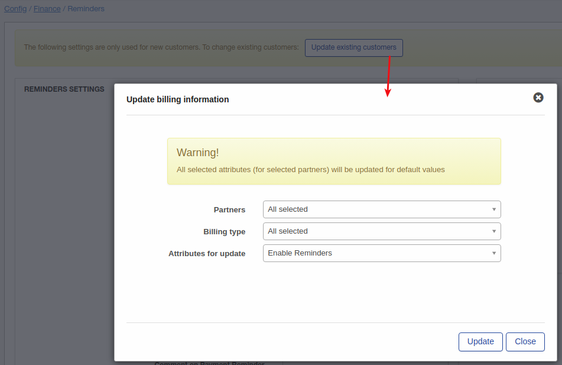

Reminders
=============

Payment Reminders are the same as Prepaid Notifications. The only difference is that Payment Reminders are used in Recurring billing and Prepaid Notifications in Prepaid Billing. Payment reminder is an email, SMS or email+SMS prompt sent to customers to make them pay for their due or overdue invoice.

To set up sending Payment Reminders go to `Config → Finance → Reminders`.

You can choose Partner before setting Reminders at the top-right corner of the screen:

The following Reminders settings can be configured here:

* **Enable Reminders** - enable or disable automatic reminders sending;
* **Message type** - choose message type for sending reminders: Mail, SMS, Mail+SMS. Information about configuring SMS you can find in our tutorial page - SMS config;
* **Hour of sending** - choose time for sending reminder;
* **Reminder #1 day** - select in how many days you'd like the First Reminder to be sent;
* **Subject #1** - type a subject for the 1st Reminder;
* **Reminder #2 day** - select in how many days you'd like the Second Reminder to be sent;
* **Subject #2** - type a subject for 2dReminder;
* **Reminder #3 day** - select in how many days you'd like the Third Reminder to be sent;
* **Subject #3** - type a subject for 3d Reminder;
* **Payment for reminder #3** - we do not recommend to use this option, please keep disabled;
* **Reminder payment methods** - select payment methods on which to send notifications;
* **Amount on payment reminder** - select amount on payment reminder;
* **Comment on payment reminder** - specify some comment on payment reminder;
* **Attach unpaid invoices with reminders to email** - choose this option to attach unpaid invoices to email.

All 3 dates selected for reminders  sending will be displayed in the "Calendar" next to "Reminders settings". In our example we chose 10 days for the Reminder #1, 5 days for the Reminder #2 and 5 days for the Reminder #3. That means reminders will be sent on 11th, 16th and 21th of of month accordingly.

This settings are global and to update some customers with these settings you can use "Update existing customers" button. For example I'd like to update day for reminder #1, for customers with partner "Person" and recurring billing type, update will look like:

Another example is update of "Enable reminders" option for all Splynx customers. Let's imagine that it was disabled for all customers, we enabled it on config and next step is update of customers:

