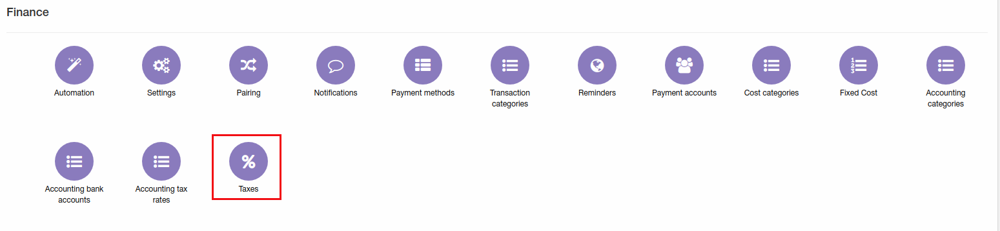
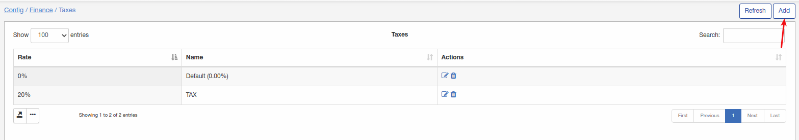
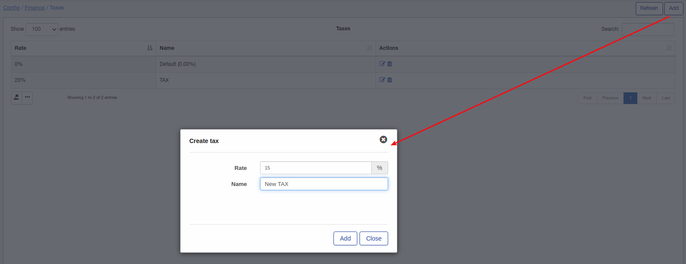
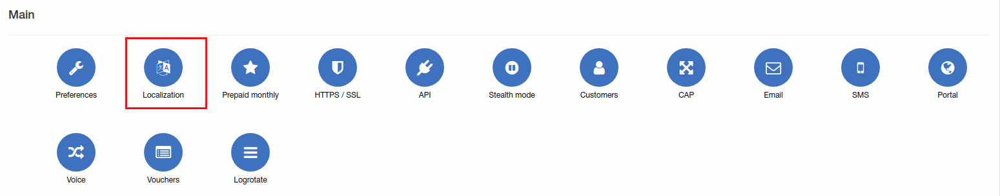
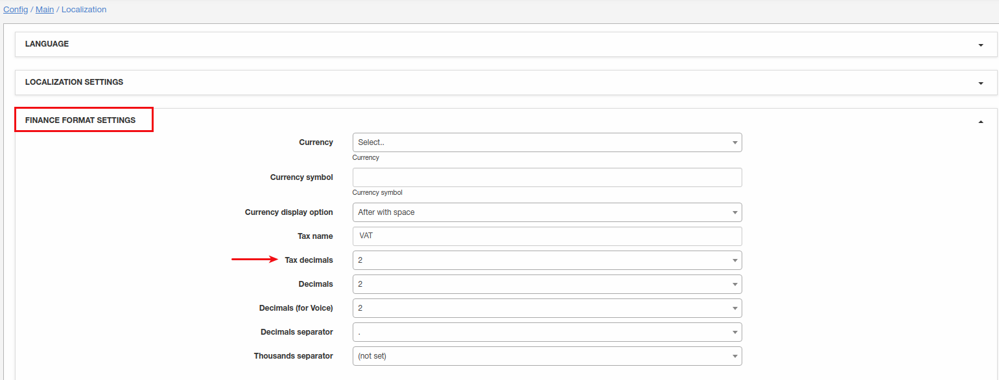
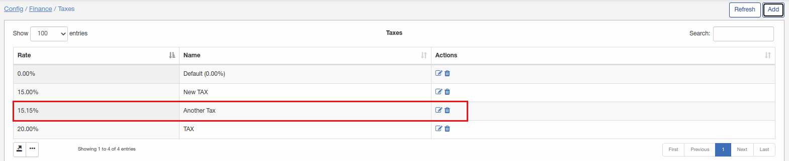

Taxes
=============

To add/edit/remove tax rates in Splynx click on `Config → Finance → Taxes`.

To add new tax rate click on "Add" button:

To add tax rate with decimals navigate to `Config -> Main -> Localization` and select amount of decimals for tax rates:

Once completed you will be able to add tax rates with decimals:

