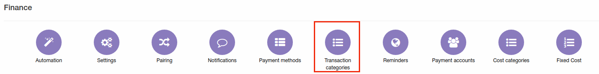
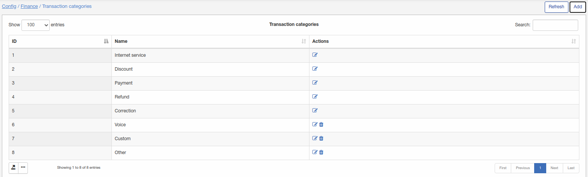
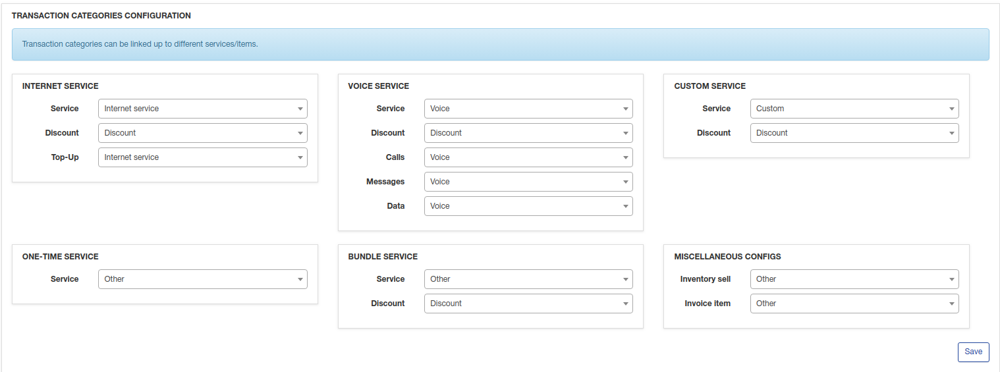
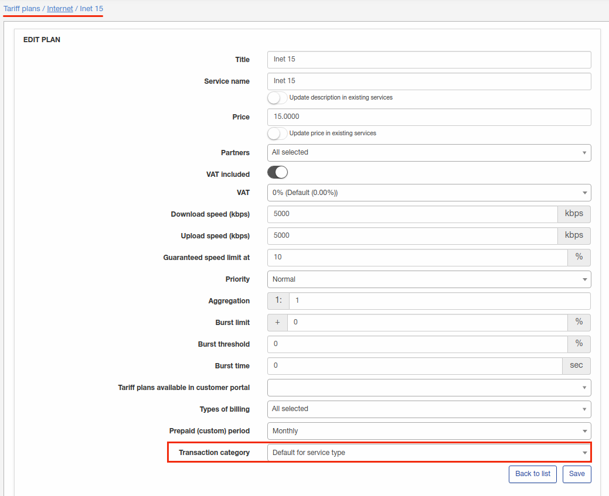
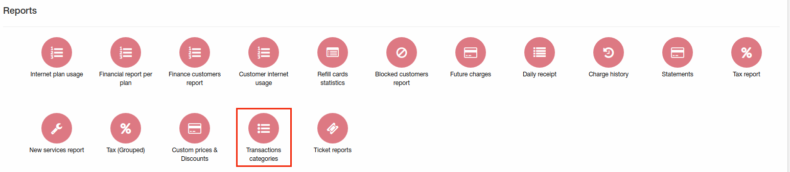
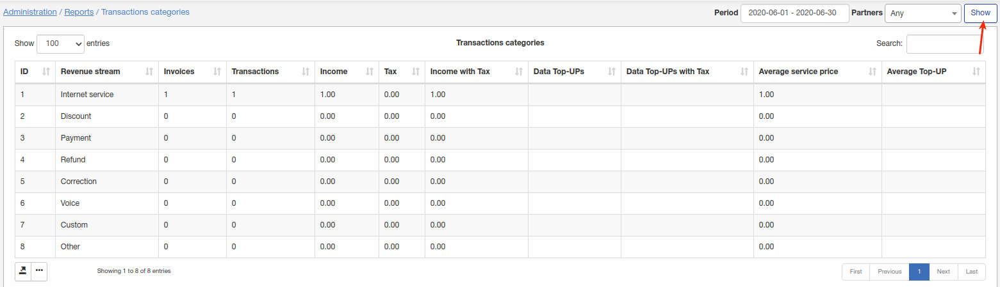
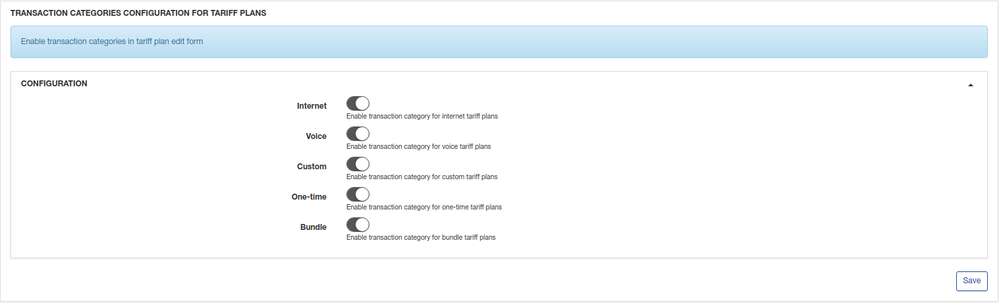
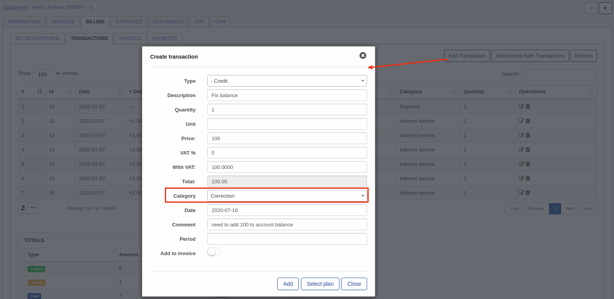

Transaction categories
=============

To check all Transaction categories in Splynx click on `Config → Finance → Transaction categories`.

#### Transaction categories

Transaction categories listed here are set by default:

I've added categories 6,7,8 and they can be removed. Default categories 1-5 can be only edited.

You can add a new Transaction category manually by clicking on Add icon at the top-right corner of the screen, export or select visible fields by click on left bottom corner on a screenshot.

#### Transaction categories configuration

Here can be configured mapping settings between services(internet, voice, custom, bundle or one-time), inventory and transaction categories. If all services have to be configured with this mapping you should select transaction category = "default for service type" under each tariff:

Then you will be able to track amount of money for each transaction category in Administration/Reports/Transaction categories report:

#### Transaction categories configuration for tariff plans

Here can be enabled mapping configuration for tariff plans if something was configured in a previous step in "Transaction categories configuration".

If these items enabled, tariffs will use configuration for transaction categories from this menu, if disabled - directly from tariff plan settings.

Now with created and configured transaction categories we can use them in billing:

 
