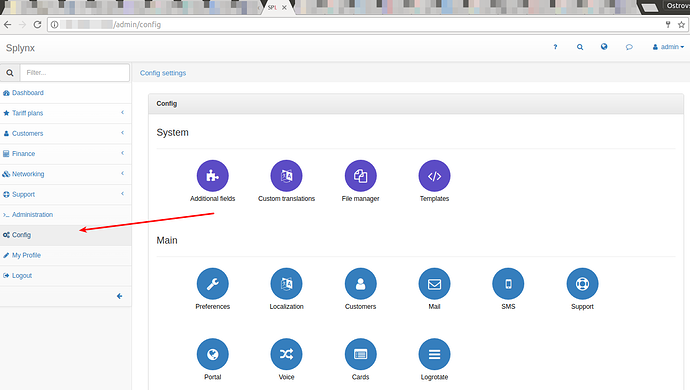
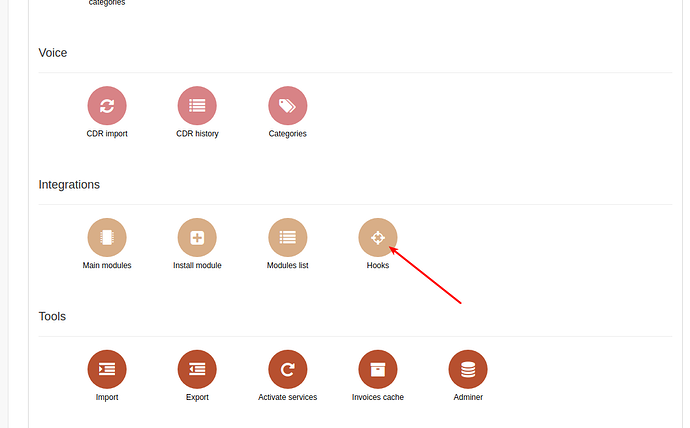
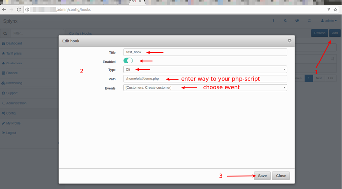
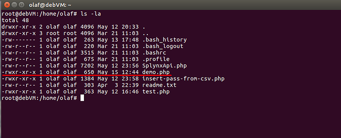
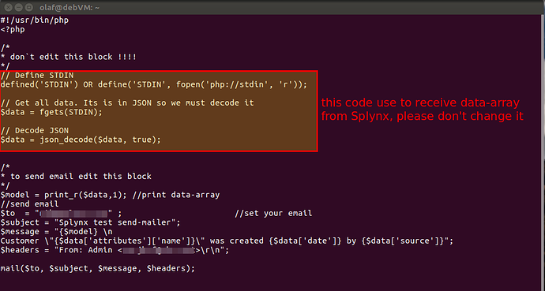

Hooks
=============


### Cli

Hook is a method of augmenting or altering the behavior of a page or application with custom callbacks. These callbacks may be maintained, modified, and managed by third-party users and developers who may not necessarily be affiliated with the originating application (Splynx). For example, we show how to use hook and send email.

To send notification on some action from Splynx you can use hooks (`Config → Integrations → Hooks`).

**Attention!!!** beginning from Splynx v.1.3





First of all, you have to know how does it work. "Hook" is listening to event you choose and if it done, it runs script you wrote in "path"-field. By the way, hook can send data-array that call this event. Let's create a new hook:



Before creating hook you have to put php-script in home-folder and give permissions 755:
```
chmod 755 script-file.php
```


And now, simple script - how to send email notification. Of course, you can use your own script that do something else.



```PHP
#!/usr/bin/php

<?php

/* * don`t edit this block !!!! */
// Define STDIN
defined('STDIN') OR define('STDIN', fopen('php://stdin', 'r'));

// Get all data. Its is in JSON so we must decode it
$data = fgets(STDIN);

// Decode JSON
$data = json_decode($data, true);


/* * to send email edit this block */
$model = print_r($data,1); //print data-array
//send email
$to  = "mail_box_to@semple.com" ;                       //set your email
$subject = "Splynx test send-mailer";
$message = "{$model} \n Customer \"{$data['attributes']['name']}\" was created {$data['date']} by {$data['source']}";
$headers = "From: Admin <mail_box_from@semple.com>\r\n";

mail($to, $subject, $message, $headers);
```

So, when a new customer will be created, we will receive an email:


Attention!!!
To send email we used mail-server - Sendmail, and by default it send email only in local-network. So, if you want to send an email to "the world", you have to reconfigure sendmail.
Run this command
```
sudo dpkg-reconfigure exim4-config
```
and use this manual - https://www.digitalocean.com/community/tutorials/how-to-install-the-send-only-mail-server-exim-on-ubuntu-12-04

---
### Custom named queue
Attention!!! beginning from Splynx v 2.0
Starting version 2.0 you can use custom named queue. To do this select hook type "Queue" and enter your queue name.


Example PHP script (based on [BunnyPHP](https://github.com/jakubkulhan/bunny)) to work with messages from custom named queue:
```
<?php

use Bunny\Channel;
use Bunny\Async\Client;
use Bunny\Message;
use React\EventLoop\Factory;

require '../vendor/autoload.php';

$connectOptions = [
 'host' => '127.0.0.1',
 'port' => 5672,
 'vhost' => '/',
 'user' => 'guest',
 'password' => 'guest',
];

$loop = Factory::create();
(new Client($loop))->connect()->then(function (Client $client) {
 return $client->channel();
})->then(function (Channel $channel) {
 return $channel->queueDeclare('hooks2', false, true, false, false)->then(function () use ($channel) {
 return $channel;
 });
})->then(function (Channel $channel) {
 echo ' [*] Waiting for messages. To exit press CTRL+C', "\n";
 $channel->consume(
 function (Message $message, Channel $channel, Client $client) {
 echo " [x] Received ", $message->content, "\n";
 },
 'hooks2'
 );
});
$loop->run();
```
**Attention**: you must use same parameters when declaring queue as in example because this parameters use Splynx when adding message to RabbitMQ!

You will get string like this: `{"type":"","call":"","data":{"source":"admin","model":"models\\admin\\administration\\Locations","action":"get_list","date":"2017-09-20","time":"14:38:12","administrator_id":"1","customer_id":null,"result":"success","attributes":{"id":null,"name":null},"attributes_additional":[],"changed_attributes":null,"extra":null,"errors":null,"ip":"192.168.77.233"}}`

Use function `json_decode` to decode it and use received data for your purposes.

---
### Webhooks

Webhooks allow you to build external Apps which subscribe to certain events on Splynx system. When one of those events is triggered, we'll send a HTTP POST payload to the webhook's configured URL.

#### Events

When configuring a webhook, you can choose which events you would like to receive payloads for.

#### Handle webhook events

For validate event you need to check header `X-Splynx-Signature` which contains the event signature. Signature is generated from response body string using the `sha1` hash function and the secret as the `HMAC key`.

#### Example PHP webhook handler

```php
<?php

define('REQUEST_TYPE_PING', 'ping');
define('REQUEST_TYPE_EVENT', 'event');
define('CONTENT_TYPE_JSON', 'application/json');
define('CONTENT_TYPE_FORM_URLENCODED', 'application/x-www-form-urlencoded');

$headers = getHeaders();
$input = file_get_contents('php://input');
$contentType = isset($headers['Content-Type']) ? $headers['Content-Type'] : '';

// Parse payload data
if ($contentType == CONTENT_TYPE_JSON) {
    $postData = json_decode($input, true);
} else {
    parse_str($input, $postData);
}

$requestType = isset($postData['type']) ? $postData['type'] : null;

// Process ping request
if ($requestType === REQUEST_TYPE_PING) {
    http_response_code(200);
    exit('ok');
}

// Validate request type
if ($requestType !== REQUEST_TYPE_EVENT) {
    http_response_code(400);
    exit('Invalid request type!');
}

// Calculate signature from payload and secret
$secret = 'your secret';
$calculatedSignature = hash_hmac('sha1', $input, $secret);

// Signature from HTTP request header
$inputSignature = isset($headers['X-Splynx-Signature']) ? $headers['X-Splynx-Signature'] : '';

// Compare signatures
if (hash_equals($inputSignature, $calculatedSignature)) {
    http_response_code(200);
    echo 'ok';

    // Success, you can process event as you want
    // ...
} else {
    // Invalid signature, return from code
    http_response_code(401);
    exit('Unauthorized!');
}

// Specific PHP function for safe getting HTTP headers
function getHeaders()
{
    $headers = [];

    if (function_exists('getallheaders')) {
        $headers = getallheaders();
    } elseif (function_exists('http_get_request_headers')) {
        $headers = http_get_request_headers();
    } else {
        foreach ($_SERVER as $name => $value) {
            if (strncmp($name, 'HTTP_', 5) === 0) {
                $name = str_replace(' ', '-', ucwords(strtolower(str_replace('_', ' ', substr($name, 5)))));
                $headers[$name] = $value;
            }
        }
    }

    return $headers;
}
```
