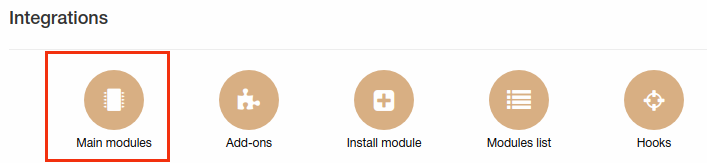
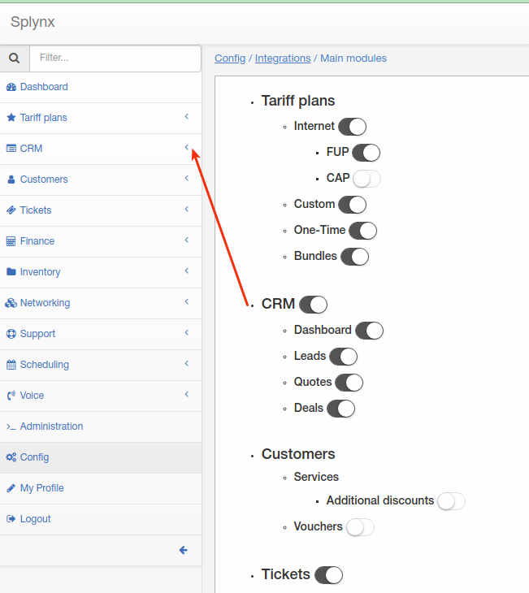
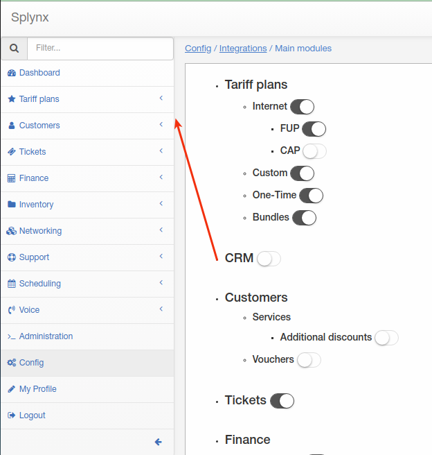

Main modules
=============
 `Configuration → Integrations → Main Modules`.

Here can be enabled/disable some Splynx modules what are not used or not needed.

### Be very attentive with this settings

Just enable or disable module what is needed.

For example: now i have enabled CRM module

It's visible on left-side menu. I won't use CRM in my system so I can disable it:

As you can see CRM disappeared from my left-side menu.
