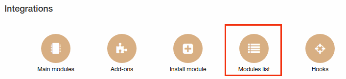
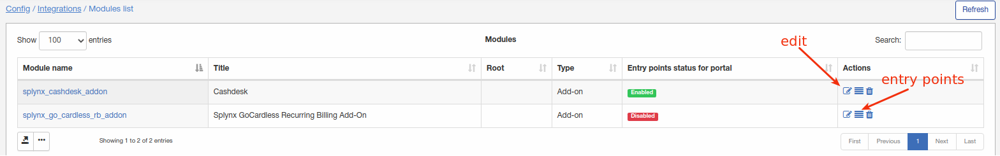
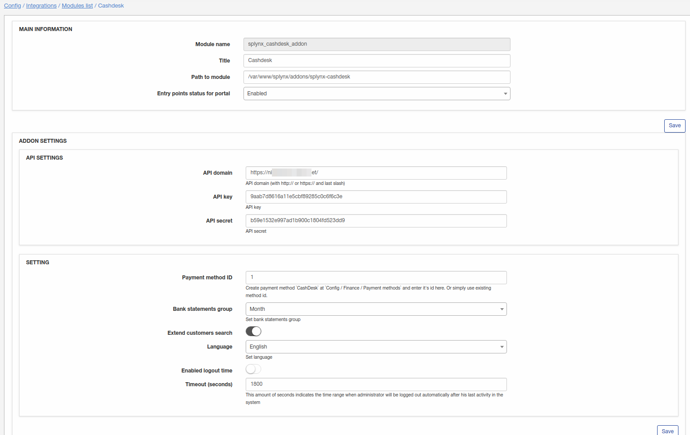
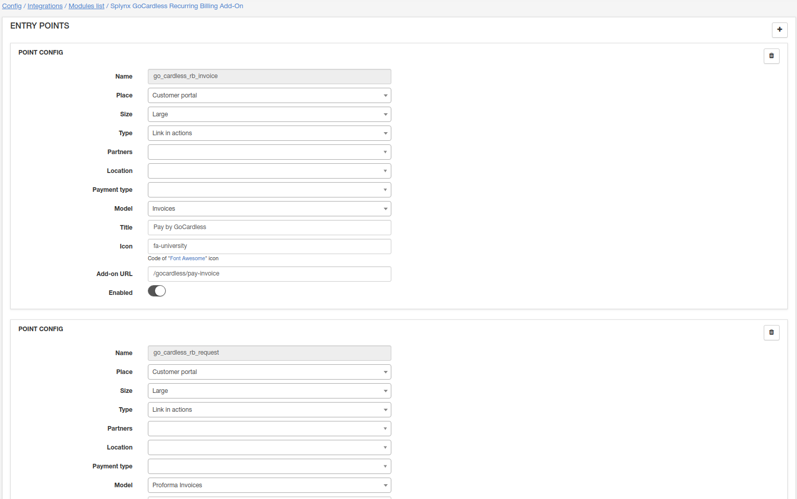
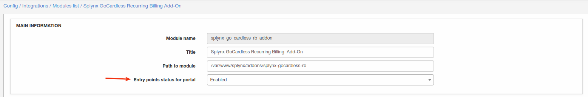
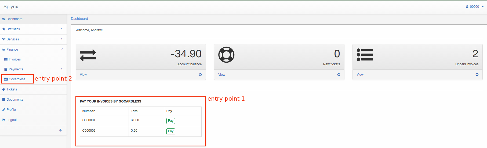
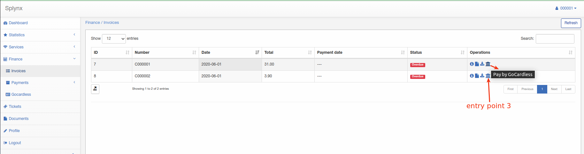

Modules list
=====

Here you can configure addons what you installed before.

For example I have installed Cashdesk and GoCardless-RB addons.

To configure these add-ons navigate to Config/Modules list:

Here module can be edited, removed and entry points can be configured(if an addon has entry points).

Let's edit Cashdesk addon:

Please do not change **API SETTINGS** if you are not sure what it is. After making changes don't forget to click "Save".

Now i want to enable entry points for customer's portal. Let's back to modules list and click on "Entry points":

Our recommendation is not to change any configurations here except of enable/disable entry point. If you are going to use entry points on portal make sure that in module configuration this option is enabled:

Now when entry points for portal are enabled let's see how it looks:

Customer can pay invoice from portal directly.
