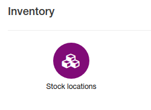
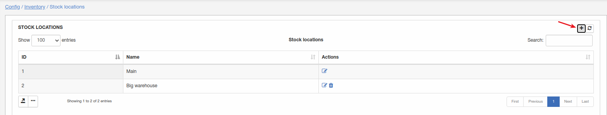
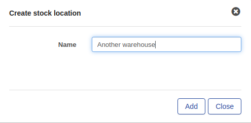
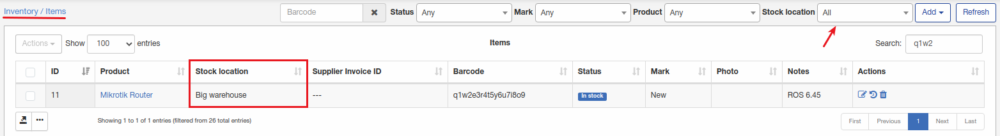

Stock locations
=============
We developed stock locations to add your warehouses where equipment(inventory items) are stored.

**_Config -> Inventory -> Stock locations_**

It's a simple list of available warehouses.

"Main" it's a default one, and it can't be deleted, just renamed.

To add a new stock location click on "+" and enter location name:

Stock locations are using to point where is stored inventory item.

Navigate to [Inventory -> items](../../../inventory/inventory.md):

Stock location can be selected for each item in inventory. Also whole list of items can be sorted by stock location, just select needed location in "Stock location" drop-down list.
