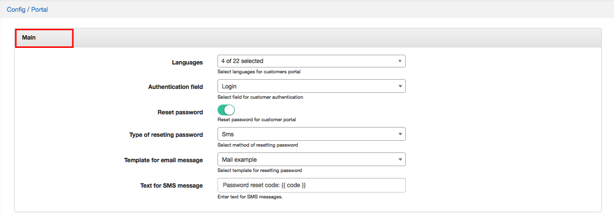
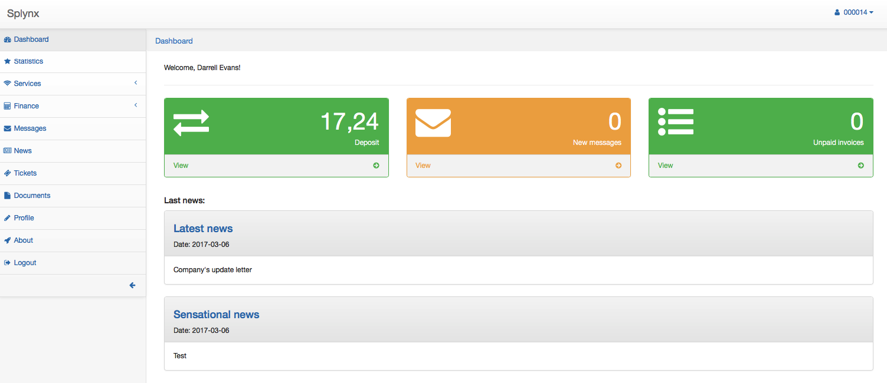
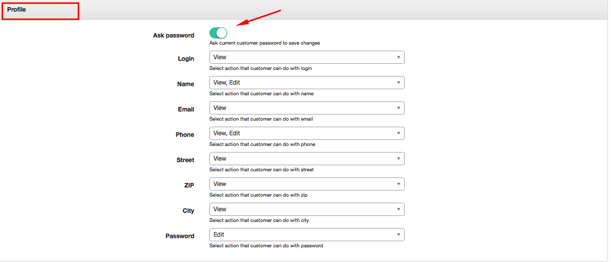
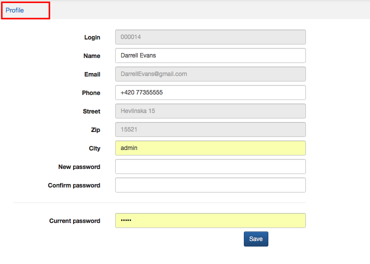
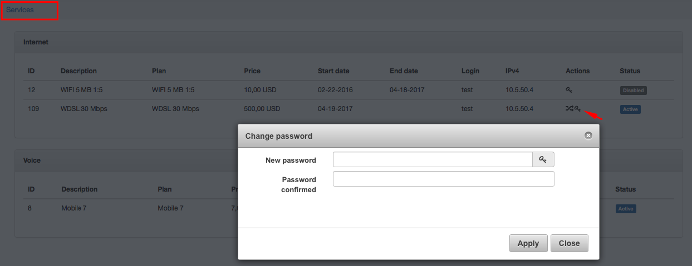
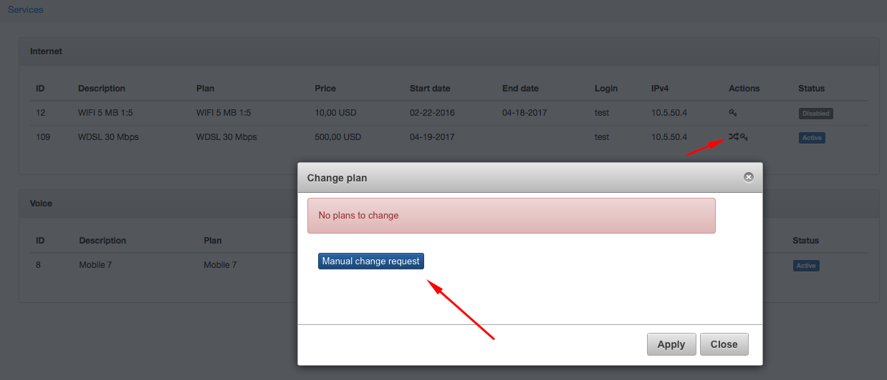
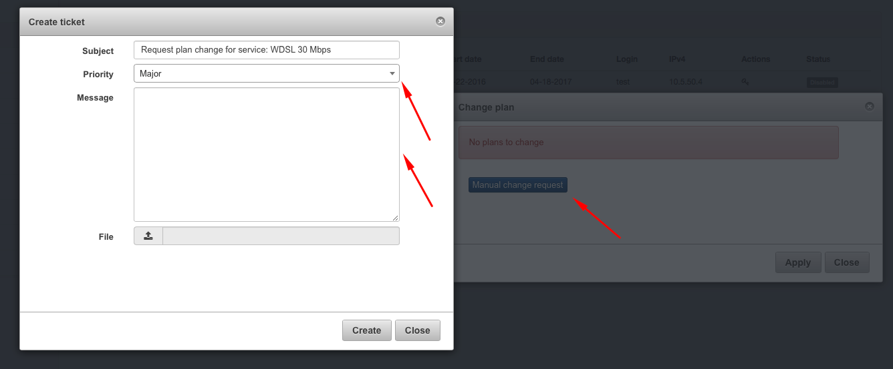
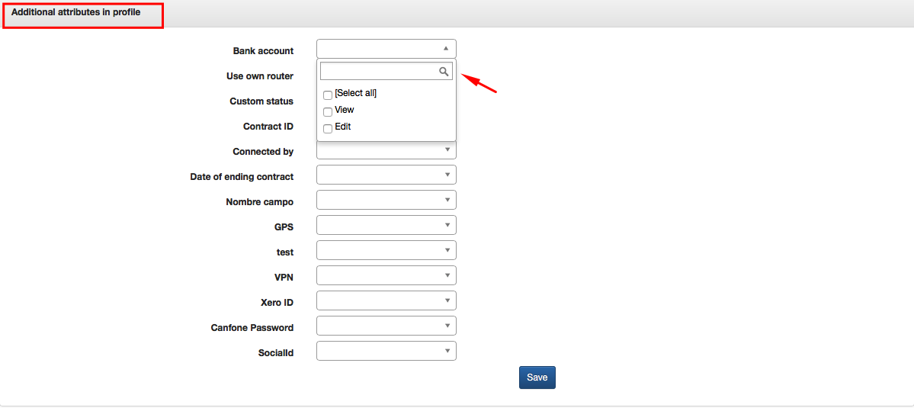
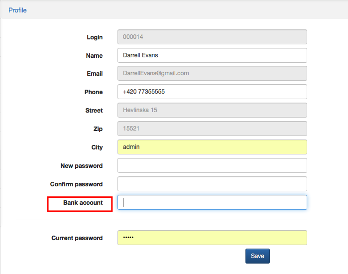

Portal
======

To configure Customer portal click on `Config → Main → Portal`. Portal configuration includes following parts:

### Main
Configuration of customer's authentication, password, ways of resetting password and languages in Customer Portal.

In main part is possible to configure:
* **Languages** - here you can select languages for your Customer Portal
* **Authentication field** - here you can select a way of customer's authentication such as  Email or Login
* **Reset password** - here you can enable or disable option of resetting password for Customer Portal
* **Type of resetting password** - select the method of resetting password via SMS or Email
* **Template for email message** - you can choose a template of email for resetting password
* **Text for SMS message** - here you can enter the text for SMS messages.

### Menu
Configuration of main modules to be displayed in Customer portal. You can choose from *Statistics, Services, Finance, Messages, Tickets, Documents, Profile, About, News*.

### Dashboard
Configuration of items to be shown on a Customer Dashboard. Here you can enable option Show Portal News and the last three portal news will be shown on a customer dashboard.

You can select following items to be displayed on Customer Dashboard: *Balance, New Tickets, New Messages, Unpaid Invoices, Unpaid Proforma Invoices*.

Below is an example of Customer account in portal with all items selected to be displayed in Side menu and Balance, New Messages, Unpaid Invoices selected to be displayed on a Dashboard.

### Profile

Configuration of customer profile which will give customer option to view his contact information or to edit it. To be able to edit and save changes customer can be asked for his current password. You should enable an option *"Ask Password"* for that.

Profile information includes:

* Login
* Name
* Email
* Phone
* Street
* ZIP
* City
* Password

For each of these items you can choose an action customer can do with it: View or Edit.

Items you've selected as just to be viewed in Customer Account will have dimmed fields and items which customer can change will be with white fields.

### Statistics

You can enable here following features:
* **Show graph** - enabled option will show a Bandwidth usage graph in Customer portal
* **Show FUP statistics** - enabled option will show details of FUP statistics
* **Show current limits** - enabled option will show current speed limits information
* **Show hard limits** - enabled option will show hard limits information
* **Show sessions statistics** - enabled option will show details of session statistics

### Services

Configuration of services and service fields to be displayed in Customer portal. Here you can also enable an option showing how many days left until the end of the service.

For each type of service you can select fields to display:

* **Internet Service** - *Customer ID, Price, Login, Radius IPv6, Change plan, Description, Start date, IPv4, Type of Connection, Password changed, Plan, End date, Test, Stop/Active service, Status*.

  

* **Voice Service** - *Customer ID, Price, Phone, Status, Description, Start date, Stop/Active service, Plan, End date, Change plan*.

  

* **Custom Service** - *ID, Price, New, Stop/active service, Description, Start date, USD/year, Change plane, Plan, End date, TEST field, Status*.

----
##### Some fields need to be explained more detailed:

* **Password changed** - enabled option will let customer change password for his service. Customer will be able to change password by clicking on icon <icon class="image-icon"></icon> in *Actions section* of the table in Services.

  

* **Change plan** - enabled option will let customer to apply for a plan changing via Customer portal by sending a request to technical support. When option is enabled customer will see an icon <icon class="image-icon"></icon> in Actions in Services. By clicking on that icon a window "Change plan" will appear where customer will choose an option *Manual change request*.

The window "Create ticket" will appear where customer will choose Priority of the ticket (Minor, Major, Critical) and write a short message. Customer can also upload a file by clicking on Upload icon <icon class="image-icon"></icon> below the text message.

### Finance

Configuration of financial items to be displayed in Customer portal such as: Invoices, Payments, Proforma Invoices and Transactions, and Payment methods available for Customer, for example, Refill cards.

### Additional attributes in profile

Configuration of additional attributes to be seen in Customer portal, for example, GPS, Contract ID, Bank Account etc. For each of these items you can choose an action customer can do with it: View or Edit. Items you've selected just to be viewed in Customer Account will have dimmed fields and items customer can change will be with white fields.

For example, you'd like to add a Customer's bank account as additional attribute to the Customer portal and you'd also like to give customer the right to edit his account number. In that case, as soon as you will select options View and Edit in Bank account field in Configuration, customer will be able to see that attribute in his Profile in Customer portal and change it.

Information about configuring Additional fields in Splynx can be found here - [Additional fields](configuration/system/additional_fields/additional_fields.md).
