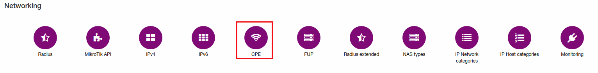
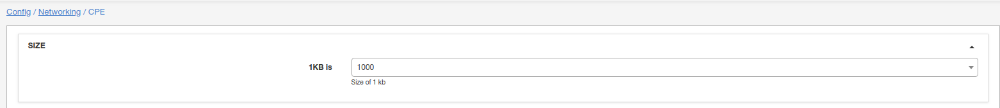
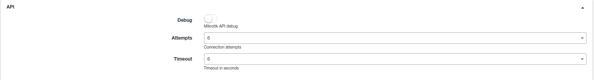
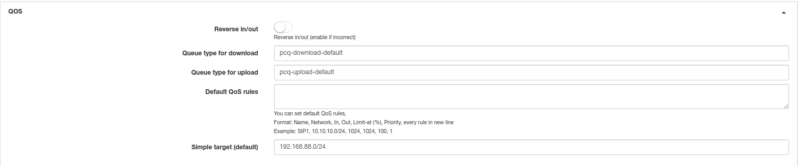
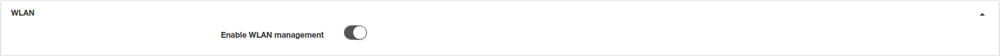
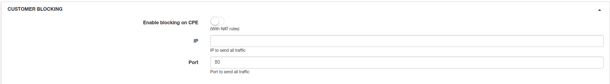
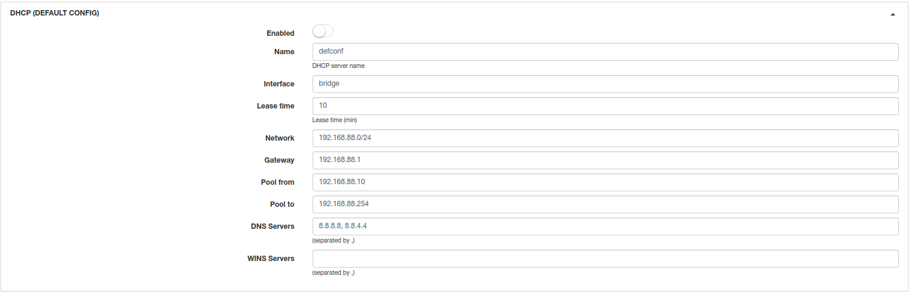

CPE (Customer Premises Equipment) configuration
===

To configure some features of CPE click on `Config → Networking → CPE`:

Here can be configured next parameters:

### Size

* **1KB is** - specify amount of bytes for 1KB for CPE traffic accounting(1000 or 1024 bytes).

### API

* **Debug** - enable mikrotik debug log(for debug/test purposes);

* **Attempts** - select connection attempts(1-10);

* **Timeout** - select timeout in seconds.

### QoS

* **Reverse in/out** -  Enable if you want to change upload by download and vice versa;

* **Queue type for download** - Set queue download type;

* **Queue type for upload** - Set queue upload type.

* **Default QoS rules** - some QoS rules can be specified here in format 1 rule = 1 line;

* **Simple target (default)** - select network.

### WLAN

* **Enable WLAN management** - enable/disable WLAN management.

### Customer blocking

* **Enable blocking on CPE** - enable/disable blocking on CPE with NAT rules;

* **IP** - specify IP to send all traffic;

* **Port** - specify port to send all traffic.

### DHCP (default configuration)

* **Enable** - enable/disable using of this default config on CPE;

* **Name** - specify name of DHCP server;

* **Interface** - type of interface;

* **Lease time** - lease time in minutes;

* **Network** - specify network;

* **Gateway** - specify gateway;

* **Pool from** - use IPs start from this IP;

* **Pool to** - last IP to be used from pool;

* **DNS servers** - specify DNS servers separated by comma;

* **WINS servers** - specify WINS servers separated by comma.

**And don't forget to save settings after change.**
