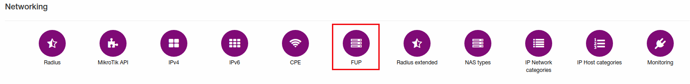
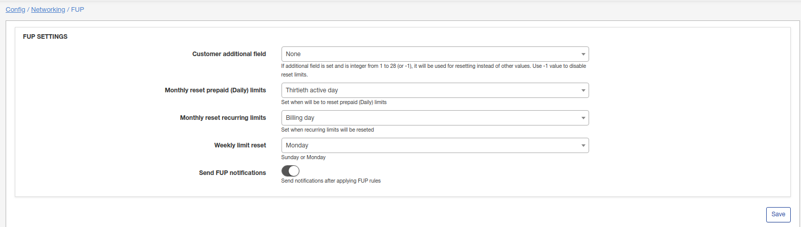

FUP
====

FUP settings are configurable in `Config → Networking → FUP`:

There are following FUP settings here to configure:

* **Customer additional field** - You can select customer additional field here. If additional field is set and is integer from 1 to 28 (or -1), it will be used for resetting instead of other values. Use -1 value to disable reset limits.

* **Monthly reset prepaid limits** - Set the day to reset prepaid limits;

* **Monthly reset recurring limits** - Set the day to reset recurring limits;

* **Weekly limit reset** - Choose Sunday or Monday to reset limits weekly;

* **Send FUP notifications** - enable/disable sending of FUP notifications after applying FUP rules.
