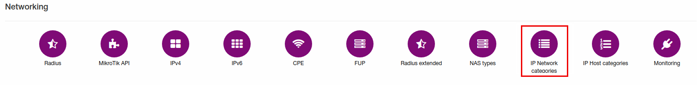
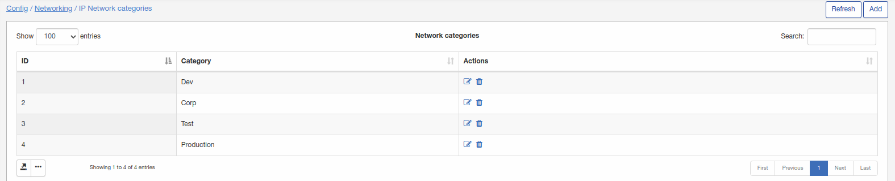
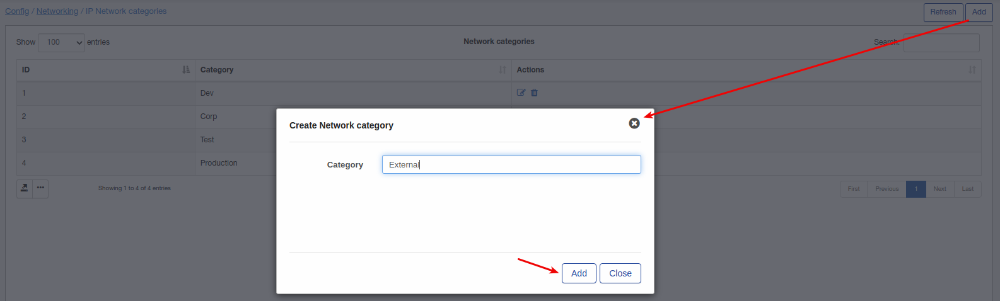

IP Network categories
=====================

You can edit or add new Network categories by clicking on `Config → Networking → IP Network Categories`.

Here IP network categories can be added/removed/edited.

To add new category click on "Add" button:

