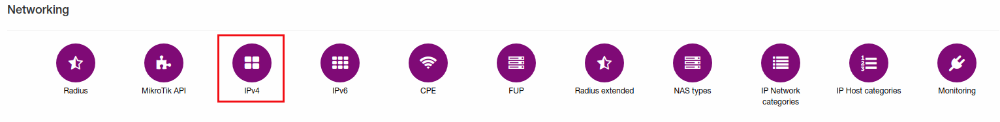
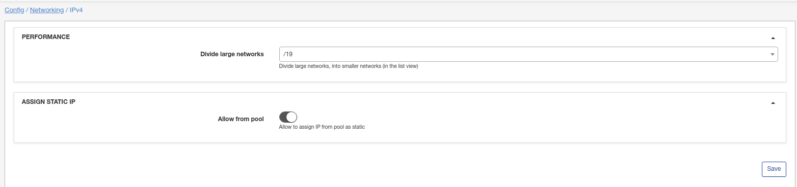

IPv4
====

To configure some features of IPv4 click on `Config → Networking → IPv4`:

There are two options here:

* **Performance** - If you need to work with big networks, divide it for smaller (for list).
* **Assign static IP** -  Enable that option to allow assigning IP from pool as static.
