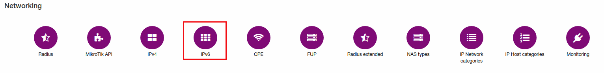
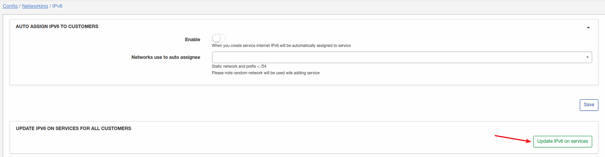

IPv6
====

To configure some features of IPv6 click on `Config → Networking → IPv6`:

There are two options here:

* **Auto assign IPv6 to customers**
  * **Enable** - enable/disable auto assign of IPv6 after service created;
  * **Networks use to auto assignee** - select IPv6 networks for auto assignment.

* **Update IPv6 on services for all customers** -  click on this button to update IPv6 addresses for internet services.
