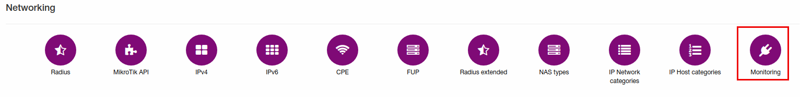
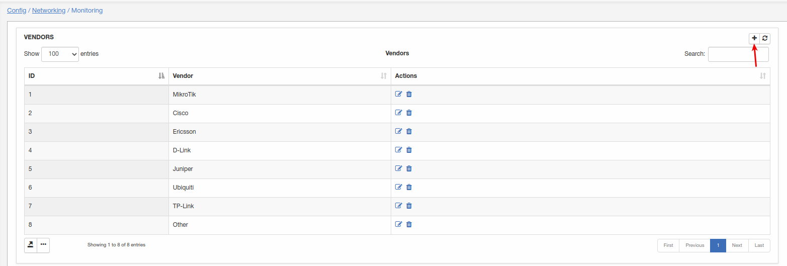
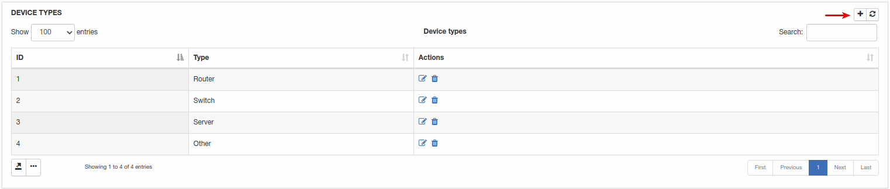
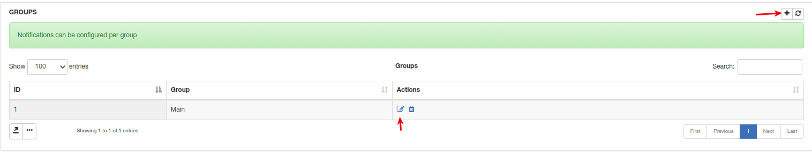
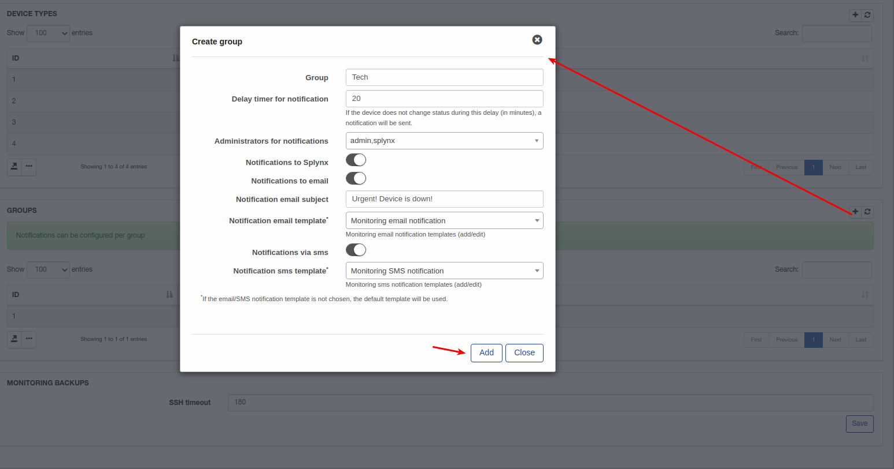
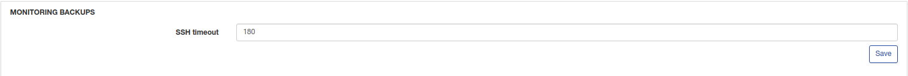

Monitoring configuration
=================

To configure Monitoring click on `Config → Networking → Monitoring`.

### Vendors

Here we have a list of vendors. You can add/edit or remove vendors using buttons, to add new vendor click on "+" button at the right top corner.

### Device types

Here we have a list of device types. To add new device type click on "+" button.

### Groups

Here we have a list of groups for monitoring notifications. To edit existed group click on edit button and to add new group click on "+" button:

Let's add group "Tech" with next parameters:

* **Delay time for notification** - If the device does not change status during this delay (in minutes), a notification will be sent;

* **Administrators for notifications** - select administrators for this group who will receive notification;

* **Notifications to Splynx** - enable/disable notification on Splynx admin web page when admin is online;

* **Notification to email** - send notifications to email;

* **Notification email template** - select template of email notification;

* **Notification via SMS** - send SMS notifications;

* **Notification SMS template** - select template of SMS notification;

### Monitoring backups

Select SSH timeout for monitoring backups.
