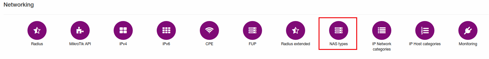
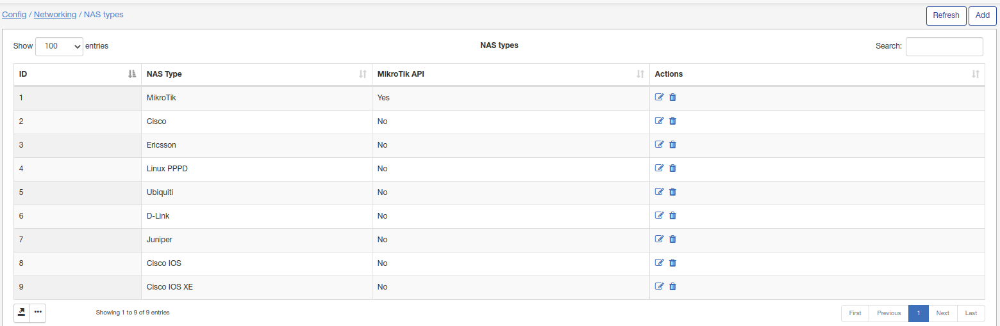
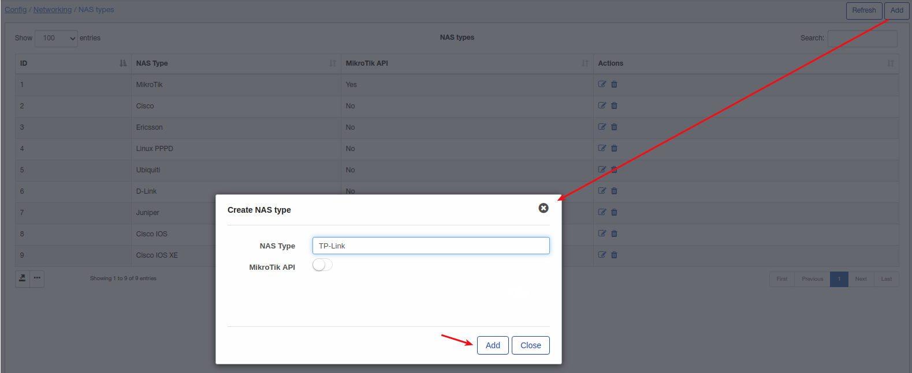

NAS types
=========

To configure NAS types click on `Config → Networking → NAS types`.

Here NAS types can be edited/added/removed.

Click on "Add" button to add new NAS type:

If this NAS type can use Mikrotik API - enable this option.
