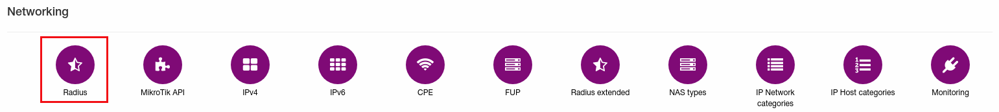
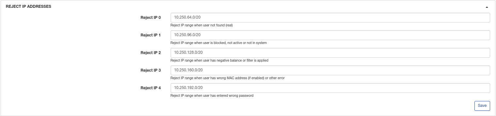
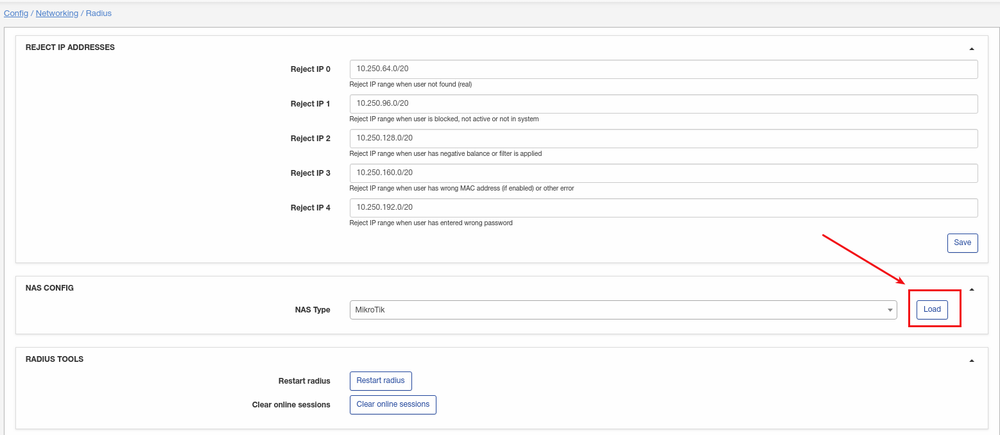
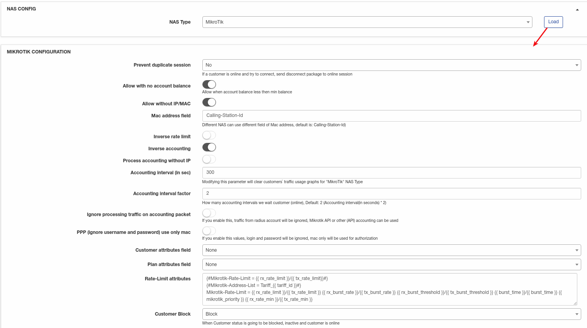
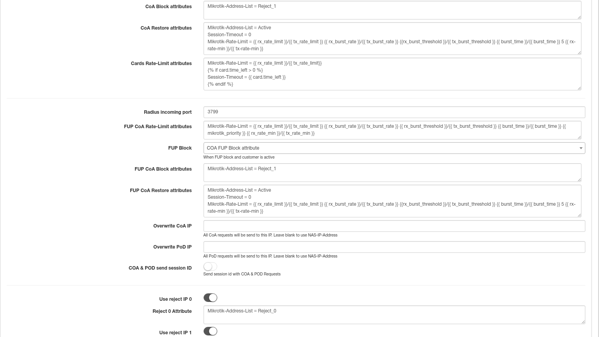
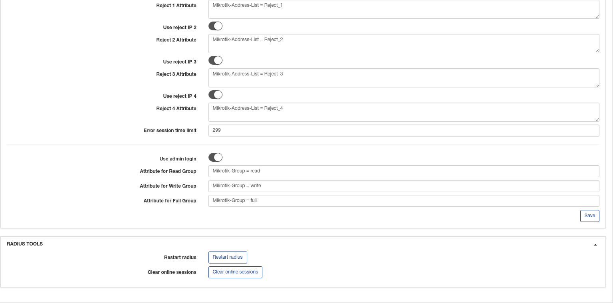
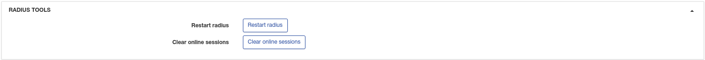

Radius
======

To configure the Radius click on `Config → Networking → Radius`.

#### These are Rejected IP addresses which ranges you can modify:

* **Reject IP 0** - Reject IP range when user not found (real);
* **Reject IP 1** - Reject IP range when user is blocked, not active or not in system;
* **Reject IP 2** - Reject IP range when user has negative balance or filter is applied;
* **Reject IP 3** - Reject IP range when user has wrong MAC address (if enabled) or other error;
* **Reject IP 4** - Reject IP range when user has entered wrong password.

If you are going to use reject pools, mschap and mschapv2 have to be disabled on a router. Reject IP pools are intended for:

1. Reduce router load. Customers won't "attack" router with new connections attempts;
2. By using reject IP pools some resources can be allowed for customer's connections with these IPs(ex. portal, payment systems etc);
3. Redirection to blocking pages.

Select the NAS type you are going to use and click on **Load** button. You can use one by default or create a new NAS type. Information about NAS type creation is available [here](configuration/network/nas_types/nas_types.md)

### Mikrotik configuration

A new configuration box will appear:

* **Prevent duplicate session** - If a customer is online and try to connect, send disconnect package to online session;
* **Allow with no account balance** - allow connection when account balance less then minimal balance;
* **Allow without IP/MAC** - if disabled, IP/MAC will be checked during authorization and if enabled, authorization will be allowed with any IP/MAC;
* **MAC address field** - different NAS can use different field of MAC address, default is "Calling-Station-Id";
* **Inverse rate limit** - change rate limit of upload by download and vice versa;
* **Inverse accounting** - change accounting of upload by download and vice versa;
* **Process accounting without IP** - enable/disable processing of accounting without IP;
* **Accounting interval** (in sec) - set time to update accounting. Recommended value 300-500;
* **Accounting interval factor** - set how many accounting intervals we wait customer(online). Default 2;
* **Ignore processing traffic on accounting packet** - if this option enabled, traffic from radius account will be ignored, Mikrotik API or another API accounting can be used;
* **PPP (ignore username and password) use only MAC** - if enabled, login/password will be ignored, MAC only will be used for authorization;
* **Customer attributes field** - specify customer additional field which will be used to send RADIUS attributes. Used for RADIUS customization;
* **Plan attributes field** - specify tariff additional field which will be used to send RADIUS attributes. Used for RADIUS customization;
* **Rate-Limit attributes** - list of rate-limit attributes. Recommended keep default;
* **Customer Block** - when customer status is going to be "blocked", "inactive" and customer is online;
* **CoA Block attributes** - list of CoA block attributes. Please keep default;
* **CoA Restore attributes** - list of CoA restore attributes. Please keep default;
* **Cards Rate-Limit attributes** - list of rate-limit attributes. Please keep default;
* **Radius incoming port** - Set port for incoming RADIUS;
* **FUP CoA Rate-Limit attributes** - list of FUP CoA rate-limit attributes. Please keep default;
* **FUP Block** - Set FUP blocking type;
* **FUP CoA Block attributes** - list of FUP CoA block attributes. Please keep default;
* **FUP CoA Restore attributes** - list of FUP CoA restore attributes. Please keep default;
* **Overwrite CoA IP** - all CoA requests will be send to this IP. Leave blank to use NAS-IP-address;
* **Overwrite PoD IP** - all PoD requests will be send to this IP. Leave blank to use NAS-IP-Address;
* **CoA & PoD send session ID** - send session ID with COA&POD requests;
* **Use reject IP [0-4]** - Enable to use the IP's 0-4 explained in first step.
* **Reject [0-4] Attribute** - list of attributes of reject pools;
* **Error session time limit** - limitation of the session time (in seconds) in case of an authorization error, forcing users to reconnect after a time out (for customers that do not have any active services).
This is necessary in order that after activation, the customer received his address from Splynx, without manual reconnection on his part;

* **Use admin login** - Enable, allows to log on router with administrator credentials
* **Attribute for Read Group** - specify attribute for read group;
* **Attribute for Write Group** - specify attribute for write group;
* **Attribute for Full Group** - specify attribute for full group;

There are two buttons at the bottom to Restart radius and Clear all online sessions.

* **Restart RADIUS** - will restart radius. Customer's connections can be dropped;
* **Clear online sessions** - will clear current online sessions.
