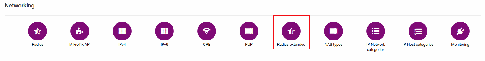
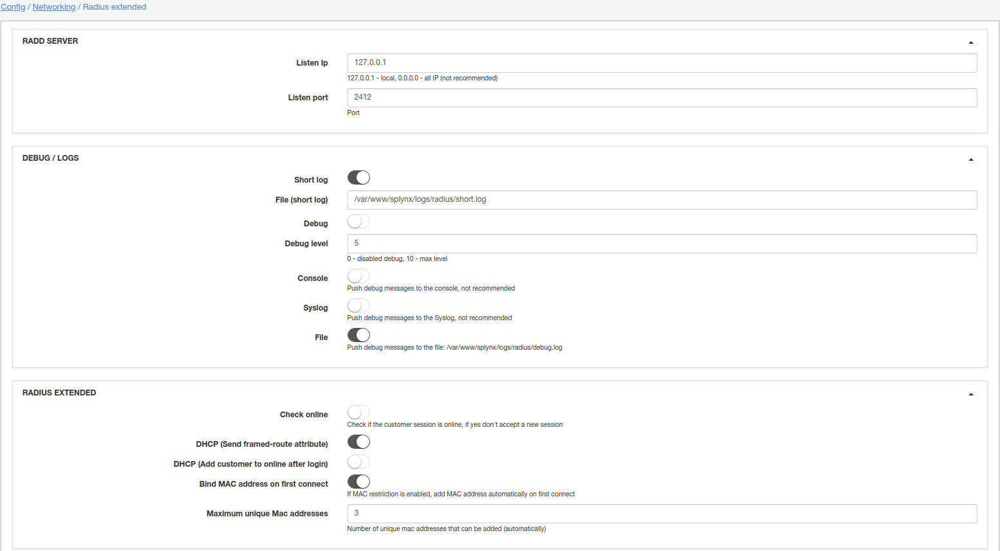
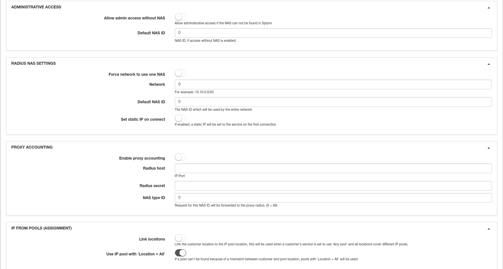
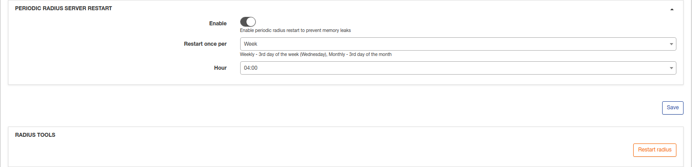

Radius Extended
===============

In addition to the main Radius configuration, here we can configure some extra features.

To change Radius Extended configuration, go to _Config / Networking / Radius extended_

## Radd Server

In Splynx we have two Radius servers. We use Freeradius as **external** Radius server; it accepts connections from clients (from routers). Freeradius transfers Radius requests to internal Radius server called **splynx_radd**. Here we can configure where **splynx_radd** listens connections.

* **Listen Ip** - IP of **splynx_radd** server.  
* **Listen port** - **splynx_radd** port.

**NOTE!** If you change configuration here, also you should change **PeerAddr**, **PeerPort** in _/etc/freeradius/splynx/splynx.pl_

## Debug / Logs

* **Short log** - enable/disable Radius short log;  
* **File (short log)** - Radius short.log file location;  
* **Debug** - enable/disable Radius debug log(/var/www/splynx/logs/radius/debug.log);  
* **Debug level** - debug level (0 - 10), 10 - more detailed;  
* **Console** - push debug messages to console, not recommended;  
* **Syslog** - push debug messages to syslog, not recommended;
* **File** - push debug messages to file: /var/www/splynx/logs/radius/debug.log

## Radius extended

* **Check online** - check if customer is already online. If online - do not allow new connection (with the same credentials). If disabled, customers can connect few times with the same credentials;

* **DHCP (Send framed-route attribute)** - Send framed-route from Radius server;

* **DHCP (Add customer to online after login)** - when we use DHCP, add customer to online after his/her connection immediately. If disabled, customer will be added to online only when his/her traffic reaches accounting limit (under _Config / Networking / MikroTik API_"min bytes for accounting");

* **Bind MAC address on first connect** - If attribute MAC is empty in internet service settings - add MAC/IP from where customer connects for first time;  

* **Maximum unique MAC addresses** - maximum number of MAC that can be added into internet service settings.

## Administrative access

* **Allow admin access without NAS** - allow administrator access in case if NAS not found on Splynx;
* **Default NAS ID** - NAS ID, if access without NAS is enabled.

## Radius NAS settings

* **Force network to use one NAS** - enable/disable force using of network by NAS;

* **Network** - specify network (for example: 10.10.0.0/20) if previous settings is enabled;   

* **Default NAS ID** - NAS ID which will be used by default for network from previous setting;  

* **Set static IP on connect** - If enabled, static IP will be set to service on connect.

## Proxy accounting

* **Enable proxy accounting** - enable/disable proxy accounting;  
* **Radius host** - IP:Port;  
* **Radius secret** - Radius secret;
* **NAS type ID** - request for this NAS Type will be proxied to next radius, 0 - all.

## IP From pools (assignment)

* **Link locations** - Link customer location to IP Pool location, this will work on case if in customer service selected "Any pool", and all locations will cover different pools;

* **Use IP pool with "Location = All"** - In case of pool with customer location not found, we can use Pools with Location = All.

## Periodic RADIUS server restart

Here can be specified periodic restart of RADIUS server to prevent memory leaks. This feature is recommended for using.

* **Enable** - enable/disable periodic restart;

* **Restart once per** - select period for periodic restart(day, week, month);

* **Hour** - time when RADIUS server will be restarted. Recommended time - at late night.

## RADIUS tools

* **Restart RADIUS** - using this button RADIUS server can be restarted. Recommended for using after some new configurations to apply changes after reboot. **Be attentive - customers can be disconnected**
