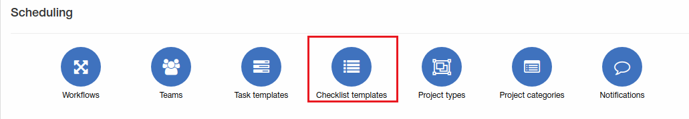

Checklist templates
=============
Here you can add, edit or remove checklists what will be used in tasks.

**_Config -> Scheduling -> Checklist templates_**

Let's add new checklist:

Select title and add steps needed.

Once checklist created, it can be used in tasks.

