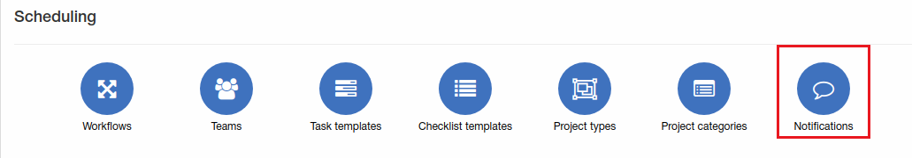
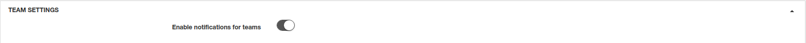
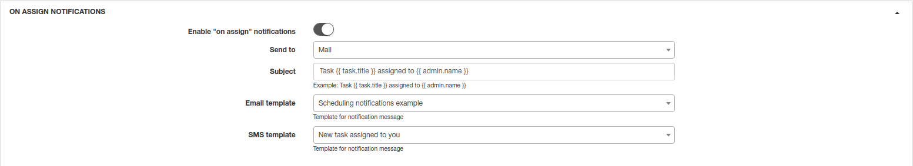
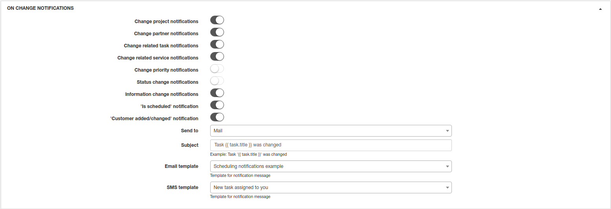
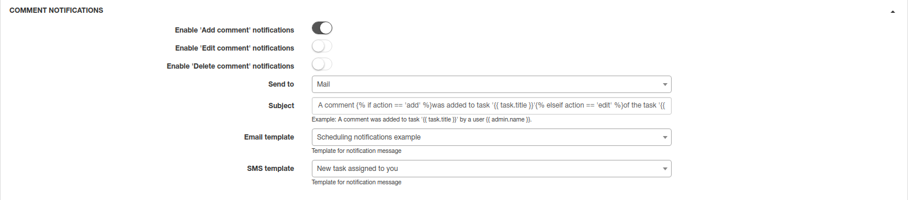
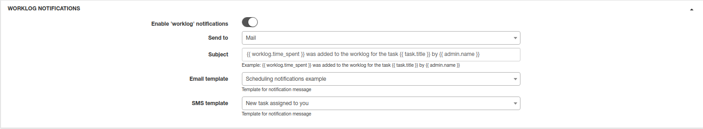
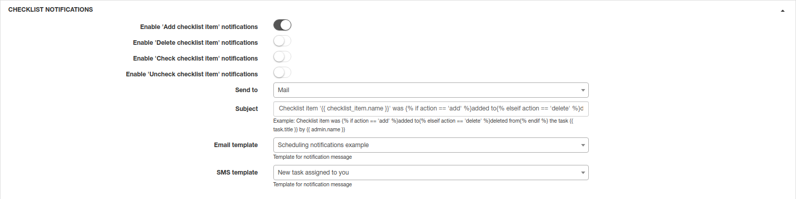
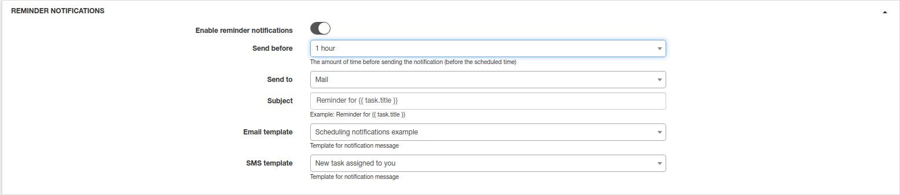
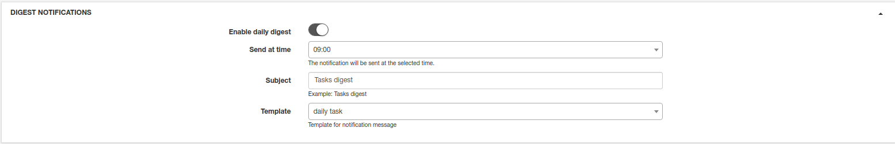
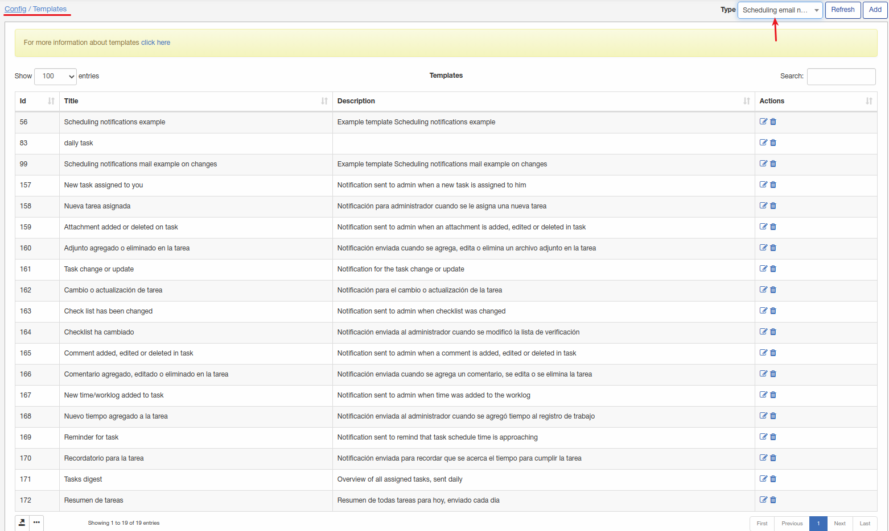

Notifications
=============
Here you can configure your scheduling notifications.

**_Config -> Scheduling -> Notifications_**

## Team settings

* **Enable notifications for teams** - enable/disable teams notifications(if task assigned to team).

## On assign notifications

* **Enable "on assign" notifications** - enable/disable notifications when task assigned/reassigned;

* **Send to** - select how notification will be send, email, SMS or email + SMS;

* **Subject** - subject of notification;

* **Email template** - template for email notification;

* **SMS template** - template for SMS notification.

## On change notifications

* **Change project notifications** - enable notification when project changed;

* **Change partner notifications** - enable notification when project partner changed;

* **Change related task notifications** - enable notification when related task changed;

* **Change related service notifications** - enable notification when related service changed;

* **Change priority notifications** - enable notification when priority changed;

* **Status change notifications** - enable notification when status changed;

* **Information change notifications** - enable notification when information changed;

* **"Is scheduled" notification** - enable notification when task is scheduled;

* **Customer added/changed notification** - enable notification when customer changed/added for a task;

* **Send to** - select how notification will be send, email, SMS or email + SMS;

* **Subject** - subject of notification;

* **Email template** - template for email notification;

* **SMS template** - template for SMS notification.

## Comment notifications

* **Enable 'add attachment' notifications** - enable notification when attachments added;

* **Enable 'delete attachment' notifications** - enable notification when attachment removed;

* **Send to** - select how notification will be send, email, SMS or email + SMS;

* **Subject** - subject of notification;

* **Email template** - template for email notification;

* **SMS template** - template for SMS notification.

## Worklog notifications

* **Enable 'worklog' notifications** - enable worklog notification;

* **Send to** - select how notification will be send, email, SMS or email + SMS;

* **Subject** - subject of notification;

* **Email template** - template for email notification;

* **SMS template** - template for SMS notification.

## Checklist notifications

* **Enable 'add checklist item' notifications** - notification when item added to checklist;

* **Enable 'delete checklist item' notifications** - notification when item removed from checklist;

* **Enable 'check checklist item' notifications** - notification when item marked in checklist;

* **Enable 'uncheck checklist item' notifications** - notification when item unmarked in checklist;

* **Send to** - select how notification will be send, email, SMS or email + SMS;

* **Subject** - subject of notification;

* **Email template** - template for email notification;

* **SMS template** - template for SMS notification.

## Reminder notifications

* **Enable reminder notifications** - enable reminder notification;

* **Send before** - the amount of time before sending the notificaion(before scheduled time);

* **Send to** - select how notification will be send, email, SMS or email + SMS;

* **Subject** - subject of notification;

* **Email template** - template for email notification;

* **SMS template** - template for SMS notification.

## Digest notifications

* **Enable daily digest** - enable daily notification about tasks;

* **Send at time** - when to send;

* **Subject** - notification subject;

* **Template** - notification template.

### All template can be found under [Config - Templates](../../system/templates/templates.md)

Email templates for scheduling:

SMS templates for scheduling:

