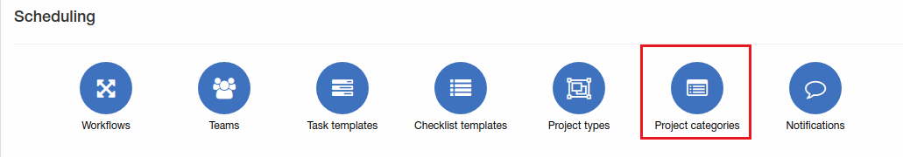
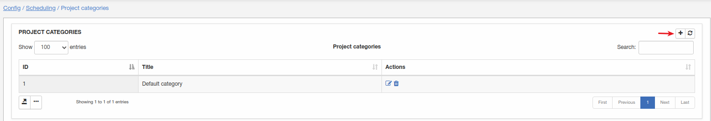
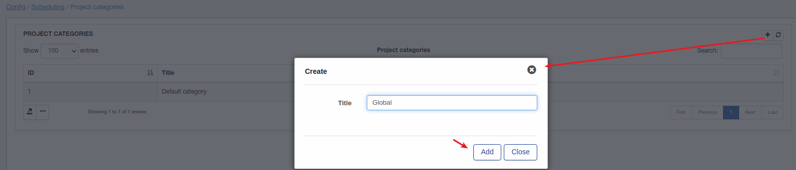
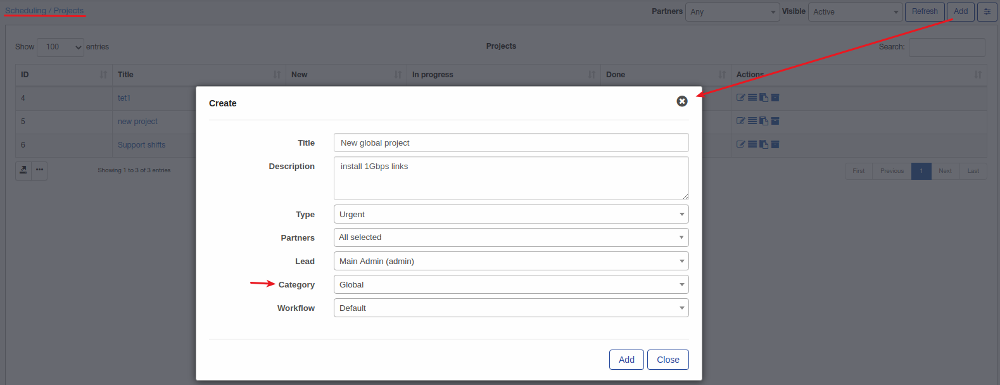

Project categories
=============
Here you can add, edit or remove project categories.

**_Config -> Scheduling -> Project categories_**

Let's add new category:

Once category added it can be used when project create:

