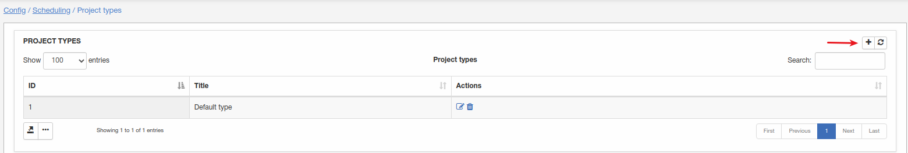
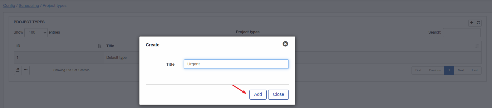
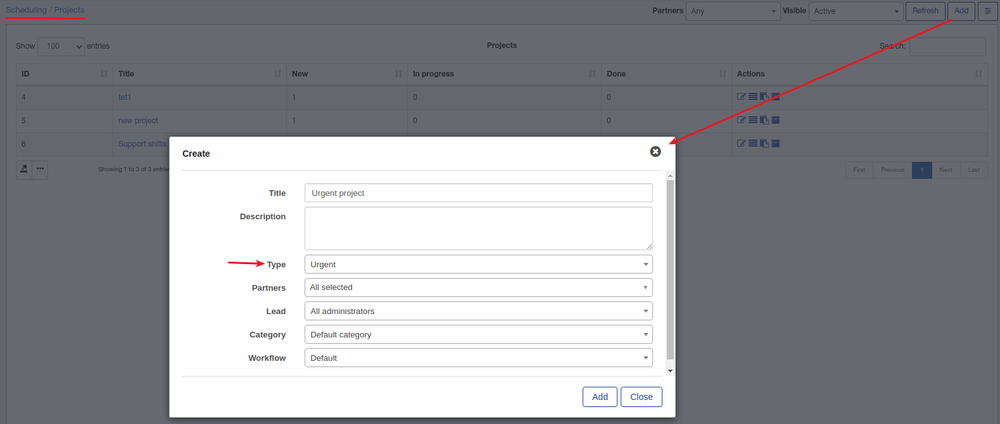

Project types
=============
Here you can add, edit or remove project types.

**_Config -> Scheduling -> Project types_**

Let's add new project type:

Once project type added, it can be when create project:

