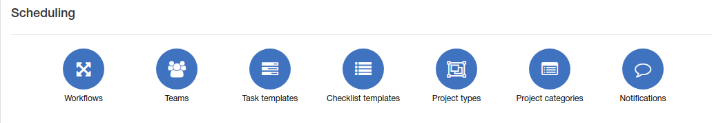

Scheduling
=============
Here you can configure your scheduling module.

* [Workflows](workflows/workflows.md)
* [Teams](teams/teams.md)
* [Task templates](task_templates/task_templates.md)
* [Checklist templates](checklist_templates/checklist_templates.md)
* [Project types](project_types/project_types.md)
* [Project categories](project_categories/project_categories.md)
* [Notifications](notifications/notifications.md)
