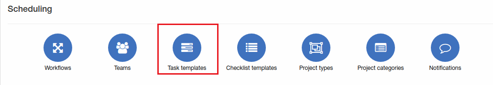

Task templates
=============
Here you can add, edit or remove some task templates. Task templates are using for faster task creation when you can load some settings from previously added task.

**_Config -> Scheduling -> Task templates_**

Let's edit task template #13 "test":

Here i changed project, to use this task template only in tasks of project "new project", checklist "Connect client" and add some default description for this task also automatically assign to "Installation team"(assignee can be changed in task).

To create new task from template select template in step 1 and click "Load" in step 2 and data will be loaded from template.

