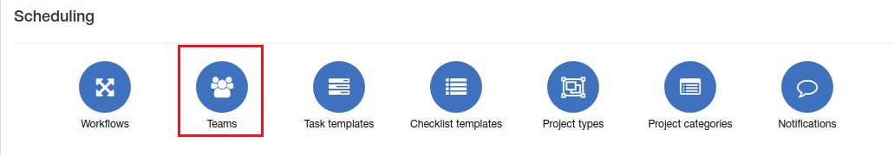

Teams
=============
Here new teams can be added, changed or deleted.

**_Config -> Scheduling -> Teams_**

As we have ampty list of team, tasks can be assigned only to some admin. Let's add new team:

Select title of team, partner and some admins who will be in this team.

Once team created, scheduling tasks can be assigned to teams:

