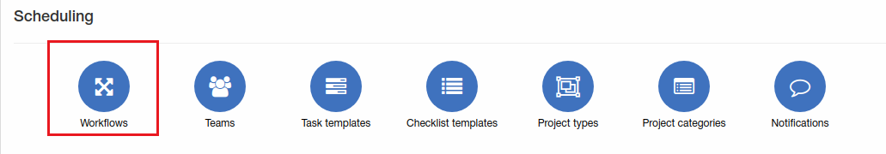
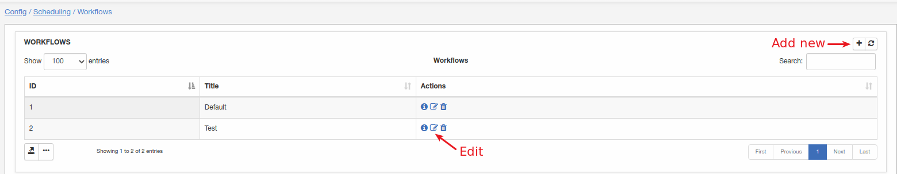
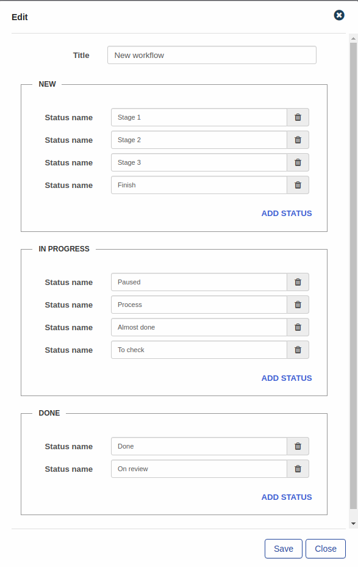
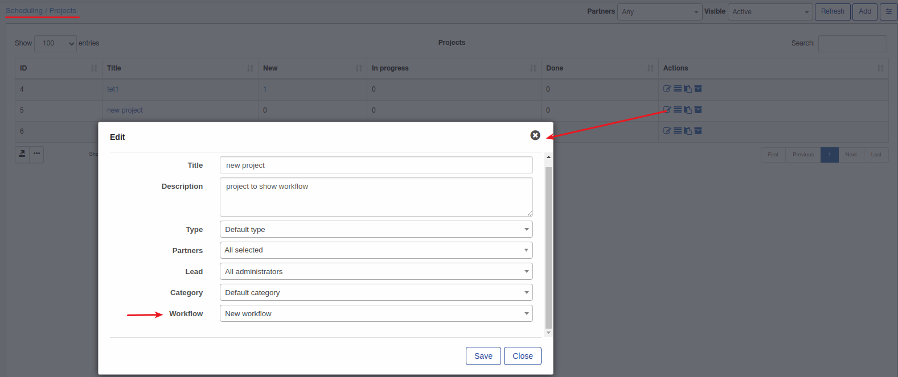
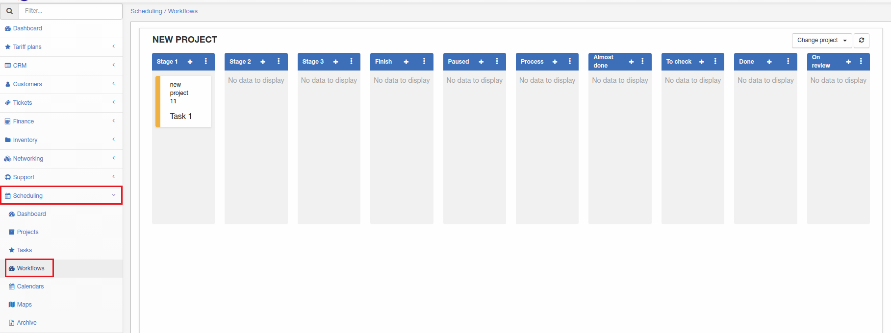

Workflows
=============
Here new workflow can be added, changed or deleted.

**_Config -> Scheduling -> Workflows_**

Let's add new workflow:

Different statuses can be added to each section "NEW", "IN PROGRESS" or "DONE". In this example we have few statuses for each section. To add new status click on "Add status". **Note that status name must be unique in a whole workflow.**

Once new workflow added it can be used in some project. Under [Scheduling - Projects](../../../scheduling/projects/projects.md) i have some project "New project" and I'm going to use this new workflow here.

Once workflow is selected for project, navigate to [Scheduling - Workflows](../../../scheduling/workflows/Workflows.md)

I have one [task](../../../scheduling/tasks/tasks.md) in my project and it's on a stage 1 in my workflow.
