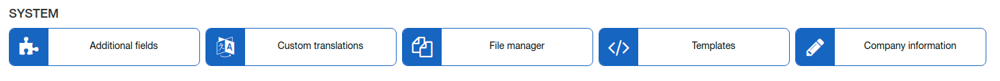

System
======

Please, follow the links below to find tutorial page about each part of system configuration:

* [ Additional fields](additional_fields/additional_fields.md)
Here some additional fields can be added for customer, service, plan etc.

* [ Custom translations](custom_translations/custom_translations.md)
Here interface phrases can be translated to another language.

* [ File manager](file_manager/file_manager.md)
Fast way to upload some file in to Splynx.

* [ Templates](templates/templates.md)
Here we store templates what we are using for invoices, notifications, payment receipts etc.

* [ Variables for templates](templates_variables/templates_variables.md)
Some examples of variables what can be used in templates.

* [ Company information](company_information/company_information.md)
Here you can specify details of ISP like URL, address, phone number, tax percent etc. Also select templates for finance documents.
