OpenVPN
====

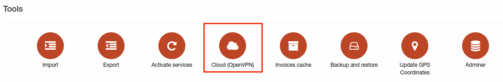

If OpenVPN server isn't configured yet page will looks like:

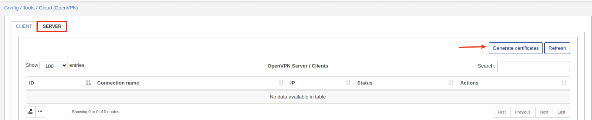

By click on "Generate certificates" OpenVPN server certificates will be generated and you will be able use it.

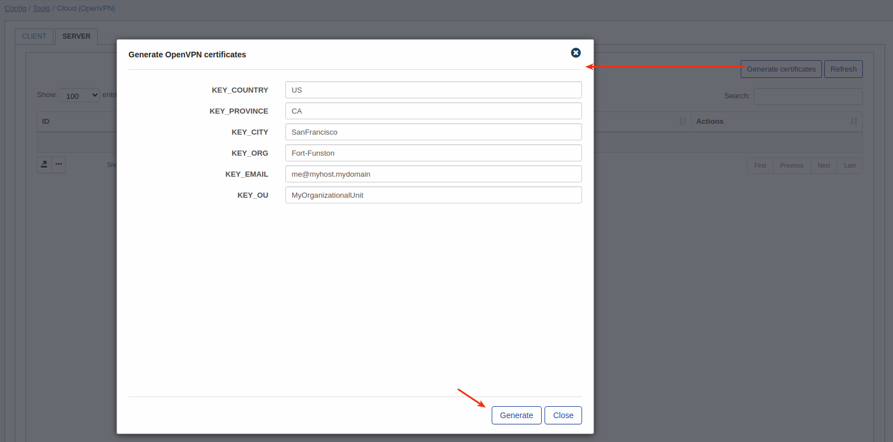

Here have to be specified next parameters:

**Country** - This field contains the 2-character ISO format country code. For example, GB is the valid country code for Great Britain, and US is the valid code for the United States. To locate a specific country code, you may take a look at this [page](www.nationsonline.org/oneworld/country_code_list.html);

**State/province** - U.S. and Canadian customers must enter a State or Province name. Do not abbreviate. In the United States, if your organization is incorporated, for instance, in the state of Delaware, but is operating within California, use California;

**City/Locality** - Mandatory field usually denotes the city in which the organization is located. Do not use abbreviations. For example, spell "Saint Louis", instead of "St. Louis". If the organization is registered only locally, for example, its business license is registered with the City Clerk; the Locality/City field must contain the name of the city where it is registered. International customers must enter either a City/Locality or a State/Province field;

**Organization** - The Organization Name (corporation, limited partnership, university, or government agency) must be registered with some authority at the national, state, or city level. Use the legal name under which your organization is registered. Do not abbreviate or use any of these symbols: ! @ # $ % ^ * ( ) ~ ? > < / ;

**Email** - email address of organization;

**Organization Unit** - Mandatory field to differentiate between divisions within an organization, for example, "Electronic Commerce Pilot" or "Human Resources". If your organization is doing business as (DBA) a trade name, you may specify the trade or DBA name in this field.

Source: https://knowledge.digicert.com/solution/SO16317.html

After specifying needed parameters here click on "Generate" and wait:

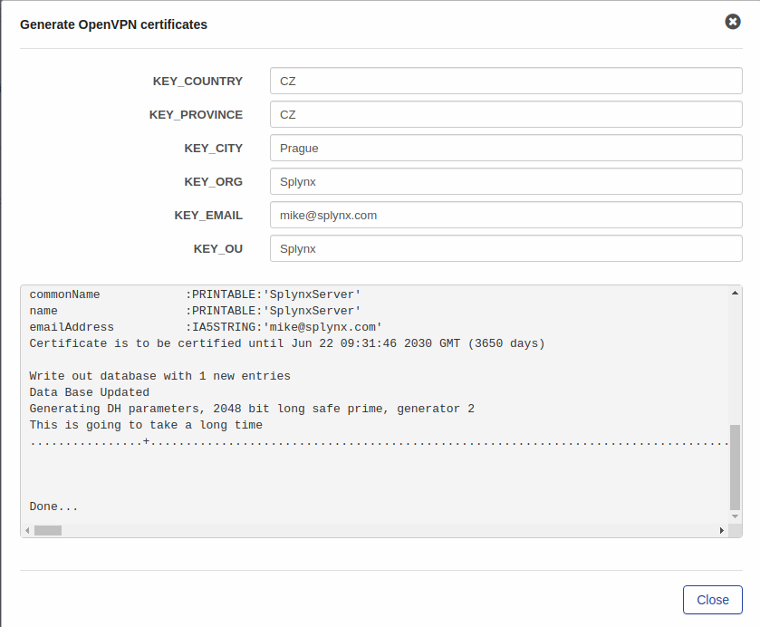

Now OpenVPN server have to be configured and enabled:

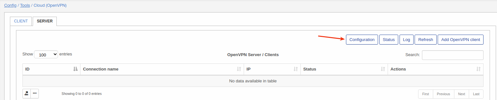

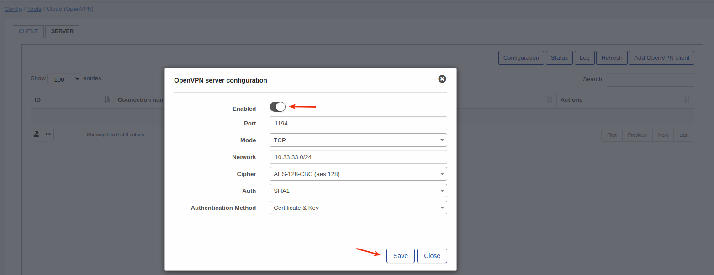

Here can be configured port, mode(TCP or UDP), network, cipher, auth(hash function SHA1 or MD5) and authentication method.

Once server is configured, let's add some client.

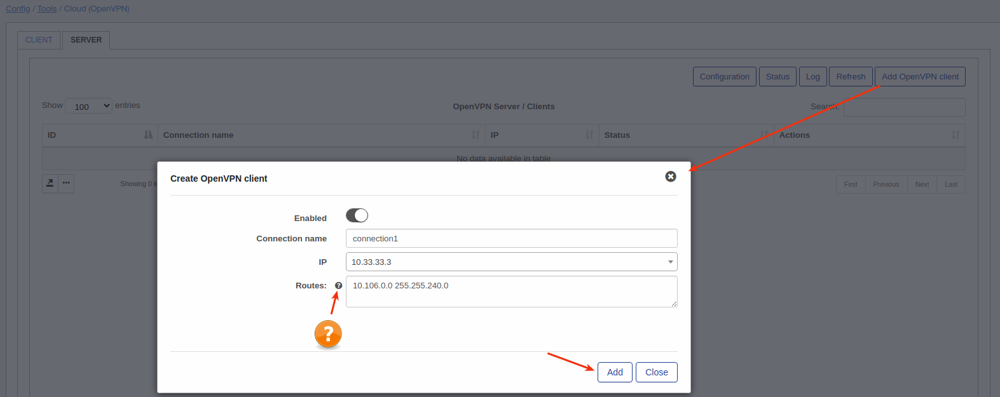

Specify connection name, IP and routes if needed. By click on "?" near router will be visible list with syntax of routes:

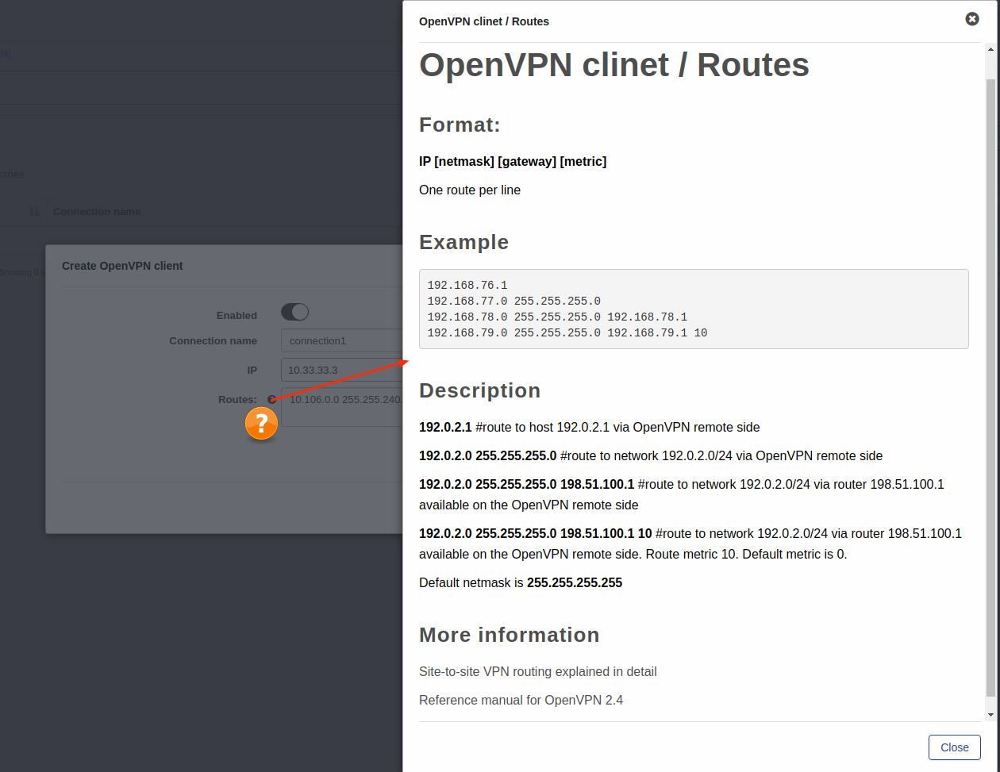

Once client connection is created let's download credentials:

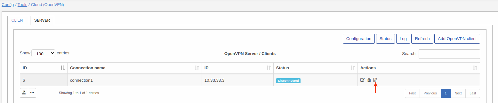

By this action "zip" archive will be downloaded with next files:

I'm going to create VPN connection between Splynx(with OpenVPN server) and some desktop Ubuntu.

### VPN client configuration on Ubuntu
Let's add VPN connection in Ubuntu:

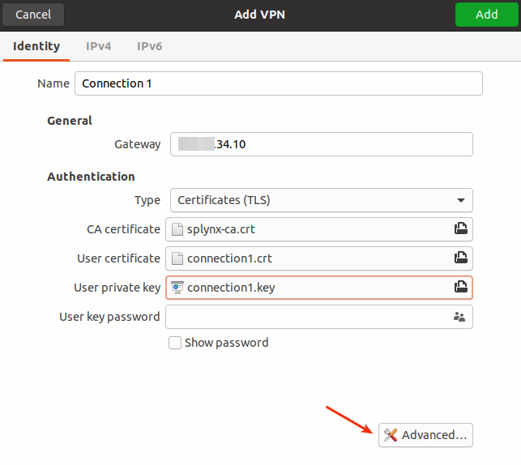

Here specify gateway(IP of server), type and certificates + keys what are required. User key password in this setup can be missed. Next step is click on "Advanced":

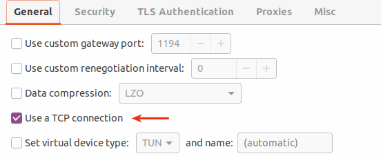

Here we specified TCP connection(regarding to server configuration).

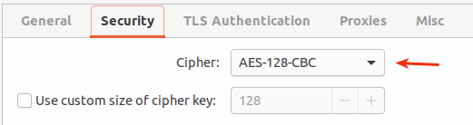

And here we have to specify Cipher(regarding server configuration).

Once it's done let's enable VPN connection and test:

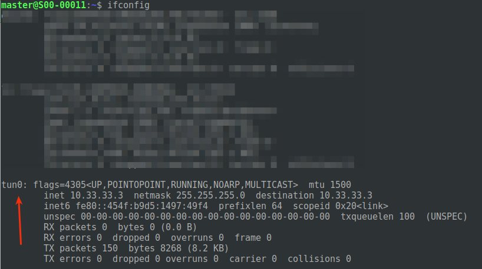

Interface with given IP was created.

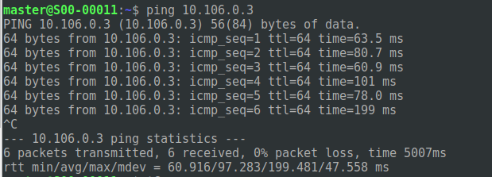

And network what was specified in routes(when we configured client) is accessible.

### VPN client configuration on Mikrotik router

Let's add new client and configure Mikrotik router as an OpenVPN client.

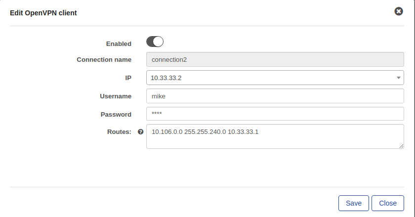

Once added and files are downloaded we have to upload certificates into Mikrotik under **Files**:

Once files uploaded we have to import these certificates under **System - Certificates**:

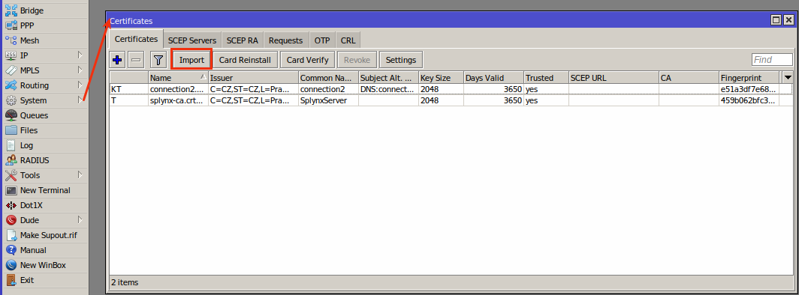

More detailed info about how to import certificates you can find [on Mikrotik wiki](https://wiki.mikrotik.com/wiki/Manual:Create_Certificates)

After all certificates imported let's create an OpenVPN client interface:

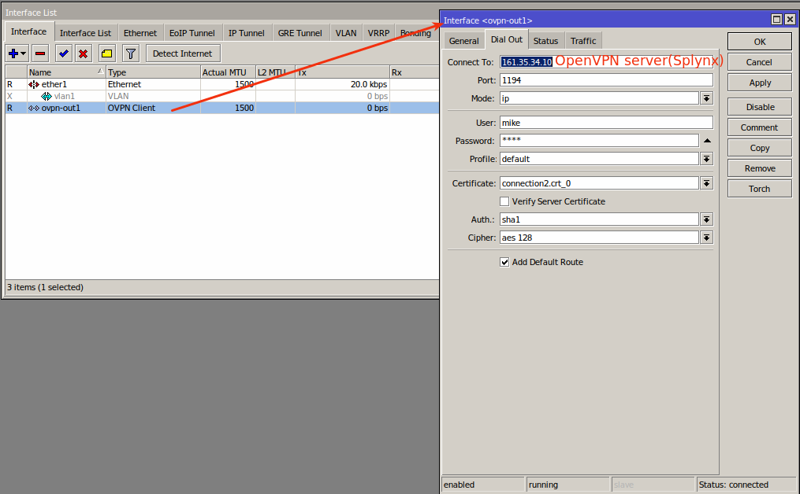

Once it's created you will see new routes under **IP - Routes**

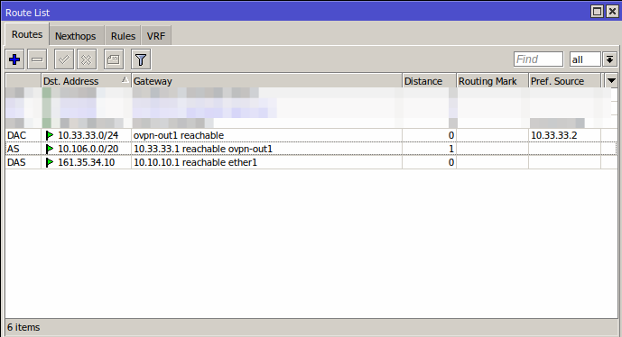

Now we need to add NAT rule under **IP - Firewall - NAT** with chain "srcnat" and "Out.Interface" = your OpenVPN client interface:

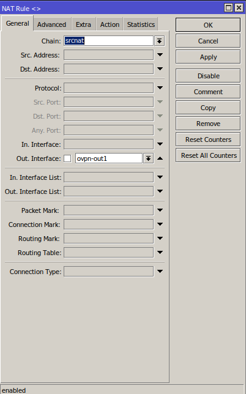

and "Action" = masquerade

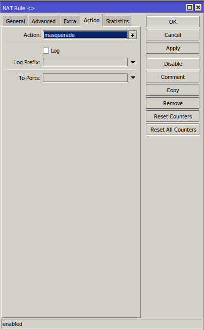    

Now you can ping network what was unreachable before:

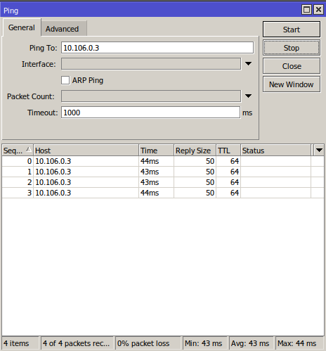

After established connection in Splynx status of connection will change to "Connected":

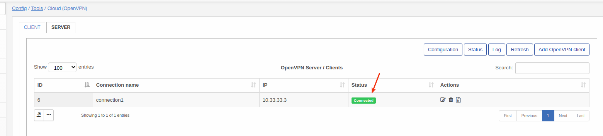

And by click on "Status" you can see some details about active connections:

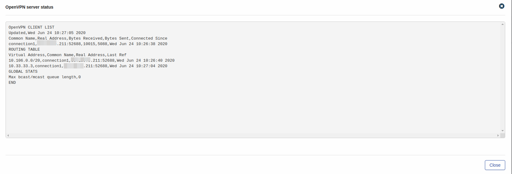

By click on "Log" logs of VPN server can be checked.
