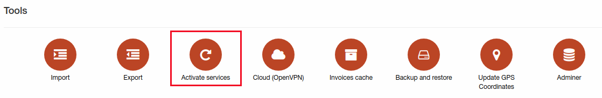
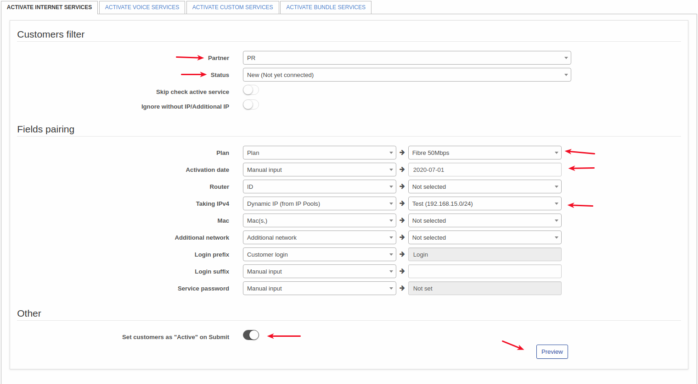
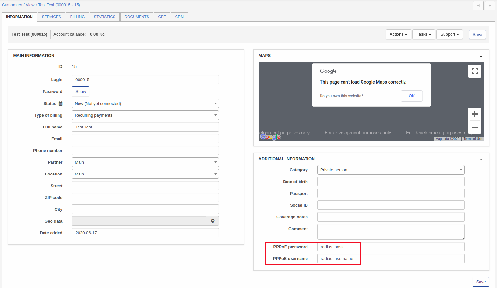
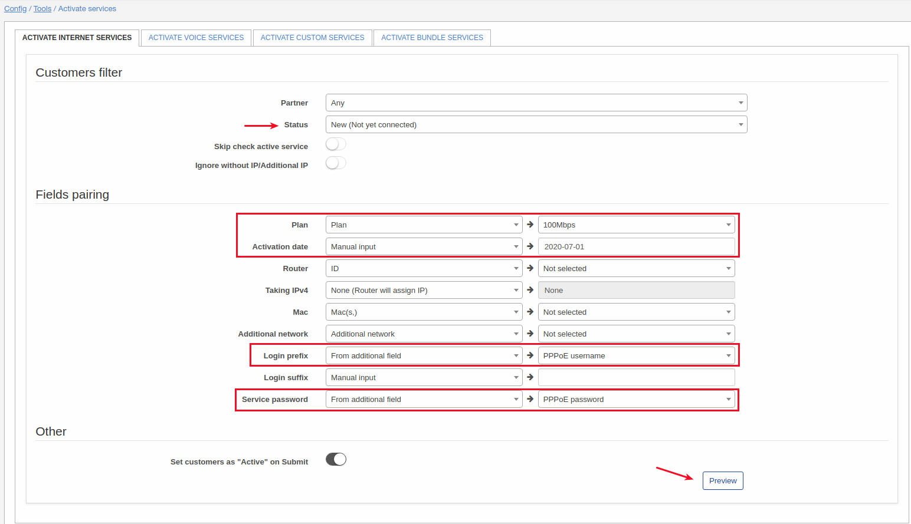
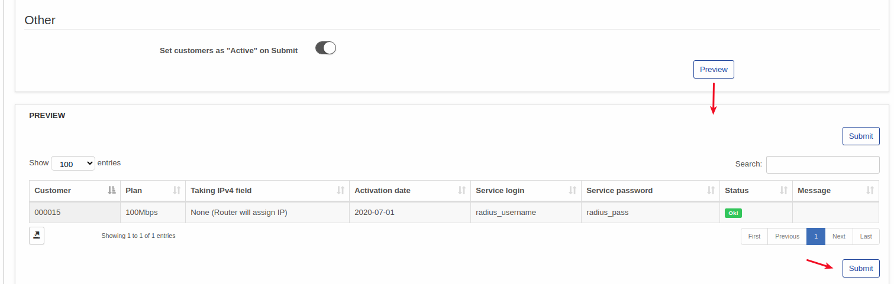
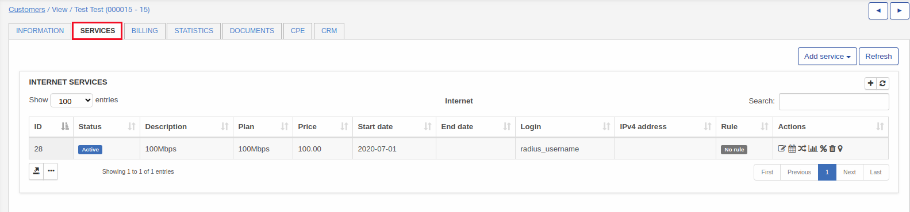

Activate services
===

Using this tool services can be created in a bulk mode.

For example we have few "New" customers from partner "PR". All these customers need internet plan "Fibre 50Mbps" with start date 2020-07-01 and IP will be assigned for service from IP pool and login and password will be generated. Using next settings my aim can be achieved.

Another example of using this tool:

i have imported customers with RADIUS login and password like shown on a screenshot:

So to create services with imported login and password i will use next setup:

and click on "Preview"

and when click on "Submit" service will be created.

