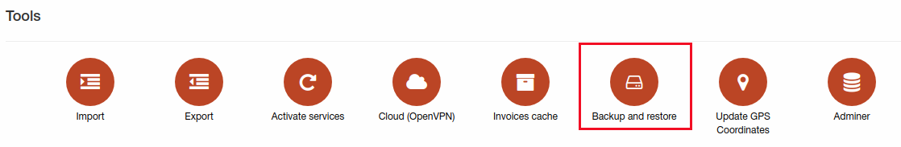
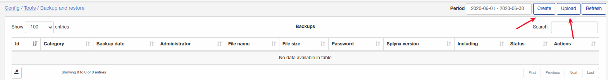
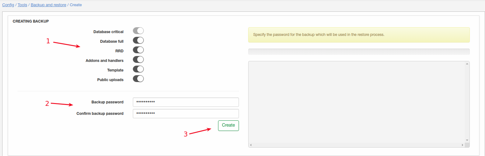
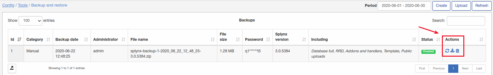
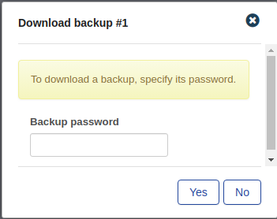
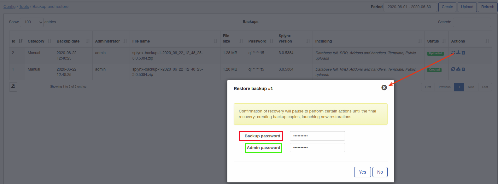

Backup and restore
====

Using this tool backup can be done directly from web page also backup can be restored from web page using the same tool.

This tool can be really useful if you are planning some mass update of Splynx settings and you are afraid of making some things wrong - just make a backup and start applying changes, in case of failure you can easily restore previous state of Splynx.

To make a backup click on "Create" or if some backup(previously done using this tool) can be uploaded click on "Upload":

To create a backup in step 1 should be selected items what will be included to backup:

**Database critical** - will be included automatically, contains all main info of Splynx(config, finances, services, networking, customers etc);

**Database full** -  entire database with structure of tables, critical info and customer's statistics and logs;

**RRD** - statistic graphs(ping, customer statistic graphs etc);

**Addons and handlers** - addons folder + folder with handlers(voice, finance etc);

**Template** - all templates;

**Public uploads** - documents, photos what were uploaded into Splynx.

In step 2 create some password for this backup and confirm it and in step 3 click on "Create".

Once backup is ready there 3 actions: restore, download and delete.

**To download backup** click on "Download" button and provide backup password:

**To restore backup** click on "Restore":

Here you have to provide backup password + admin password. Then you will have to confirm restore once more by providing backup + admin passwords:

Then you will see process of restoration:

#### during restore process an error can occur on current tab - in this case just re-login to Splynx web page.

After backup restore we get Splynx state with no backup(as it was before making first backup).

### Recommendation: not to store tons of unnecessary and old backups for saving disk space. 
