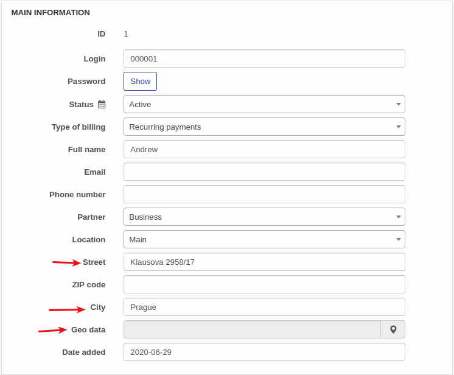
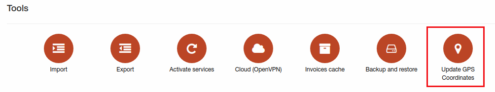
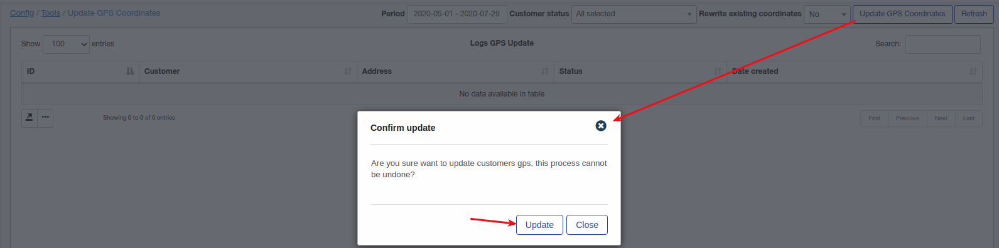
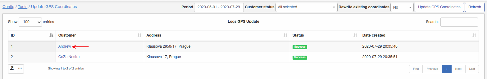
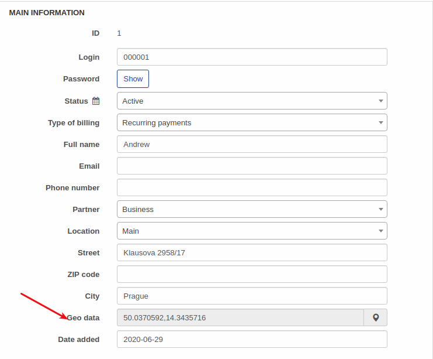

Update GPS coordinates
====

This feature can be helpful when a lot of customers have street address, city but GPS coordinate are not populated. You can populate GPS coordinates for these customers with this feature. For example we have next situation:

Geo data can be specified manually for one customer, but what if you have 1000+ customers with not updated GPS?

Firstly navigate to `Config -> Tools -> Update GPS coordinates`:

If some customers already have GPS coordinates and they shouldn't be overwritten select "No" for "Rewrite existing coordinates" parameter.

Next, click on "update GPS coordinates"

Once completed, you will see customers list with updated coordinates:

 let's take a look "Andrew" customer account

As you can see coordinates were updated. 
