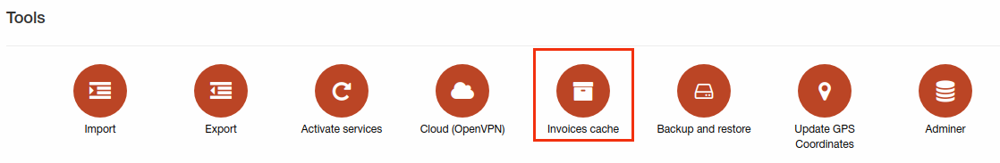
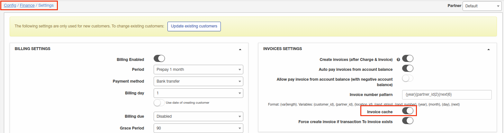
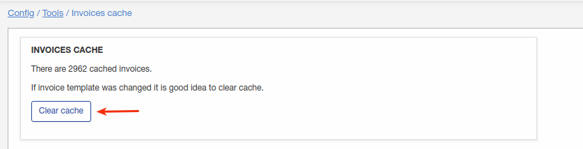

Invoices cache
====

Splynx is caching invoices for faster generation of invoice PDF document. Sometimes it's needed to make some changes into invoice PDF template and after that we recommend to clear invoice cache using this tool.

Invoice cache can be enabled under Config/Finance/Settings:

And invoices cache can be cleared here:

Simply click on "Clear cache" - that's all.

### Note
It might be helpful when were made some changes in invoice PDF template but it's not visible on generated PDF, the reason can be in invoice cache.

If you are changing your PDF invoice template frequently, don't forget to clear cache here.
