Capped plans and Top-Ups
===

CAP is a feature that allows ISP to provide Internet services with monthly limitation of data and charge customers for additional data.

For example monthly limit for some internet tariff plan in Splynx is 200GB, once customer used 200GB you can block connection or decrease speed. In case when customer wants to use the Internet without limitations he can buy a Top-up(additional data pack) and use this data without speed limitations. In Splynx, we designed this feature so the customer could issue a Top-up from portal, the administrator can apply a Top-up for a customer and also it can be done automatically (when monthly limit is reached - issue a top-up automatically).

First of all, you need to enable the CAP module under _Config → Integrations _→ Main Modules.__

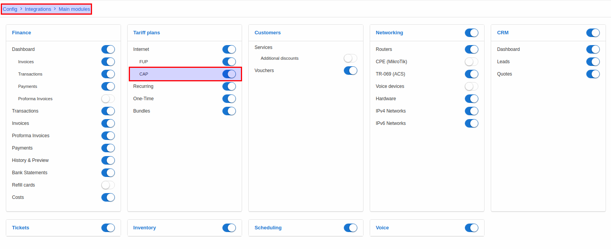

Once this done you can navigate to _Plans -> Internet_ and click on this button to configure CAP:

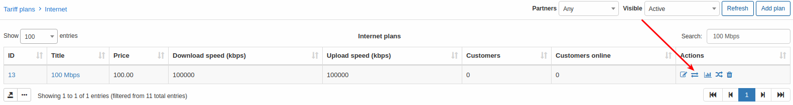

Here you can configure some FUP policies, CAP and simulate&test the behavior of system on FUP and CAP rules. Do not mix FUP and CAP configurations what can cause conflicts. On this page we won't create any FUP rules, but only CAP + time frames for traffic accounting.

## CAP сonfiguration

Let's start with `Monthly limits (CAP)` configuration:

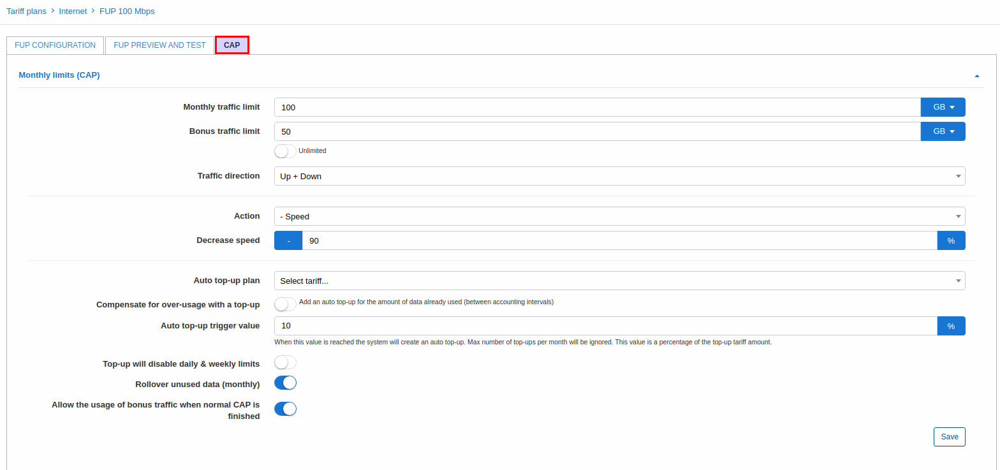

Here is a description of available options:

* **Monthly traffic limit** - here you can set how much data customer can consume per month;

* **Bonus traffic limit** - this option will work ONLY with some time frames specified under `FUP configuration` tab:

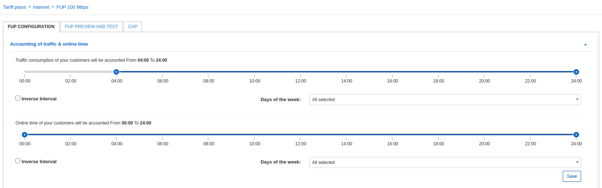

In this case customer will be able to use 50GB of bonus traffic only from 00:00 to 04:00 (Monthly limit of 100GB won't be used here). If you account traffic for a whole day (without FUP time frames) - this option will not work.

You can set bonus traffic here or enable toggle called `Unlimited` to allow customer to consume traffic without limits between 00:00 and 04:00.

* **Traffic direction** - select direction of traffic for accounting: `Up + Down`, `Up` or `Down`;

* **Action** - select what to do with connection once monthly limit is reached: `Block`, `Set fixed speed`, `- Speed`;

* **Auto top-up plan** - select one of previously created top-ups what will be automatically applied by customer when monthly limit is reached (auto top-up have to be enabled under customer's settings);

* **Compensate for over-usage with top-up** - this option is created for tariff plans with high speed to avoid not-charged over-usage of traffic. Let's say customer has a plan with 1Gbps speed and accounting interval = 5 minutes and CAP limit = 500GB, Splynx reveices data that customer have already used 499.95GB and Splynx won't block this connection as CAP limit is 500GB and in 5 minutes Splynx receives last data that customer have already used 502GB, so with this toggle enabled Splynx will charge over-used 2GB accordingly to tariff price;

* **Auto top-up trigger value** - specify amount of data (in percents) what a connection can consume after which top-up will be applied. For example a top-up 1GB was applied and customer have used it, so when 10% (according to my settings) of 1GB will be used additionally - auto top-up will be applied;

* **Top-up will disable daily and weekly limits** - enable/disable this option to ignore daily or weekly FUP limits (under "FUP configuration" tab);

* **Rollover unused data(monthly)** - enable/disable option to rollover unused data to the next month;

* **Allow the usage of bonus traffic when normal CAP is finished** - witn this option enabled customer will be able to use bonus traffic even if monthly limit is reached.

## Top-ups

These plans are used when monthly data CAP's are reached and the customer wishes to extend their services. Customers pay for Top-Ups in order to regain access according to the data limits of the Top-up plan.

Top-up plans are beneficial to you as an ISP as this creates an additional source of income with existing customers using a capped service.

Splynx has simplified the top-up concept for anyone to use appropriately, with just 5 parameters to be set to create a top-up plan or simply loading a preexisting top-up plan.

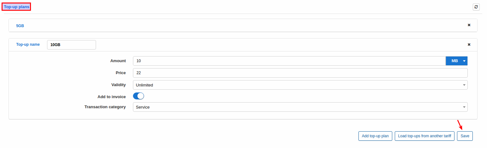

On this screenshot you can see 2 top-up plans: 5GB and 10GB. Use buttons `Add top-up plan` to add new top-up, `Load top-ups from another tariff` - to load existing top-ups what you previously created for another plan and `Save` button to save changes.

To create a new plan you need to specify data amount, price, validity, transaction category and enable/disable option to add this transaction into invoice.

## Notifications

It's really important to inform the customer about amount of used data to avoid "surprises" when the Internet is not available and the customer wasn't notified.

For this purpose we developer a flexible system of CAP notifications:

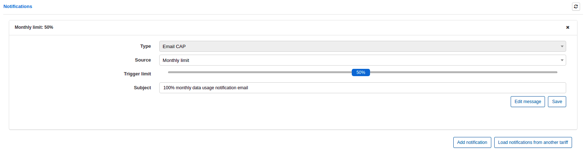

According to this notification settings (on a screenshot) Splynx will send email message when half of the monthly limit is used with subject which you can specify under `Subject` field and message body which you can specify by clicking on `Edit message` button.

Under `Source` field you can select which data will be used for notification:

* **Monthly limit** - it will checks only for Monthly limit amount(CAP) to send notification, top-ups and bonus data will be ignored. For example when CAP is 100GB and customer bought a top-up 10GB, notification will be send when customer will use 50GB, but not 55GB(50% of available 100GB + 10GB);

* **Total usage** - will check for total available data amount including top-ups;

* **Top-up usage** - it will check only for top-up data usage, CAP limit is ignored;

* **Top-up action** - inform customer about applied top-up;

* **Auto top-up action** - inform customer about applied auto top-up.

Click on `Add notification` button to add a new notification of `Load notifications from another tariff` to load previously created notifications from another tariff plan.

## Examples

Let's add an internet service with monthly limit for the customer:

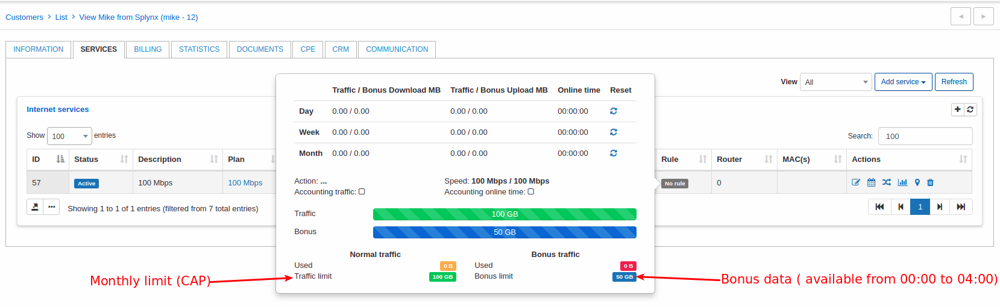

So customer has 100GB monthly limit + 50GB bonus available only from between 00:00 and 04:00 according to tariff plan settings.

Under customer view now we have this window with personal CAP settings:

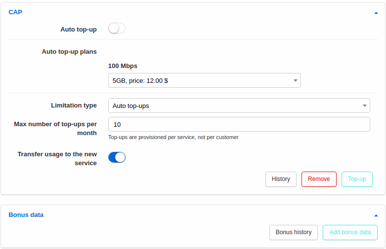

* **Auto top-up** - enable/disable auto top-ups;

* **Auto top-up plans** - select a top-up plan what will be applied automatically (if auto top-up enabled);

* **Limitation type** - select type of limitations of top-ups amount per month;

* **Max number of top-ups per month** - set max amount of top-ups per month;

* **Transfer usage to the new service** - enable/disable transfer of unused top-up data to a new service in case of plan change.

Using button `History` you can see top-up data history (top-ups, rollover data, transfers of data) for specific period of time:

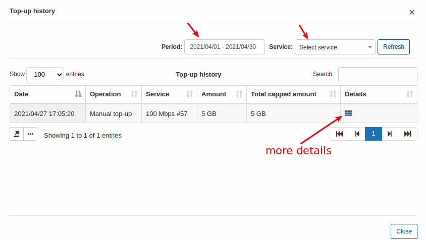

Using button `Top-up` you can apply a top-up manually for the customer:

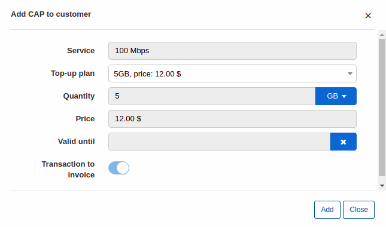

Here you can select one of available top-up plans OR set amount(quantity), price, validity manually.

The transaction is added to the list of transactions since the toggle to add transaction to invoice is disabled and the amount will be debited to the customer's account. If this toggle is enabled the transaction will be added to the customers' future invoice.

To remove some amount of data what was added by top-up use button `Remove`.

It is possible to add some bonus data using `Add bonus data` button:

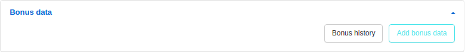

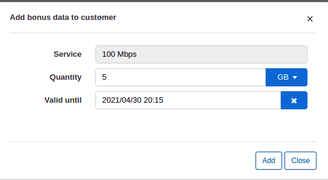

Just select service, amount of data and validity and click on `Add` button.

You can track bonus data history by click on `Bonus history`.

With top-up applied and some bonus data customer's service will look like this:

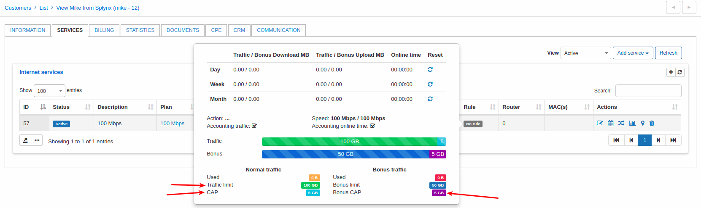

**NOTE!** Bonus data will be available for using only on off-peak hours (00:00 - 04:00 according to tariff plan settings). If you want to "make a gift" fot a customer, use top-up with price = 0.

## What customer sees on a portal

It can be configured what items to display for a customer but in this case we enabled displaying of all items related to traffic amount, CAP and FUP so directly on a dashboard customer will see available and used data:

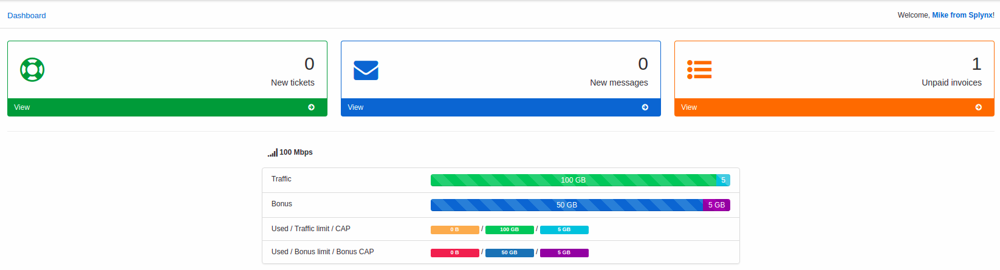

Under `Services -> Top-up` customer can enable/disable auto top-up issuing, select auto top-up plan (we disabled this option in our example) and issue top-up manually:

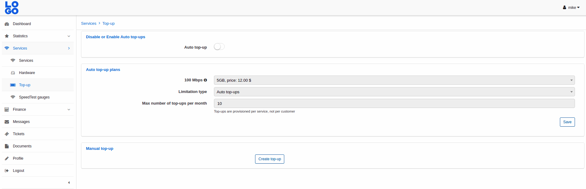

For this option to be available, permissions in the portal should be granted for customers to have access to this feature. To grant access, navigate to Config → Main → Portal and select "Per partner settings". There are two sections to grant access for customers to perform top-ups:

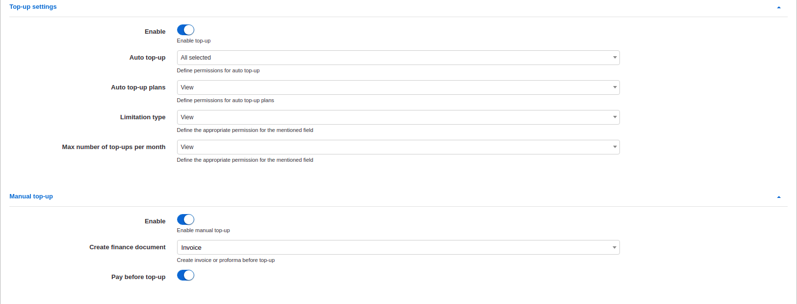

**Top-up settings** - Permissions regarding auto top-up plans made available to the customer tariffs and how they can interact with these fields:

* **Enable** - allow/deny the ability to perform auto top-ups;

* **Auto Top-up** - select level of access/ability to Auto top-up feature (View, Edit, All selected);

* **Auto top-up plans** - select level of access/ability to plans(View, Edit, All selected);

* **Limitation type** - select level of access/ability to limitations(View, Edit, All selected);

* **Max number of top-up per month** - select the level of access/ability to the maximum allowed top-ups per month(View, Edit, All selected).

**Manual Top-up** settings - These are permissions and actions for customers to create top-ups manually and how they can interact:

* **Enable** - allow/deny the ability to make manual top-ups;

* **Crate finance document** - which type of documents to create for the applied/requested top-up;

* **Pay before top-up** - select whether the customer has to pay for the top-up before the data can be used or not.

**Global CAP settings can be adjusted under [Config -> Main -> CAP](configuration/main_configuration/cap/cap.md)**
